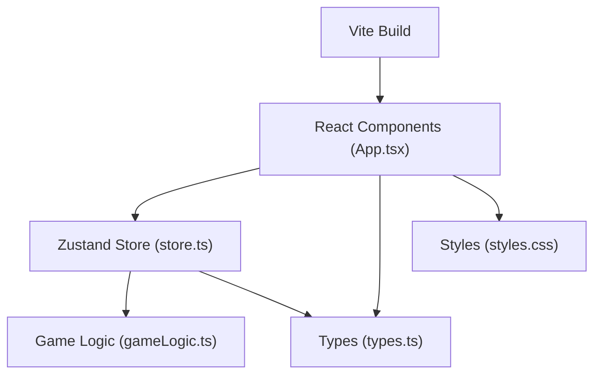

## 1. 架构设计



## 2. 技术描述

- **前端框架**：React@18 + TypeScript
- **构建工具**：Vite
- **状态管理**：Zustand
- **唯一ID**：uuid

## 3. 核心模块依赖

| 模块 | 依赖 | 说明 |
|-----|------|------|
| 类型定义 | 无 | types.ts - 符文类型、法术等级、接口定义 |
| 游戏逻辑 | 类型定义 | gameLogic.ts - 纯函数，合成检查、连击计算、魔力管理 |
| 状态管理 | 游戏逻辑+类型 | store.ts - Zustand全局状态 |
| UI组件 | 状态管理+类型 | App.tsx - 主布局，所有UI元素 |
| 样式 | 无 | styles.css - 全局样式和动画 |

## 4. 文件结构

```
auto35/
├── package.json          # 依赖：react@18, react-dom@18, zustand, uuid
├── vite.config.js        # Vite配置
├── tsconfig.json         # TypeScript配置（严格模式，target es2022）
├── index.html            # 入口页面
└── src/
    ├── main.tsx          # React入口
    ├── types.ts          # 类型定义
    ├── gameLogic.ts      # 游戏逻辑纯函数
    ├── store.ts         # Zustand状态管理
    ├── App.tsx          # 主组件
    └── styles.css       # 全局样式
```

## 5. 数据模型

### 5.1 符文类型

```typescript
enum RuneType {
  FIRE = 'fire',     // 火焰
  ICE = 'ice',       // 寒冰
  THUNDER = 'thunder', // 雷电
  WIND = 'wind',     // 风
  EARTH = 'earth',   // 大地
  SHADOW = 'shadow'  // 暗影
}
```

### 5.2 法术等级

```typescript
type SpellLevel = 'primary' | 'intermediate' | 'advanced';
```

### 5.3 对齐模式

```typescript
type AlignmentMode = 'horizontal' | 'vertical' | 'diagonal';
```

### 5.4 法术记录

```typescript
interface SpellRecord {
  id: string;
  name: string;
  type: RuneType;
  level: SpellLevel;
  alignment: AlignmentMode;
  damage: number;
  manaCost: number;
  discovered: boolean;
}
```

### 5.5 探索日志

```typescript
interface ExplorationLog {
  id: string;
  timestamp: string;
  runeCombination: RuneType[];
  success: boolean;
  spellLevel?: SpellLevel;
}
```

### 5.6 游戏状态

```typescript
interface GameState {
  runeBoard: (RuneType | null)[][];  // 3x3符文盘
  mana: number;                         // 当前魔力
  maxMana: number;                    // 最大魔力
  combo: number;                     // 连击数
  lastCastTime: number;               // 上次施法时间
  isCoolingDown: boolean;              // 是否冷却中
  discoveredSpells: string[];     // 已发现法术ID列表
  autoExplore: boolean;             // 自动探索模式
  explorationLogs: ExplorationLog[];    // 探索日志
  selectedCell: { row: number; col: number } | null; // 当前选中格子
  showCollection: boolean;          // 是否显示收藏面板
  activeSpellEffect: { type: RuneType; level: SpellLevel } | null;
  pulseEffect: { type: RuneType; startTime: number } | null;
}
```

## 6. 核心函数

### 6.1 gameLogic.ts 导出函数

| 函数名 | 参数 | 返回值 | 说明 |
|-------|------|--------|------|
| `checkAlignment` | board: (RuneType \| null)[][] | `{ type: RuneType; mode: AlignmentMode; level: SpellLevel }[]` | 检查所有对齐组合 |
| `calculateCombo` | currentCombo: number, lastCastTime: number | number | 计算当前连击数 |
| `consumeMana` | currentMana: number, level: SpellLevel | `{ success: boolean; remaining: number }` | 消耗魔力 |
| `getSpellByAlignment` | mode: AlignmentMode | SpellLevel | 根据对齐模式获取法术等级 |
| `generateRandomCombination` | triedCombinations: string[] | RuneType[][] | 生成未尝试过的符文组合 |
| `getAllSpells` | 无 | SpellRecord[] | 获取所有法术列表 |

### 6.2 store.ts Action

| Action | 参数 | 说明 |
|--------|------|------|
| `placeRune` | row, col, type | 放置符文 |
| `clearBoard` | 无 | 清空符文盘 |
| `castSpell` | type, level | 释放法术 |
| `updateMana` | delta | 更新魔力值 |
| `incrementCombo` | 无 | 增加连击 |
| `resetCombo` | 无 | 重置连击 |
| `setCoolingDown` | value | 设置冷却状态 |
| `discoverSpell` | spellId | 标记法术已发现 |
| `toggleAutoExplore` | 无 | 切换自动探索 |
| `addExplorationLog` | log | 添加探索日志 |
| `toggleCollection` | 无 | 切换收藏面板 |
| `setSelectedCell` | cell | 设置选中格子 |
| `setActiveSpellEffect` | effect | 设置法术特效 |
| `setPulseEffect` | effect | 设置脉冲特效 |

## 7. 性能优化

- **粒子数量控制**：最大200个，超出自动清理
- **帧率优化**：使用CSS动画优先，避免频繁重绘
- **内存管理**：探索日志最多100条，自动删除最早记录
- **防抖处理**：符文盘交互延迟<30ms
