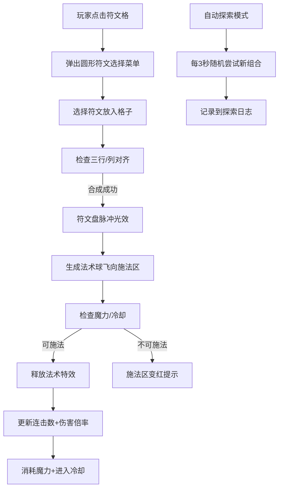

## 1. 产品概述

魔法工坊是一款浏览器端符文合成与法术释放游戏，玩家通过探索不同符文组合发现新法术、按节奏释放连击，并管理魔力与冷却资源。

- 核心玩法：符文合成 → 法术释放 → 连击管理 → 探索收藏
- 目标用户：休闲游戏玩家、魔法题材爱好者

## 2. 核心功能

### 2.1 功能模块

1. **符文盘系统**：3x3九宫格符文放置与合成
2. **施法系统**：法术释放、特效展示、冷却管理
3. **资源管理**：魔力条、连击条、自动回复
4. **自动探索**：AI自动尝试符文组合并记录
5. **收藏面板**：已发现法术展示、进度统计

### 2.3 页面详情

| 页面名称 | 模块名称 | 功能描述 |
|---------|---------|---------|
| 主游戏页 | 符文盘区域 | 3x3九宫格，点击弹出圆形符文选择菜单，三行/列对齐触发合成 |
| 主游戏页 | 施法区域 | 接收合成产生的法术球，展示法术特效，冷却状态提示 |
| 主游戏页 | 资源状态栏 | 魔力条（渐变色填充、回复辉光）、连击条（白色填充、收缩动画） |
| 主游戏页 | 探索日志 | 自动探索记录，时间戳+符文组合+结果，滚动浏览 |
| 主游戏页 | 收藏面板 | 右侧滑入，法术卡片按等级分栏，进度条显示发现进度 |

## 3. 核心流程

## 4. 用户界面设计

### 4.1 设计风格
- **主色调**：深紫黑色#0D0D1A到#1A1A2E径向渐变背景
- **符文颜色**：火焰(橙红)、寒冰(蓝白)、雷电(亮黄)、风(青绿)、大地(棕黄)、暗影(深紫)
- **按钮风格**：圆角、悬浮放大1.05倍、阴影加深
- **字体**：Cinzel（标题）+ Crimson Pro（正文），营造魔法古籍氛围
- **动画曲线**：cubic-bezier(0.25, 0.46, 0.45, 0.94) 缓出

### 4.2 页面设计概要

| 页面名称 | 模块名称 | UI元素 |
|---------|---------|---------|
| 主游戏页 | 符文盘 | 半透明圆弧光晕（双层）、缓慢旋转、3x3网格、灰色半透明符文占位 |
| 主游戏页 | 符文选择菜单 | 圆形布局、6个符文图标环绕、悬浮放大1.15倍+投影 |
| 主游戏页 | 施法区 | 合成脉冲光效、法术特效（粒子/冰晶/闪电）、冷却环形进度条 |
| 主游戏页 | 魔力/连击条 | 240px长、渐变填充、回复辉光、连击收缩动画 |
| 主游戏页 | 探索日志 | 半透明背景、圆角、滚动条、时间戳格式HH:MM:SS |
| 主游戏页 | 收藏面板 | 右侧滑入、毛玻璃效果、法术卡片、折叠分栏、进度条 |

### 4.3 响应式设计
- **桌面端**：符文盘居中，右侧面板从右侧滑出
- **移动端**（<768px）：符文盘缩小到2x2，所有尺寸80%，侧边面板从底部弹出
- **触摸优化**：点击区域放大，减少误触

### 4.4 视觉特效
- **合成光效**：脉冲闪烁0.6秒，强度0.3→1.0→0
- **法术特效**：火焰粒子爆裂、寒冰冰晶扩散、雷电线条闪烁
- **连击特效**：5连击以上旋转符文字符粒子
- **冷却特效**：暗红色环形进度条旋转
