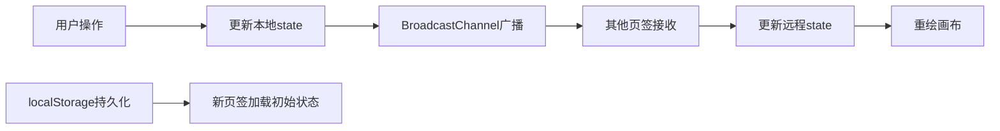

## 1. 产品概述

SketchSync 是一款面向设计师和前端开发者的轻量级实时协作白板工具，支持多人在浏览器多页签中同步绘制草图、添加便签和连线，无需后端服务，纯前端实现。

- 核心价值：会议中团队成员可以在同一个虚拟白板上共同创作，所有操作实时同步，提升沟通效率
- 技术亮点：基于 BroadcastChannel + localStorage 实现本地多页签同步，零后端依赖

## 2. 核心功能

### 2.1 功能模块

1. **无限画布**：支持自由绘制、橡皮擦、缩放、拖拽平移
2. **便签系统**：双击创建便签、拖拽移动、删除、文字编辑
3. **连线功能**：按住 Ctrl 连接两个便签，生成贝塞尔曲线
4. **工具栏**：画笔/橡皮擦切换、颜色选择、粗细调节、清空画布
5. **同步系统**：多页签实时同步、连接状态指示

### 2.2 页面详情

| 页面名称 | 模块名称 | 功能描述 |
|-----------|-------------|---------------------|
| 主画布页 | 无限画布 | 鼠标绘制自由线条，支持笔触颜色和粗细调整，橡皮擦功能 |
| 主画布页 | 画布操作 | 滚轮缩放（0.25x-4x，0.3秒平滑动画），空格+拖拽平移 |
| 主画布页 | 便签组件 | 双击创建便签，300字限制，拖拽移动带旋转效果，右上角删除按钮 |
| 主画布页 | 连线功能 | Ctrl+点击两个便签生成带箭头贝塞尔曲线，颜色#4A90D9，线宽2px |
| 顶部工具栏 | 工具选择 | 画笔/橡皮擦按钮切换，选中时高亮显示 |
| 顶部工具栏 | 颜色选择器 | 8种预设颜色，点击后外圈高亮 |
| 顶部工具栏 | 粗细滑块 | 1-10px范围，实时显示当前数值 |
| 顶部工具栏 | 清空画布 | 红色文字按钮，点击弹出确认对话框 |
| 顶部工具栏 | 同步状态 | 绿色/灰色圆点指示多页签连接状态 |

## 3. 核心流程

### 3.1 用户操作流程
用户打开应用 → 选择画笔工具 → 在画布上绘制 → 双击创建便签 → 输入文字 → 拖拽便签到合适位置 → 按住Ctrl连接两个便签 → 打开新页签验证同步效果

### 3.2 同步流程

## 4. 用户界面设计

### 4.1 设计风格
- 主色调：#4A90D9（工具选中态），#FF6B6B（删除/警告），#2ECC71（同步正常）
- 背景色：#F9F9F9（画布），#FFFFFFE0（工具栏半透明白色）
- 便签色：#FFF9C4（淡黄色背景），阴影 0 4px 12px rgba(0,0,0,0.12)
- 圆角风格：工具栏按钮圆角适中，便签圆角16px，对话框圆角12px
- 字体：PingFang SC, sans-serif，字号14px
- 动效：缩放0.3秒缓动，按钮点击缩放反馈，便签拖拽半透明+轻微旋转

### 4.2 页面设计概述

| 页面名称 | 模块名称 | UI元素 |
|-----------|-------------|-------------|
| 主画布页 | 工具栏 | 固定顶部56px，半透明白色背景，底部1px阴影，从左到右排列工具 |
| 主画布页 | 画布区域 | 全屏无限画布，#F9F9F9背景，支持滚轮缩放和空格拖拽 |
| 主画布页 | 便签 | 圆角16px，淡黄色背景，右上角圆形红色删除按钮，拖拽时0.7透明度+轻微旋转 |
| 主画布页 | 连线 | 贝塞尔曲线，带箭头，#4A90D9颜色，线宽2px |
| 顶部工具栏 | 确认对话框 | 半透明遮罩，圆角12px，确认/取消按钮 |

### 4.3 性能要求
- 拖拽和绘制帧率稳定在55fps以上
- 支持50个便签同时存在时拖动流畅
- 缩放动画0.3秒平滑过渡

### 4.4 响应式
- 桌面端优先设计，全屏展示
- 工具栏自适应宽度
- 画布操作主要针对鼠标和键盘（空格键）
