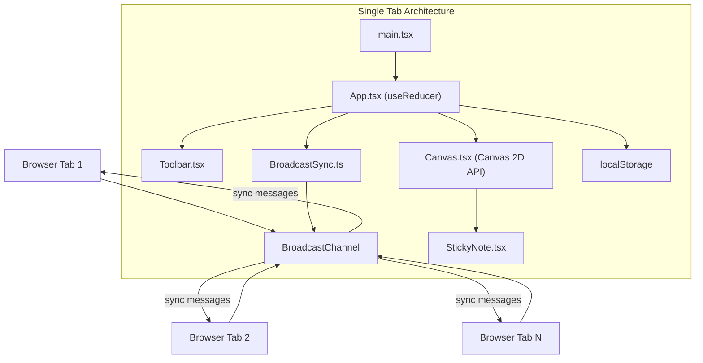

## 1. 架构设计



## 2. 技术描述

- **前端框架**: React@18 + ReactDOM@18
- **开发语言**: TypeScript (严格模式, target es2020)
- **构建工具**: Vite 5.x
- **状态管理**: React useReducer (集中管理全局状态)
- **同步机制**: BroadcastChannel API + localStorage
- **唯一ID生成**: uuid 库
- **渲染技术**: HTML5 Canvas 2D API + React DOM 混合渲染

## 3. 核心数据结构

### 3.1 类型定义

```typescript
// 工具类型
type Tool = 'pen' | 'eraser';

// 点坐标
interface Point {
  x: number;
  y: number;
}

// 绘制线条
interface Stroke {
  id: string;
  points: Point[];
  color: string;
  width: number;
  isEraser: boolean;
}

// 便签
interface StickyNote {
  id: string;
  x: number;
  y: number;
  text: string;
  width: number;
  height: number;
}

// 连线
interface Connection {
  id: string;
  fromNoteId: string;
  toNoteId: string;
  curvature: number;
}

// 画布变换
interface Transform {
  x: number;
  y: number;
  scale: number;
}

// 全局状态
interface AppState {
  strokes: Stroke[];
  notes: StickyNote[];
  connections: Connection[];
  currentTool: Tool;
  currentColor: string;
  currentWidth: number;
  transform: Transform;
  selectedNoteId: string | null;
  connectionStartId: string | null;
  isSyncConnected: boolean;
}
```

### 3.2 Action 类型

```typescript
type Action =
  | { type: 'SET_TOOL'; payload: Tool }
  | { type: 'SET_COLOR'; payload: string }
  | { type: 'SET_WIDTH'; payload: number }
  | { type: 'ADD_STROKE'; payload: Stroke }
  | { type: 'UPDATE_STROKE'; payload: Stroke }
  | { type: 'ADD_NOTE'; payload: StickyNote }
  | { type: 'UPDATE_NOTE'; payload: StickyNote }
  | { type: 'DELETE_NOTE'; payload: string }
  | { type: 'ADD_CONNECTION'; payload: Connection }
  | { type: 'SET_TRANSFORM'; payload: Transform }
  | { type: 'SELECT_NOTE'; payload: string | null }
  | { type: 'SET_CONNECTION_START'; payload: string | null }
  | { type: 'CLEAR_CANVAS' }
  | { type: 'SET_SYNC_CONNECTED'; payload: boolean }
  | { type: 'SYNC_STATE'; payload: Partial<AppState> };
```

## 4. 文件结构

| 文件路径 | 职责描述 |
|----------|----------|
| `package.json` | 项目依赖配置，react@18, react-dom@18, uuid |
| `vite.config.js` | Vite 构建配置，React 插件 |
| `tsconfig.json` | TypeScript 配置，严格模式，target es2020 |
| `index.html` | 入口 HTML，全屏无滚动条 |
| `src/main.tsx` | React 入口，挂载根组件，初始化 BroadcastChannel |
| `src/App.tsx` | 容器组件，useReducer 管理全局状态，同步逻辑 |
| `src/components/Canvas.tsx` | 画布组件，Canvas 2D 绘制，鼠标事件处理 |
| `src/components/Toolbar.tsx` | 工具栏组件，工具选择、颜色、粗细、清空 |
| `src/components/StickyNote.tsx` | 便签组件，渲染、拖拽、删除 |
| `src/utils/BroadcastSync.ts` | 同步工具，封装 BroadcastChannel |

## 5. 关键技术实现

### 5.1 画布变换系统
- 使用 CSS `transform: translate(x, y) scale(scale)` 实现画布平移和缩放
- 滚轮缩放使用 requestAnimationFrame 实现 0.3s 平滑缓动动画
- 文字标签在缩放时保持字体大小不变，通过反向缩放实现

### 5.2 绘制系统
- 使用 Canvas 2D API 绘制线条和连线
- 实时绘制采用增量更新策略，优化性能
- 橡皮擦通过绘制与背景同色的粗线条实现

### 5.3 同步机制
- BroadcastChannel 用于实时广播状态变更
- localStorage 用于持久化和新页签初始化
- 心跳机制检测连接状态，更新同步指示器

### 5.4 性能优化
- 使用 `requestAnimationFrame` 确保 60fps 绘制
- 便签使用 CSS transform 拖拽，避免重排
- Canvas 绘制采用离屏缓冲和局部重绘

## 6. 预设配置

### 6.1 颜色预设
```javascript
const PRESET_COLORS = [
  '#333333', // 默认黑色
  '#FF6B6B', // 红色
  '#4A90D9', // 蓝色
  '#27AE60', // 绿色
  '#F39C12', // 橙色
  '#9B59B6', // 紫色
  '#1ABC9C', // 青色
  '#E74C3C', // 深红
];
```

### 6.2 样式常量
```javascript
const CONSTANTS = {
  CANVAS_BG: '#F9F9F9',
  TOOLBAR_HEIGHT: 56,
  TOOLBAR_BG: 'rgba(255, 255, 255, 0.88)',
  NOTE_BG: '#FFF9C4',
  NOTE_RADIUS: 16,
  ERASE_WIDTH: 20,
  MIN_SCALE: 0.25,
  MAX_SCALE: 4,
  SCALE_DURATION: 300,
};
```
