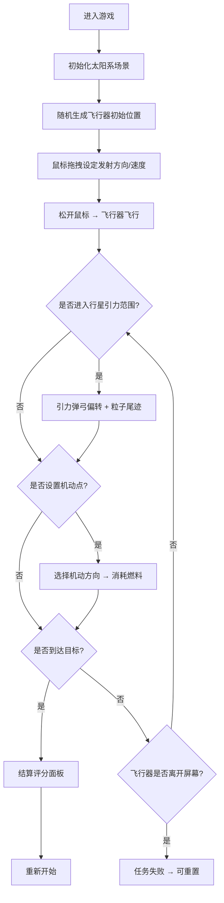

## 1. 产品概述

引力弹弓轨道模拟器是一款基于浏览器的2D物理模拟游戏，玩家通过操控飞行器利用行星引力弹弓效应进行轨道机动，最终到达目标星域。该产品旨在结合真实天体物理原理与互动游戏体验，帮助玩家直观理解引力辅助轨道机动的科学概念。

- 核心目标：提供沉浸式的天体轨道模拟体验，让玩家通过策略性操作完成星际航行任务
- 目标用户：航天爱好者、物理学习者、休闲游戏玩家
- 市场价值：教育性与娱乐性结合的科学模拟游戏，填补浏览器端高品质引力物理模拟游戏的空白

## 2. 核心特性

### 2.1 用户角色（如适用）
本游戏为单用户操作，无需角色区分。

### 2.2 功能模块
1. **太阳系场景模块**：恒星渲染、行星轨道系统、引力影响范围可视化
2. **飞行器控制模块**：鼠标拖拽发射、初始速度方向设定、轨迹可视化
3. **引力弹弓模拟模块**：真实引力计算、双曲线偏转、粒子尾迹效果
4. **行星系统管理模块**：动态添加行星、随机轨道参数、多行星引力交互
5. **机动点控制模块**：路径点标记、四向机动操作、燃料消耗管理
6. **目标评分系统模块**：目标星域标记、到达判定、多维度评分结算

### 2.3 页面详情

| 页面名称 | 模块名称 | 功能描述 |
|-----------|-------------|---------------------|
| 主游戏界面 | 太阳系场景 | 2D俯视视角，恒星位于中心带脉动光晕，行星椭圆轨道运动，鼠标悬停显示行星信息浮窗 |
| 主游戏界面 | 飞行器发射 | 鼠标从飞行器拖拽设定初始速度（0-200px），方向箭头蓝红渐变，松开后开始飞行 |
| 主游戏界面 | 引力弹弓 | 进入行星引力范围（黄色半透明圆圈）后施加引力，轨迹变为双曲线段（橙色2px），粒子尾迹（黄到橙渐变） |
| 主游戏界面 | 行星添加 | 左下角圆形按钮点击添加新行星（最多3颗），随机轨道半长轴300-500px、离心率0.1-0.3 |
| 主游戏界面 | 机动控制 | 点击飞行器路径设置机动点，弹出四扇区圆形菜单（加速/减速/左转/右转），消耗燃料5-15%随机 |
| 主游戏界面 | 目标评分 | 随机位置闪烁金色星形目标，进入20px半径到达，结算显示路径长度、燃料、机动次数、总分（100-200分） |

## 3. 核心流程

玩家进入游戏后，首先观察太阳系场景布局，然后通过鼠标拖拽飞行器设定发射方向与速度。飞行器飞行过程中，玩家可观察其是否自然进入行星引力范围进行弹弓加速。若需主动调整轨道，可在飞行路径上点击设置机动点，通过四向操作菜单执行轨道机动（消耗燃料）。当飞行器最终进入目标星域时，游戏自动结算并展示评分结果。

## 4. 用户界面设计

### 4.1 设计风格

- **主色调**：暗黑科幻风，背景纯黑 #0A0A1A
- **强调色**：
  - 恒星：#FF6B35（橙红色带脉动光晕）
  - 飞行器轨迹：默认白色，引力弹弓时 #FF9933（橙色）
  - 速度箭头：#3A86FF → #FF006E（蓝到红渐变）
  - 引力范围：#FFDD44A0（半透明黄色）
  - 目标标记：#FFD700（闪烁金色）
  - UI数值文字：#AADDAA（绿色调等宽字体）
- **按钮风格**：玻璃拟态扁平化，背景半透明白 #FFFFFF10，边框 1px 实体 #FFFFFF20，圆角 8px，悬浮时背景 #FFFFFF20 + transform: translateY(-2px) + box-shadow
- **字体**：数值显示使用 'Courier New' 等宽字体，界面文字使用无衬线字体
- **布局风格**：全屏沉浸式 Canvas 画布，UI 控件悬浮于画布之上，左下角行星添加按钮，右上角状态面板

### 4.2 页面设计概述

| 页面名称 | 模块名称 | UI 元素 |
|-----------|-------------|-------------|
| 主游戏界面 | 状态面板（右上角） | 玻璃风格面板，等宽字体显示：速度(px/s)、燃料(%)、机动次数、当前分数 |
| 主游戏界面 | 行星添加按钮（左下角） | 圆形图标直径30px，背景#2A2A4A，边框#5A5A8A，悬浮边框#8A8ABA，Plus图标 |
| 主游戏界面 | 速度箭头（拖拽时） | 从飞行器出发的带箭头线段，长度0-200px映射速度，颜色蓝→红线性渐变 |
| 主游戏界面 | 行星信息浮窗 | 悬停行星时显示，背景#1A1A2AE0，圆角6px，阴影0 2px 12px，内容：名称/轨道半径/引力范围 |
| 主游戏界面 | 机动点操作菜单 | 圆形半径50px，四等分扇区，分别标注：加速(↑)、减速(↓)、左转(←)、右转(→) |
| 主游戏界面 | 结算面板 | 居中半透明 #1A1A2EA0，圆角12px，阴影0 8px 32px rgba(0,0,0,0.5)，显示四项指标+总分大字+重新开始按钮 |
| 主游戏界面 | 轨迹可视增强 | 轨迹线上每10像素生成半透明小圆点（直径2px），与轨迹同色 |
| 主游戏界面 | 行星轨道线 | 虚线 #4A6A8A（及其他新增颜色），宽度1px，鼠标悬停行星时变为实线加粗2px |

### 4.3 响应式

本项目为桌面优先设计（Canvas 全屏自适应窗口尺寸），所有交互基于鼠标操作，暂不做移动端触控适配。窗口大小变化时，Canvas 自动 resize，场景坐标系中心保持为窗口中心。

### 4.4 动画效果

- 恒星：光晕脉动动画周期 3 秒，半径 60px 基础值 ±10px 呼吸效果
- 目标标记：星形闪烁周期 0.8 秒，透明度 0.5 ↔ 1.0 交替
- 飞行器粒子尾迹：每帧生成 2 个粒子，生命周期 1.5 秒，颜色黄 → 橙渐变，尺寸随时间衰减
- 行星：绕恒星椭圆轨道匀速运动，角度随时间线性更新
- 按钮悬浮：transform: translateY(-2px) + 背景色加深 + box-shadow，过渡 0.2s ease
