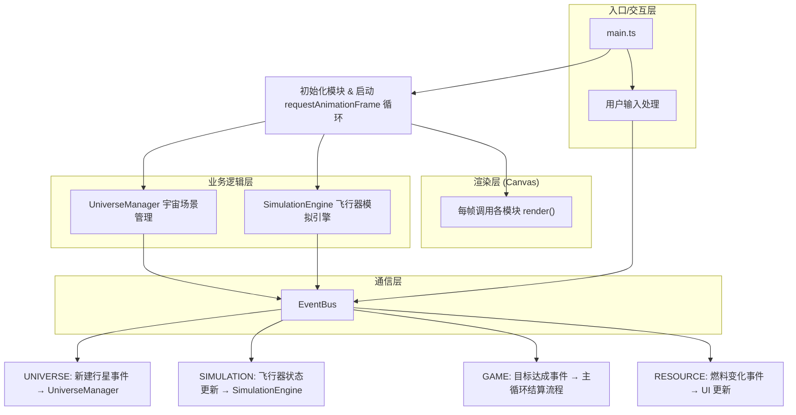

## 1. 架构设计

本项目为纯前端浏览器游戏，采用模块化架构。核心思想是将场景管理、物理模拟、事件通信、渲染循环解耦，通过事件总线实现模块间松耦合通信。



## 2. 技术描述

- **前端框架**：无外部 UI 框架，纯原生 TypeScript + HTML5 Canvas 2D API
- **构建工具**：Vite 5.x + @vitejs/plugin-basic-ssl（处理 ESM 模块，无外部库）
- **TypeScript 配置**：严格模式，target ES2020，moduleResolution bundler
- **后端**：无（纯前端游戏）
- **数据库**：无（状态全部内存驻留）
- **性能指标**：3 颗行星 + 飞行器持续运行时 ≥60FPS，粒子总数 ≤200（超出时淘汰最早生成的粒子）

## 3. 模块与文件组织

| 文件路径 | 职责 | 输入 / 输出 |
|-----------|-------------|-------------|
| `package.json` | 项目元信息，scripts: dev/build/preview，无运行时依赖 | dev 启动 vite |
| `vite.config.js` | Vite 构建配置，引用 @vitejs/plugin-basic-ssl | 纯配置 |
| `tsconfig.json` | TS 严格模式配置，ES2020 target，bundler 模块解析 | 纯配置 |
| `index.html` | 入口 HTML：全屏 Canvas + CSS 基础样式，加载 src/main.ts | DOM 结构 |
| `src/modules/EventBus.ts` | 发布-订阅事件总线，定义事件类型枚举 | on / emit / off 接口 |
| `src/modules/UniverseManager.ts` | 恒星/行星/轨道/引力范围的生成、更新、渲染，向 SimulationEngine 提供引力场数据 | 输入：事件；输出：行星数组（位置/质量/引力半径） |
| `src/modules/SimulationEngine.ts` | 飞行器运动积分、引力弹弓计算（双曲圆锥曲线近似）、机动点管理、燃料状态、路径记录与粒子尾迹 | 输入：引力场数据；输出：飞行器状态数组 + 轨迹点 + 粒子 |
| `src/main.ts` | 初始化所有模块、启动动画循环、处理鼠标事件（拖拽发射/路径点击/按钮点击）、协调渲染顺序（背景→轨道→行星→轨迹→飞行器→UI） | 入口，协调全部模块 |

### 数据流方向
```
用户输入 (mouse)
    ↓
main.ts (事件分发)
    ↓
EventBus.emit()
    ↓
┌───────────────────────────────────────────────────┐
│  UniverseManager  ←── 新建行星                    │
│       ↓ 更新行星位置(每帧)                         │
│  输出: planets[] → 传给 SimulationEngine          │
│                                                    │
│  SimulationEngine ←── 机动操作 / 燃料变化         │
│       ↓ 物理积分(每帧)                             │
│  输出: craftState(位置/速度/燃料) + trail + particles │
└───────────────────────────────────────────────────┘
    ↓
main.ts → CanvasRenderingContext2D 依次绘制所有元素
    ↓
  屏幕呈现
```

## 4. 事件类型定义（EventBus）

```typescript
enum EventType {
  PLANET_CREATED = 'planet:created',        // 新建行星，payload: Planet
  CRAFT_STATE_UPDATED = 'craft:state',      // 飞行器状态更新，payload: CraftState
  TARGET_REACHED = 'game:target-reached',   // 目标达成，payload: ScoreResult
  FUEL_CHANGED = 'craft:fuel',              // 燃料变化，payload: number (百分比)
  MANEUVER_EXECUTED = 'craft:maneuver',     // 执行机动，payload: ManeuverType
  GAME_RESET = 'game:reset',                // 重置游戏
}
```

## 5. 核心数据模型

### 5.1 实体类型定义

```typescript
// 恒星
interface Star {
  x: number; y: number;
  radius: number;
  color: string;          // '#FF6B35'
  haloRadius: number;     // 60
  pulsePhase: number;     // 0 ~ 2π
}

// 行星
interface Planet {
  id: string;
  name: string;
  color: string;          // 从暖色系中选
  orbitColor: string;     // 轨道线颜色
  semiMajorAxis: number;  // 半长轴 (px)
  eccentricity: number;   // 离心率 0~1
  orbitAngle: number;     // 当前轨道角度 (rad)
  orbitSpeed: number;     // 角速度 (rad/frame)
  radius: number;         // 行星视觉半径
  influenceRadius: number;// 引力影响半径 (px)
  mass: number;           // 引力计算用质量
  x: number; y: number;   // 当前笛卡尔坐标
}

// 飞行器
interface Craft {
  x: number; y: number;
  vx: number; vy: number;
  fuel: number;           // 0 ~ 100
  trail: TrailPoint[];    // 轨迹点
  trailLength: number;    // 总路径像素长度
  maneuverCount: number;
  inGravityRangeOf: string | null; // 正在受哪颗行星引力影响
}

// 轨迹点
interface TrailPoint {
  x: number; y: number;
  isHyperbolic: boolean;  // 是否处于引力弹弓段
}

// 机动点
interface ManeuverPoint {
  id: string;
  x: number; y: number;
  activated: boolean;
}

// 粒子
interface Particle {
  x: number; y: number;
  vx: number; vy: number;
  life: number;           // 0 ~ 1.5 (秒)
  maxLife: number;
}

// 目标星域
interface Target {
  x: number; y: number;
  radius: number;         // 20
  blinkPhase: number;     // 0 ~ 2π
}
```

### 5.2 物理算法要点

1. **行星位置计算**（椭圆轨道极坐标方程）：
   ```
   r = a(1-e²) / (1 + e·cosθ)
   x = cx + r·cosθ,  y = cy + r·sinθ
   ```

2. **引力计算**（进入 influenceRadius 后开启）：
   ```
   dx = planet.x - craft.x, dy = planet.y - craft.y
   dist = sqrt(dx²+dy²)
   if dist < influenceRadius:
       force = G * planet.mass / (dist² + ε)   // ε防除零
       ax += force * dx / dist
       ay += force * dy / dist
   ```

3. **机动操作**（在点击路径位置处对速度施加脉冲）：
   - 加速/减速：沿当前速度方向 ±Δv
   - 左转/右转：沿法线方向 ±Δv（即旋转 90° 方向）

4. **路径长度计算**：每帧累加 `sqrt(dx²+dy²)` 到 trailLength。

5. **分数计算**：
   ```
   ratio = standardPathLength / actualTrailLength   // standard为直线距离
   bonus = clamp(ratio, 1, 2) × 100
   score = 100 + bonus   // 范围 100 ~ 200
   ```

## 6. 性能优化策略

1. **粒子池管理**：固定数组容量 200，超出时 FIFO 覆盖最旧粒子（环形数组），避免 GC
2. **轨迹点降采样**：用于可视化的圆点采样间距 10px，而非每帧一个点
3. **引力计算早出**：先做 `dist² < influenceRadius²` 比较，避免开平方
4. **Canvas 批量绘制**：同类元素一次 beginPath，减少 GPU 状态切换（如轨道虚线一次性绘制完再画行星）
5. **requestAnimationFrame 帧同步**：所有更新和渲染严格在同一 tick 内完成，避免多帧撕裂

## 7. 渲染顺序（z-index 从低到高）

1. 背景（纯黑 #0A0A1A，清屏）
2. 行星轨道虚线
3. 恒星 + 脉动光晕（径向渐变）
4. 引力影响范围圆圈（半透明黄，位于行星下一层）
5. 行星本体 + 柔和光晕
6. 目标星域闪烁星形
7. 飞行器轨迹圆点（每10px采样）
8. 飞行器轨迹线（引力弹弓段橙色加粗）
9. 机动点标记（白色/金色圆点）
10. 机动点操作扇区菜单（激活时）
11. 飞行器本体 + 当前帧速度箭头（拖拽时）
12. 粒子尾迹（additive 混合感，使用 globalAlpha）
13. DOM UI 层（按钮、状态面板、结算面板、行星信息浮窗）
