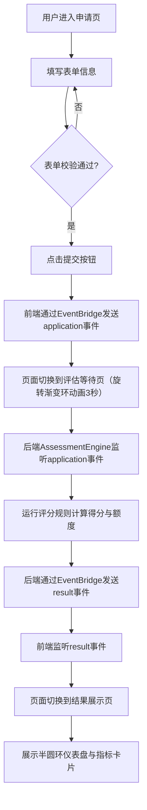

## 1. 产品概述

LoanFlow 是一款面向小微企业主和个体户的信用评估模拟器，用户可在浏览器中快速提交借贷申请，并实时查看信用评分与估算额度。项目侧重于申请流程的模拟和信用评分的可视化，类似于简化版网商银行后台体验。

- 目标用户：小微企业主、个体工商户
- 核心价值：降低借贷申请门槛，提供即时信用评估反馈，帮助用户了解自身信用状况

## 2. 核心功能

### 2.1 用户角色

| 角色 | 注册方式 | 核心权限 |
|------|----------|----------|
| 申请人 | 无需注册 | 填写借贷申请表、查看信用评估结果 |

### 2.2 功能模块

1. **申请页**：左右分栏表单填写、实时进度跟踪、输入校验反馈
2. **评估等待页**：旋转渐变环等待动画、状态提示文字
3. **结果页**：半圆环仪表盘评分展示、预估额度与风险等级指标卡片

### 2.3 页面详情

| 页面名称 | 模块名称 | 功能描述 |
|----------|----------|----------|
| 申请页 | 表单区（60%宽度） | 包含姓名、身份证号（18位校验）、手机号、公司名称、近6月平均流水、是否有抵押物共6项输入，聚焦外发光效果、校验失败红色边框+抖动、校验通过绿色对勾 |
| 申请页 | 引导提示区（40%宽度） | 右侧固定宽度最小320px，背景色#F7F8FC，圆角12px，提供填写指引 |
| 申请页 | 进度条 | 宽度100%高度6px圆角3px，渐变色#4A7CFF到#7B61FF，根据填写完成度动态推进 |
| 评估等待页 | 旋转渐变环 | conic-gradient从#4A7CFF到#7B61FF再到#4A7CFF，环宽8px直径80px居中旋转，3秒后自动跳转 |
| 评估等待页 | 状态提示 | 文字"正在评估您的信用..."，字体16px颜色#666 |
| 结果页 | 半圆环仪表盘 | 弧长0-180度，分数0-1000，大号字体48px加粗居中显示，弧色根据分值变化（红/橙/绿），外圈发光模糊6px，过渡0.8s ease-out |
| 结果页 | 预估额度卡片 | 格式¥X.XX万元，字体24px加粗颜色#333，卡片宽度46%圆角12px白色背景阴影 |
| 结果页 | 风险等级卡片 | 低/中/高对应绿/橙/红色标签，卡片宽度46%圆角12px白色背景阴影 |
| 结果页 | 免责提示 | 文字"本评估仅供参考，实际额度以最终审批为准"，字体12px颜色#999 |

## 3. 核心流程

用户打开页面后进入申请表单页，按照引导依次填写个人信息与企业经营数据。表单实时校验输入并展示进度条。全部校验通过后点击提交按钮，前端通过EventBridge将申请数据发送给后端评估模块。页面切换至评估等待页，显示3秒旋转渐变环动画。后端模块通过setTimeout模拟评分计算耗时，计算完成后通过EventBridge发送结果事件。前端监听到结果事件后自动切换到结果展示页，以半圆环仪表盘呈现信用评分，并以卡片形式展示预估额度和风险等级。

## 4. 用户界面设计

### 4.1 设计风格

- 主色：#4A7CFF（蓝色），辅助色：#7B61FF（紫色）和 #2E3A6E（深蓝）
- 按钮风格：主色背景白色文字，圆角8px，内边距10px 24px，hover变深#3A6AE6，过渡0.2s
- 字体：-apple-system, BlinkMacSystemFont 系统默认字体，正文14px常规，标题16px加粗
- 布局风格：卡片式布局，圆角12px，阴影0 2px 12px rgba(0,0,0,0.06)
- 输入框：圆角6px，边框1px solid #D9D9D9，聚焦外发光#4A7CFF模糊4px
- 图标风格：简洁线性图标，绿色对勾表示校验通过

### 4.2 页面设计概览

| 页面名称 | 模块名称 | UI要素 |
|----------|----------|--------|
| 申请页 | 表单区 | 左侧60%宽度，6个输入项纵向排列，聚焦外发光效果，校验状态反馈，底部进度条 |
| 申请页 | 引导提示区 | 右侧40%宽度，最小320px，背景#F7F8FC，圆角12px，指引文案 |
| 评估等待页 | 旋转环 | 居中旋转渐变环，环宽8px直径80px，下方16px灰色提示文字 |
| 结果页 | 仪表盘 | 半圆环SVG，48px加粗分数居中，弧色按分段变化，外圈发光6px |
| 结果页 | 指标卡片 | 两张卡片46%宽度左右排列，白色背景圆角12px阴影 |

### 4.3 响应式设计

- 桌面优先设计，移动端自适应
- 屏幕宽度 < 768px 时：
  - 申请页左右分栏变为上下堆叠，左侧表单和右侧提示各占全宽
  - 结果页指标卡片变为上下排列，各占全宽
  - 导航栏（高度56px，白色背景，底部边框1px solid #E8E8E8）收起为汉堡菜单
- 触摸优化：按钮和输入框在移动端有足够的点击区域

### 4.4 3D场景指导

不适用
