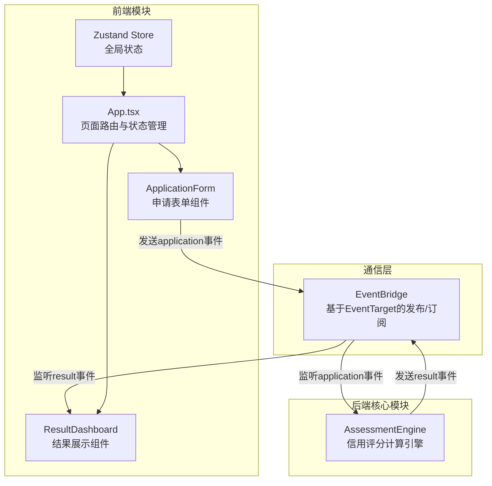
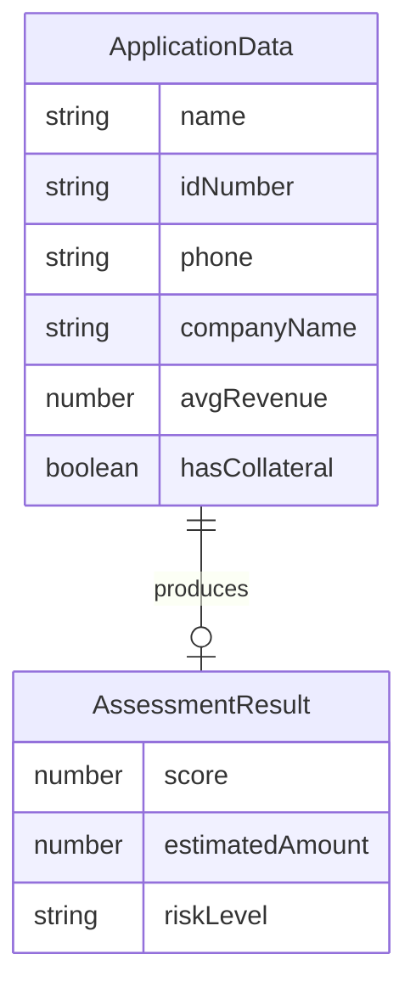

## 1. 架构设计



## 2. 技术说明

- 前端：React@18 + TypeScript + Vite
- 状态管理：Zustand
- 跨模块通信：自定义EventBridge（基于EventTarget实现的发布/订阅模式）
- 后端模拟：AssessmentEngine（纯前端模块，通过setTimeout模拟计算耗时）
- 样式方案：CSS Modules + 全局CSS变量（不使用Tailwind，遵循用户指定的文件结构）
- 初始化工具：Vite
- 数据库：无（纯前端模拟）

## 3. 路由定义

| 路由 | 用途 |
|------|------|
| / | 申请表单页（默认页） |
| /assessment | 评估等待页 |
| /result | 结果展示页 |

> 注：本项目使用状态管理切换页面，不使用react-router-dom进行路由跳转，以保证页面切换时间不超过100ms。

## 4. API定义

本项目为纯前端模拟，无HTTP API。前后端模块通过EventBridge事件总线通信：

### 4.1 事件类型定义

```typescript
// application事件 - 前端发送申请数据
interface ApplicationData {
  name: string;
  idNumber: string;
  phone: string;
  companyName: string;
  avgRevenue: number;
  hasCollateral: boolean;
}

// result事件 - 后端返回评估结果
interface AssessmentResult {
  score: number;          // 0-1000
  estimatedAmount: number; // 预估额度（万元）
  riskLevel: 'low' | 'medium' | 'high';
}
```

### 4.2 事件流

1. 前端通过 `eventBridge.emit('application', data)` 发送申请数据
2. 后端 AssessmentEngine 监听 `application` 事件，运行评分规则
3. 3秒后后端通过 `eventBridge.emit('result', result)` 发送评估结果
4. 前端 ResultDashboard 监听 `result` 事件，更新界面展示

## 5. 服务端架构图

不适用（纯前端项目，无后端服务）

## 6. 数据模型

### 6.1 数据模型定义



### 6.2 评分规则

| 因素 | 权重 | 说明 |
|------|------|------|
| 平均流水 | 40% | 流水越高分数越高，上限400分 |
| 抵押物 | 25% | 有抵押物+250分，无抵押+100分 |
| 身份信息完整性 | 20% | 姓名+身份证+手机号均有效+200分 |
| 企业信息 | 15% | 有公司名称+150分 |

- 预估额度 = (score / 1000) × 平均流水 × 3（有抵押物时系数为5）
- 风险等级：score < 400 → 高风险，400 ≤ score < 700 → 中风险，score ≥ 700 → 低风险

### 6.3 数据定义语言

不适用（无数据库，所有数据存储在Zustand状态和EventBridge事件中）
