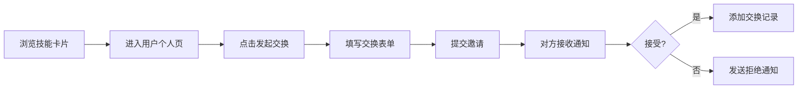

## 1. 产品概述

SkillSwap 是一个轻量级技能交换平台，让用户能够发布自己擅长的技能、搜索他人的技能需求、发起技能交换邀请，并通过时间轴追踪个人技能成长轨迹。

- **核心价值**：打破知识付费壁垒，让用户通过"以技易技"的方式互相学习，建立技能交换社区
- **目标用户**：有学习意愿、拥有一技之长的年轻人群体，包括学生、职场人士、兴趣爱好者

## 2. 核心功能

### 2.1 用户角色

| 角色 | 注册方式 | 核心权限 |
|------|----------|----------|
| 普通用户 | 默认自动创建 | 发布技能、搜索技能、发起/接受/拒绝交换邀请、查看个人技能看板、管理消息 |

### 2.2 功能模块

1. **首页**：搜索推荐面板、标签云筛选、技能卡片瀑布流
2. **个人中心**：技能看板、技能雷达图、技能管理（添加/编辑/删除）
3. **消息中心**：交换邀请通知、接受/拒绝通知、系统通知、分页浏览
4. **交换流程**：发起交换邀请、填写交换详情、邀请处理、交换记录生成

### 2.3 页面详情

| 页面名称 | 模块名称 | 功能描述 |
|----------|----------|----------|
| 首页 | 标签云筛选 | 左侧技能分类标签云，点击标签筛选技能卡片，支持多选 |
| 首页 | 搜索框 | 实时搜索过滤技能卡片，支持模糊匹配技能名和用户昵称 |
| 首页 | 技能瀑布流 | 右侧推荐技能卡片瀑布流布局，懒加载，点击进入用户个人页 |
| 个人中心 | 技能看板 | 横向滚动展示自己发布的所有技能，支持编辑和删除 |
| 个人中心 | 技能雷达图 | Canvas 绘制五维雷达图，支持拖拽顶点调整数值 |
| 个人中心 | 交换记录 | 展示历史技能交换记录，显示交换者、技能、相对时间 |
| 消息中心 | 通知列表 | 带颜色标识的通知卡片，分页显示，支持标记已读 |
| 通用 | 深色模式 | 顶部导航栏月亮/太阳图标切换，全局样式平滑过渡 |

## 3. 核心流程

### 3.1 技能交换主流程

用户浏览首页技能卡片 → 点击感兴趣的技能卡片进入对方个人页 → 点击"发起交换"按钮 → 填写交换时间和说明 → 提交邀请 → 对方在消息中心查看邀请 → 对方接受或拒绝 → 若接受则双方技能看板自动添加交换记录

### 3.2 Mermaid 流程图

## 4. 用户界面设计

### 4.1 设计风格

- **主色调**：#6366F1（靛蓝色）
- **辅助色**：#F59E0B（琥珀色）作为强调色
- **背景**：白色/浅灰色为主，深色模式下为 #1F2937
- **圆角层级**：按钮 8px、卡片 12px、模态框 20px
- **阴影**：卡片使用 0 2px 8px rgba(0,0,0,0.08) 轻微阴影
- **字体**：Inter 字体（Google Fonts）
- **动效**：悬停放大 1.05 倍、0.2s 过渡、点击涟漪、页面滑动切换

### 4.2 页面设计概览

| 页面名称 | 模块名称 | UI 元素 |
|----------|----------|----------|
| 首页 | 标签云 | 圆角矩形标签，背景 #E0F2FE，文字 #0369A1，悬停背景 #BAE6FD + 放大 |
| 首页 | 技能卡片 | 260px 宽卡片，头像 40px 圆形，技能标签列表，瀑布流布局 |
| 个人中心 | 技能卡片 | 横向滚动卡片，编辑/删除按钮，模态框编辑 |
| 个人中心 | 雷达图 | Canvas 绘制五维雷达图，可拖拽顶点调整数值 |
| 消息中心 | 通知卡片 | 左侧颜色竖条区分类型，分页按钮圆角样式 |
| 通用 | 模态框 | 半透明黑色背景 #00000060，白色面板圆角 20px，淡入动画 0.3s |

### 4.3 响应式设计

- **设计优先级**：桌面端优先（1280px+）
- **移动端适配**：标签云和瀑布流改为单列布局，导航栏简化
- **触摸优化**：按钮最小尺寸 44x44px，确保可点击区域充足

### 4.4 交互反馈

- **悬停**：按钮和可点击卡片都有悬停放大和颜色变化效果
- **点击**：添加涟漪效果，给用户即时反馈
- **消息通知**：未读消息红点标记，数字翻页弹跳动画
- **表单反馈**：文本域字数统计，超出阈值颜色变化（橙色/红色）
