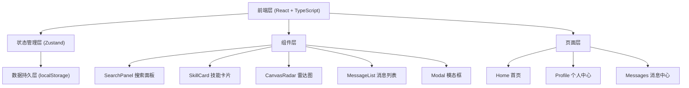

## 1. 架构设计



## 2. 技术描述

- **前端框架**：React@18 + TypeScript@5 + Vite@5
- **状态管理**：Zustand（轻量级，支持中间件持久化）
- **路由**：React Router DOM@6
- **图标**：@mdi/react（Material Design Icons）
- **唯一ID**：uuid
- **样式方案**：原生 CSS + CSS Variables（支持深色模式切换）
- **数据持久化**：localStorage + Zustand persist 中间件
- **构建工具**：Vite，配置路径别名 `@` 指向 `src`

## 3. 路由定义

| 路由路径 | 页面组件 | 说明 |
|----------|----------|------|
| `/` | HomePage | 首页，搜索 + 标签云 + 技能瀑布流 |
| `/profile/:userId` | ProfilePage | 个人中心，技能看板 + 雷达图 + 交换记录 |
| `/messages` | MessagesPage | 消息中心，通知列表 + 分页 |

## 4. 数据模型

### 4.1 数据类型定义

```typescript
// 用户
interface User {
  id: string;
  nickname: string;
  avatar: string;
  bio: string;
  radarScores: {
    frontend: number;
    backend: number;
    design: number;
    dataAnalysis: number;
    softSkills: number;
  };
}

// 技能卡片
interface Skill {
  id: string;
  userId: string;
  title: string;
  tags: string[];
  description: string;
  category: string;
  createdAt: number;
}

// 交换记录
interface ExchangeRecord {
  id: string;
  fromUserId: string;
  toUserId: string;
  skillId: string;
  skillTitle: string;
  exchangeTime: string;
  note: string;
  createdAt: number;
}

// 消息
interface Message {
  id: string;
  type: 'invite' | 'accept' | 'reject' | 'system';
  fromUserId: string;
  toUserId: string;
  title: string;
  content: string;
  relatedSkillId?: string;
  relatedInviteId?: string;
  isRead: boolean;
  createdAt: number;
}

// 交换邀请
interface Invite {
  id: string;
  fromUserId: string;
  toUserId: string;
  skillId: string;
  skillTitle: string;
  expectedTime: string;
  note: string;
  status: 'pending' | 'accepted' | 'rejected';
  createdAt: number;
}
```

### 4.2 Store 状态结构

```typescript
interface AppState {
  currentUser: User;
  users: User[];
  skills: Skill[];
  messages: Message[];
  invites: Invite[];
  exchangeRecords: ExchangeRecord[];
  darkMode: boolean;
  selectedTags: string[];
  searchQuery: string;
  
  // Actions
  setDarkMode: (value: boolean) => void;
  addSkill: (skill: Omit<Skill, 'id' | 'createdAt'>) => void;
  updateSkill: (id: string, updates: Partial<Skill>) => void;
  removeSkill: (id: string) => void;
  sendInvite: (invite: Omit<Invite, 'id' | 'status' | 'createdAt'>) => void;
  acceptInvite: (inviteId: string) => void;
  rejectInvite: (inviteId: string) => void;
  markMessageRead: (messageId: string) => void;
  markAllMessagesRead: () => void;
  updateRadarScores: (scores: Partial<User['radarScores']>) => void;
  setSelectedTags: (tags: string[]) => void;
  setSearchQuery: (query: string) => void;
}
```

## 5. 性能优化方案

### 5.1 瀑布流懒加载
- 使用 Intersection Observer API
- 首次加载 12 张卡片
- 滚动到距底部 200px 时预加载下一批 8 张
- 卡片组件使用 React.memo 避免不必要重渲染

### 5.2 雷达图性能
- Canvas 2D 绘制，帧率不低于 30FPS
- requestAnimationFrame 调度重绘
- 拖拽时使用防抖处理数值更新
- 组件卸载时清理动画帧

### 5.3 列表操作响应
- Zustand 状态选择器使用 select 函数精准订阅
- 列表项使用唯一 key
- 编辑/删除操作使用不可变更新

## 6. 文件结构

```
.
├── index.html
├── package.json
├── vite.config.js
├── tsconfig.json
└── src/
    ├── main.tsx
    ├── App.tsx
    ├── types/
    │   └── index.ts
    ├── store/
    │   └── useStore.ts
    ├── components/
    │   ├── CanvasRadar.tsx
    │   ├── MessageList.tsx
    │   ├── SkillCard.tsx
    │   ├── SearchPanel.tsx
    │   ├── Modal.tsx
    │   └── Navbar.tsx
    ├── pages/
    │   ├── HomePage.tsx
    │   ├── ProfilePage.tsx
    │   └── MessagesPage.tsx
    ├── hooks/
    │   ├── useInfiniteScroll.ts
    │   └── useTheme.ts
    ├── utils/
    │   ├── time.ts
    │   └── mockData.ts
    └── styles/
        └── globals.css
```

## 7. 核心实现说明

### 7.1 瀑布流布局
- CSS columns 实现多列瀑布流
- 每列宽度 260px，间距 20px
- Intersection Observer 监听最后一张卡片实现无限加载

### 7.2 雷达图拖拽
- 计算鼠标位置与雷达图顶点的距离
- 距离小于阈值时允许拖拽
- 拖拽时实时更新角度对应的数值
- 使用 requestAnimationFrame 保证绘制流畅

### 7.3 深色模式切换
- CSS Variables 定义所有颜色变量
- 通过切换 `data-theme` 属性触发样式切换
- 0.5s 平滑过渡动画
- 状态持久化到 localStorage

### 7.4 消息数字动画
- 使用 CSS keyframes 实现数字翻页弹跳效果
- 数字变化时添加动画类
- 动画结束后移除类，为下一次动画做准备
