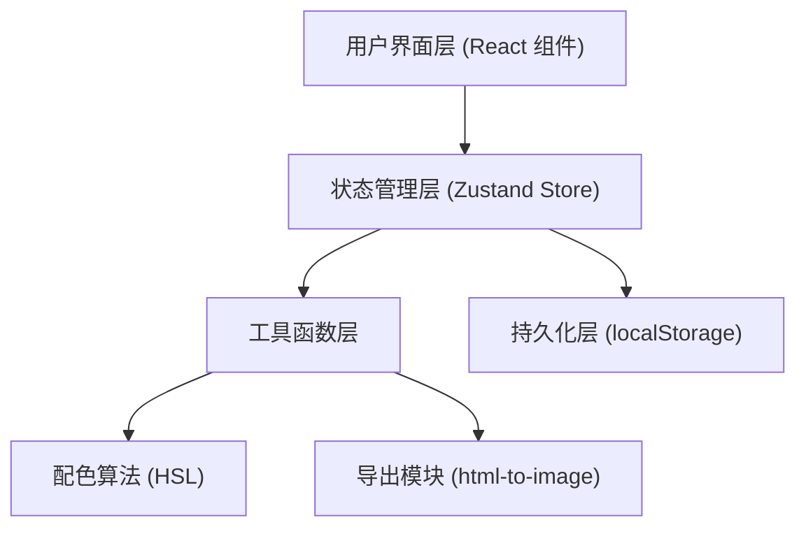
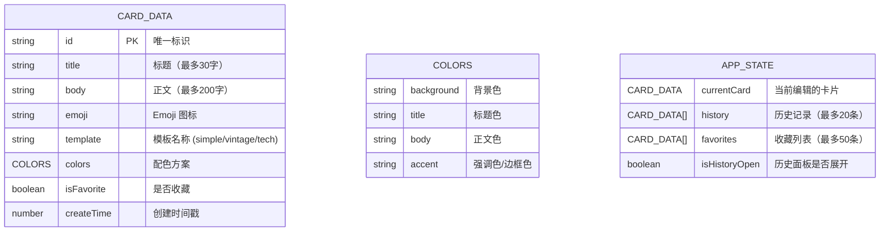

## 1. 架构设计



## 2. 技术说明

- **前端框架**：React 18 + TypeScript
- **构建工具**：Vite
- **状态管理**：Zustand（集中管理卡片数据、历史记录、收藏状态）
- **导出功能**：html-to-image@1.11（将 DOM 转换为 PNG）
- **唯一 ID 生成**：uuid
- **持久化**：localStorage（历史记录、收藏数据）
- **后端**：无（纯前端应用）
- **数据库**：无（使用 localStorage 存储）

## 3. 路由定义

| 路由 | 用途 |
|------|------|
| / | 主应用页面（卡片编辑器+预览+历史面板） |

单页应用，无需多路由。

## 4. 数据模型

### 4.1 数据模型定义



### 4.2 类型定义

```typescript
interface CardColors {
  background: string;
  title: string;
  body: string;
  accent: string;
}

interface CardData {
  id: string;
  title: string;
  body: string;
  emoji: string;
  template: 'simple' | 'vintage' | 'tech';
  colors: CardColors;
  isFavorite: boolean;
  createTime: number;
}

interface TemplateConfig {
  name: string;
  label: string;
  defaultColors: CardColors;
  fontFamily: string;
}
```

## 5. 文件结构

```
.
├── package.json
├── vite.config.js
├── tsconfig.json
├── index.html
└── src/
    ├── main.tsx              # 应用入口
    ├── App.tsx               # 根组件（布局组装）
    ├── store.ts              # Zustand Store
    ├── utils/
    │   ├── colorGenerator.ts # HSL 配色生成算法
    │   └── exportUtils.ts    # 导出功能封装
    ├── constants/
    │   └── templates.ts      # 模板配置常量
    └── components/
        ├── Editor.tsx        # 编辑区组件
        ├── Preview.tsx       # 预览区组件
        ├── HistoryPanel.tsx  # 历史记录面板
        └── Toast.tsx         # 提示组件（如需要）
```

## 6. Store Actions 定义

| Action | 描述 |
|--------|------|
| `updateCard(partial: Partial<CardData>)` | 更新当前卡片数据 |
| `setTemplate(template: string)` | 切换模板并应用默认配色 |
| `generateColors()` | 基于当前模板主色生成 3 套备选配色 |
| `applyColors(colors: CardColors)` | 应用选中的配色方案到卡片 |
| `saveHistory()` | 将当前卡片保存到历史记录（自动去重/限制数量） |
| `restoreCard(id: string)` | 从历史/收藏中恢复卡片到编辑状态 |
| `toggleFavorite(id: string)` | 切换卡片收藏状态 |
| `removeFromHistory(id: string)` | 从历史记录中移除 |
| `toggleHistoryPanel()` | 切换历史面板显示/隐藏 |
