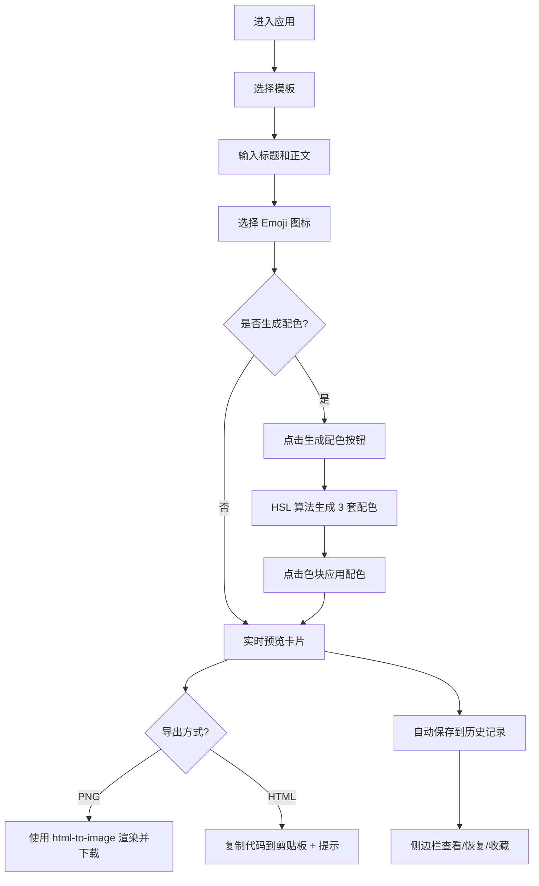

## 1. 产品概述

知识卡片工具是一款在浏览器中快速制作和分享知识卡片的 Web 应用，帮助用户解决手动设计卡片排版耗时且不擅长配色的问题。用户可以选择预设模板、输入内容、一键生成配色方案，并将卡片导出为图片或复制 HTML 代码进行分享。

- 主要用途：快速制作视觉精美的知识卡片，无需设计经验
- 目标用户：知识分享者、自媒体创作者、教师、学生等需要制作卡片式内容的人群
- 产品价值：降低设计门槛，提升内容创作效率

## 2. 核心功能

### 2.1 功能模块

1. **卡片编辑区**：模板选择、标题输入、正文输入、Emoji 选择、配色生成与应用
2. **卡片预览区**：实时预览卡片效果、导出 PNG、复制 HTML 代码
3. **历史记录面板**：历史记录列表、收藏管理、状态恢复

### 2.2 页面详情

| 页面名称 | 模块名称 | 功能描述 |
|----------|----------|----------|
| 主页面 | 模板选择器 | 3 套预设模板（简约白、复古纸、科技蓝），点击切换，带有选中状态高亮 |
| 主页面 | 标题输入框 | 限制 30 字，输入时实时同步到预览区 |
| 主页面 | 正文文本框 | 限制 200 字，行高 1.6，首行缩进 2 字符，输入实时同步 |
| 主页面 | Emoji 选择器 | 24 个预设 Emoji 图标，点击选择，直径 60px 圆形显示 |
| 主页面 | 配色生成器 | "生成配色"按钮点击后基于 HSL 算法生成 3 套备选配色，色块列表展示，点击即应用 |
| 主页面 | 卡片预览区 | 固定尺寸 400x300px，圆角 16px，阴影效果，实时渲染所有编辑内容 |
| 主页面 | 导出功能 | 导出 PNG（2x 分辨率，自动命名下载）、复制 HTML 代码（带成功提示） |
| 主页面 | 历史记录面板 | 侧边栏滑入滑出，显示缩略图+时间，点击恢复，星标收藏，最多 20 条历史+50 条收藏 |

## 3. 核心流程

用户进入应用后，默认显示简约白模板和示例内容。用户选择模板 → 输入标题和正文 → 选择 Emoji → （可选）点击生成配色并选择方案 → 实时预览卡片效果 → 导出 PNG 或复制 HTML 代码分享。编辑过程中自动保存历史记录，用户可随时从侧边栏恢复或收藏卡片。

## 4. 用户界面设计

### 4.1 设计风格

- **主色调**：操作按钮使用 #4A90D9（悬停 #357ABD），整体简洁现代
- **模板配色**：
  - 简约白：背景 #F8F9FA，标题 #212529，正文 #495057，边框 #DEE2E6
  - 复古纸：背景 #F5E6C8，标题 #5C3A21，正文 #7A5C3A，边框 #C4A27A
  - 科技蓝：背景 #E6F2FF，标题 #003366，正文 #004080，边框 #99C2FF
- **按钮样式**：圆角 8px，文字白色，悬停缩放 0.95 倍，点击缩放 0.9 倍，过渡 0.15s
- **字体**：标题自动适配字号（24px-48px），正文字号适中，行高 1.6
- **布局**：左右分栏（桌面端），上下布局（移动端 <900px）
- **动画**：配色切换 0.4s ease-out 淡入淡出，历史面板 0.3s ease-out 滑入

### 4.2 页面设计概览

| 页面名称 | 模块名称 | UI 元素 |
|----------|----------|----------|
| 主页面 | 左侧编辑区（420px，#F0F0F0） | 模板切换按钮组、标题输入、正文文本域、Emoji 网格、配色色块列表、生成配色按钮 |
| 主页面 | 右侧预览区（剩余宽度，#2C2C2C） | 居中的卡片预览（400x300px，圆角 16px，阴影）、导出按钮组 |
| 主页面 | 历史面板（280px，#E8E8E8） | 历史记录列表（缩略图 80x60px，圆角 8px，时间戳，收藏星标）、关闭按钮 |
| 主页面 | 底部工具栏 | "历史"图标按钮（左下角） |

### 4.3 响应式

- **桌面端（≥900px）**：左右分栏布局，左侧编辑区 420px，右侧预览区自适应
- **移动端（<900px）**：上下布局，编辑区在上（100% 宽，320px 高），预览区在下（高度自适应），历史面板改为底部弹出
- 所有可点击区域均考虑触摸优化，最小点击区域不小于 44x44px

## 5. 性能要求

- 配色生成+动画应用：≤ 300ms
- PNG 导出 Canvas 渲染：≤ 500ms
- 页面首次加载：无明显卡顿，交互响应即时
