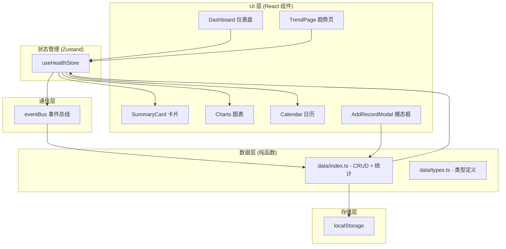

## 1. 架构设计



## 2. 技术描述

- **前端框架**：React@18 + TypeScript@5
- **构建工具**：Vite（含 React 插件）
- **路由**：react-router-dom@6
- **状态管理**：zustand
- **图表库**：recharts
- **工具库**：uuid
- **数据存储**：localStorage（纯前端，无需后端）
- **初始化方式**：使用 `vite-init` 基于 `react-ts` 模板

## 3. 路由定义

| 路由 | 页面 | 用途 |
|-------|------|------|
| `/` | Dashboard 仪表盘 | 周报卡片 + 日历 + 添加记录入口 |
| `/trend` | TrendPage 趋势页 | 折线图/柱状图 + 全量记录表格 |

## 4. 核心类型定义

```typescript
// src/modules/data/types.ts
export interface Medication {
  id: string;
  name: string;
  dosage: string;
  time: string; // ISO time "HH:mm"
  taken: boolean;
}

export interface HealthMetrics {
  systolic?: number;   // 收缩压
  diastolic?: number;  // 舒张压
  bloodSugar?: number; // 血糖 mmol/L
}

export interface HealthRecord {
  id: string;
  date: string;       // ISO date "YYYY-MM-DD"
  timestamp: number;
  medication: Medication;
  metrics: HealthMetrics;
  note?: string;
}

export interface WeeklyStats {
  avgBloodPressure: { systolic: number; diastolic: number };
  adherenceRate: number;     // 0-100 百分比
  abnormalDays: number;
  totalDoses: number;
}

export interface LineChartPoint {
  date: string;
  systolic?: number;
  diastolic?: number;
  bloodSugar?: number;
}

export interface BarChartItem {
  name: string;
  count: number;
}
```

## 5. 项目文件结构

```
auto43/
├── package.json
├── vite.config.js
├── tsconfig.json
├── index.html
└── src/
    ├── main.tsx                 # React 入口 + Router 初始化
    ├── App.tsx                  # 路由配置 + 布局 + 过渡动画
    ├── eventBus.ts              # 跨模块事件总线（pub/sub）
    ├── components/
    │   ├── AddRecordModal.tsx   # 添加记录模态框 + 表单校验
    │   └── Calendar.tsx         # 用药日历组件
    ├── modules/
    │   ├── data/
    │   │   ├── types.ts         # 全部类型定义
    │   │   └── index.ts         # localStorage CRUD + 纯函数统计
    │   └── visual/
    │       ├── Charts/
    │       │   └── index.tsx    # 折线图 + 柱状图组件
    │       ├── Cards/
    │       │   └── SummaryCard.tsx  # 周报摘要卡片
    │       ├── Dashboard.tsx    # 仪表盘首页
    │       └── TrendPage.tsx    # 趋势分析页
    └── store/
        └── useHealthStore.ts    # Zustand store（可选，或内联在模块中）
```

## 6. 数据层纯函数清单

| 函数名 | 输入 | 输出 | 说明 |
|--------|------|------|------|
| `getAllRecords` | - | `HealthRecord[]` | 从 localStorage 读取全部记录 |
| `saveRecord` | `HealthRecord` | `void` | 新增/覆盖写入单条记录 |
| `deleteRecord` | `id: string` | `void` | 按 id 删除记录 |
| `queryByDateRange` | `start, end` | `HealthRecord[]` | 日期范围检索 |
| `queryByMedication` | `records, name` | `HealthRecord[]` | 按药物类型筛选 |
| `computeWeeklyStats` | `records` | `WeeklyStats` | 计算周报核心指标 |
| `prepareLineChartData` | `records, range` | `LineChartPoint[]` | 折线图数据预处理 |
| `prepareBarChartData` | `records` | `BarChartItem[]` | 柱状图用药频率统计 |
| `getMonthlyAverageDoses` | `records` | `number` | 月均服药次数 |
| `getAbnormalRatio` | `records` | `number` | 血压异常比率 |

## 7. 事件总线定义

```typescript
// 事件类型
type EventType =
  | 'record:added'      // 新增记录 → 触发图表/卡片刷新
  | 'record:updated'    // 编辑记录
  | 'record:deleted'    // 删除记录
  | 'range:changed';    // 时间范围切换

// 事件总线 API
eventBus.on(event, callback)
eventBus.off(event, callback)
eventBus.emit(event, payload)
```

## 8. 性能优化策略

1. **数据层**：localStorage 读写统一通过纯函数，避免重复 JSON 解析
2. **Zustand**：使用 selector 精确订阅，避免不必要重渲染
3. **Recharts**：数据点超过 50 自动降采样，保持 50fps+
4. **动画**：CSS 原生 transition/keyframes，避免 JS 动画主线程阻塞
5. **骨架屏**：首屏数据加载时显示 skeleton，提升感知速度
