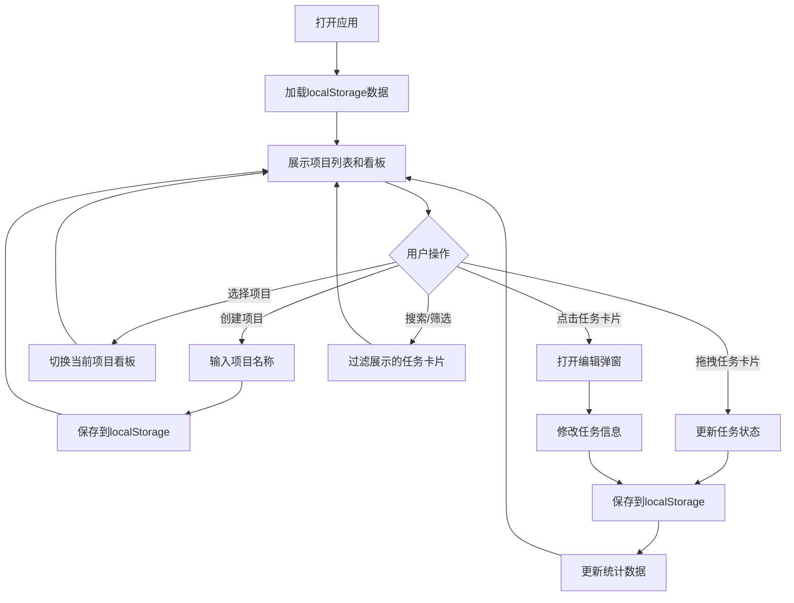

## 1. 产品概述

CollabTask是一款轻量级团队任务看板与协作应用，帮助团队高效管理项目进度、分配任务并实时追踪完成状态。通过直观的看板界面和数据可视化，让团队协作更加透明和高效。

- 核心目标：为小型团队提供简单易用的任务管理工具，无需复杂配置即可上手
- 目标用户：软件开发团队、产品团队、项目管理团队等需要协作完成任务的群体
- 产品价值：提升团队沟通效率，清晰展示任务进度，减少信息不对称

## 2. 核心功能

### 2.1 用户角色

| 角色 | 注册方式 | 核心权限 |
|------|----------|----------|
| 团队成员 | 本地使用（无需注册） | 创建项目、管理任务、分配负责人、查看统计数据 |

### 2.2 功能模块

1. **项目管理**：侧边栏展示项目列表，支持创建和删除项目
2. **任务看板**：三列看板布局（待办、进行中、已完成），支持拖拽排序
3. **任务卡片**：展示任务详情，支持编辑、分配负责人、设置截止日期和优先级
4. **统计仪表盘**：展示项目进度数据，包含环形图和柱状图
5. **搜索与过滤**：支持按标题搜索和按优先级筛选任务

### 2.3 页面详情

| 页面名称 | 模块名称 | 功能描述 |
|---------|----------|----------|
| 主应用页面 | 侧边栏项目管理 | 项目列表展示、添加项目、删除项目、切换项目 |
| 主应用页面 | 统计仪表盘 | 总任务数、已完成数、逾期数统计，环形进度图、成员任务柱状图 |
| 主应用页面 | 搜索过滤栏 | 任务标题搜索框、优先级下拉筛选器 |
| 主应用页面 | 任务看板 | 三列任务列展示、任务卡片拖拽、状态切换 |
| 主应用页面 | 任务卡片 | 任务信息展示、点击编辑弹窗、拖拽操作 |
| 弹窗组件 | 任务编辑弹窗 | 编辑任务标题、负责人、截止日期、优先级 |

## 3. 核心流程

用户打开应用后，首先看到侧边栏的项目列表和默认项目的看板。用户可以：

## 4. 用户界面设计

### 4.1 设计风格

- **主色调**：侧边栏深蓝灰色 #1E293B，主内容区白色 #FFFFFF
- **强调色**：高优先级红色 #EF4444，中优先级橙色 #F59E0B，低优先级绿色 #10B981，图表渐变 #6366F1 到 #A78BFA
- **文字颜色**：主文字 #334155，侧边栏文字 #F8FAFC
- **按钮风格**：圆角设计，悬停时有阴影和位移动画
- **字体**：使用现代无衬线字体，标题粗体带下划线装饰
- **布局风格**：经典侧边栏+主内容布局，卡片式设计，清晰的视觉层次
- **图标风格**：使用简洁的线性图标（lucide-react）

### 4.2 页面设计概述

| 页面名称 | 模块名称 | UI 元素 |
|---------|----------|----------|
| 主应用页面 | 侧边栏 | 宽度280px，背景#1E293B，项目列表，添加项目按钮，删除按钮 |
| 主应用页面 | 统计仪表盘 | 统计卡片展示关键数据，环形进度图，成员任务柱状图 |
| 主应用页面 | 搜索过滤栏 | 搜索框（280px宽，放大镜图标，圆角8px，背景#F1F5F9），优先级下拉筛选 |
| 主应用页面 | 任务看板 | 三列等宽布局，任务列标题，任务卡片区域可滚动 |
| 主应用页面 | 任务卡片 | 背景#F8FAFC，边框#E2E8F0，圆角8px，阴影0 1px 3px rgba(0,0,0,0.06)，悬停阴影加深并上移2px |
| 弹窗组件 | 任务编辑弹窗 | 半透明黑色遮罩#00000080，白色背景，圆角12px，阴影0 8px 32px rgba(0,0,0,0.12) |

### 4.3 响应式设计

- **桌面端（>768px）**：侧边栏固定宽度280px，三列看板水平排列
- **移动端（≤768px）**：侧边栏折叠为汉堡菜单，看板列改为垂直排列，优化触摸交互
- **动画效果**：
  - 拖拽时卡片半透明，平滑移动动画
  - 过滤时卡片淡入淡出（0.3秒过渡）
  - 悬停时卡片阴影加深并轻微上移
  - 状态切换时平滑过渡

### 4.4 性能要求

- 拖拽操作帧率稳定在60FPS
- 搜索过滤响应时间不超过100ms
- 数据持久化使用localStorage，读写操作异步处理不阻塞UI
