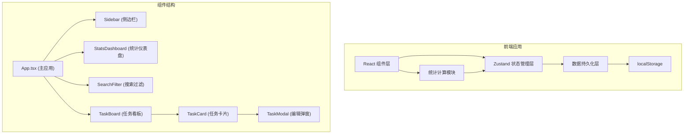

## 1. 架构设计



## 2. 技术描述

- **前端框架**：React@18 + TypeScript
- **构建工具**：Vite@5
- **状态管理**：Zustand
- **拖拽库**：react-beautiful-dnd
- **图表库**：recharts
- **唯一ID生成**：uuid
- **数据持久化**：localStorage（自定义封装）
- **样式方案**：CSS Modules + 内联样式（按用户需求，不使用Tailwind）
- **图标库**：lucide-react

## 3. 目录结构

```
d:\P\tasks\auto44\
├── package.json
├── vite.config.js
├── tsconfig.json
├── index.html
├── src\
│   ├── main.tsx              # React入口
│   ├── App.tsx               # 主应用组件
│   ├── store\
│   │   └── taskStore.ts      # Zustand状态管理
│   ├── modules\
│   │   ├── taskBoard\
│   │   │   ├── TaskBoard.tsx # 看板组件
│   │   │   └── TaskCard.tsx  # 任务卡片组件
│   │   └── stats\
│   │       └── StatsDashboard.tsx # 统计仪表盘
│   ├── components\
│   │   ├── Sidebar.tsx       # 侧边栏组件
│   │   ├── TaskModal.tsx     # 任务编辑弹窗
│   │   └── SearchFilter.tsx  # 搜索过滤组件
│   ├── utils\
│   │   └── dataPersistence.ts # 数据持久化工具
│   ├── types\
│   │   └── index.ts          # TypeScript类型定义
│   └── styles\
│       └── global.css        # 全局样式
```

## 4. 数据模型

### 4.1 类型定义

```typescript
// 任务优先级
type Priority = 'high' | 'medium' | 'low';

// 任务状态
type TaskStatus = 'todo' | 'in-progress' | 'done';

// 团队成员
interface TeamMember {
  id: string;
  name: string;
}

// 任务
interface Task {
  id: string;
  title: string;
  assigneeId: string;
  dueDate: string; // ISO date string
  priority: Priority;
  status: TaskStatus;
  projectId: string;
  createdAt: string;
}

// 项目
interface Project {
  id: string;
  name: string;
  createdAt: string;
}

// Store状态
interface TaskStore {
  projects: Project[];
  tasks: Task[];
  members: TeamMember[];
  currentProjectId: string | null;
  searchQuery: string;
  filterPriority: Priority | 'all';
  
  // 项目操作
  addProject: (name: string) => void;
  deleteProject: (id: string) => void;
  setCurrentProject: (id: string) => void;
  
  // 任务操作
  addTask: (task: Omit<Task, 'id' | 'createdAt'>) => void;
  updateTask: (id: string, updates: Partial<Task>) => void;
  deleteTask: (id: string) => void;
  moveTask: (taskId: string, newStatus: TaskStatus) => void;
  
  // 过滤操作
  setSearchQuery: (query: string) => void;
  setFilterPriority: (priority: Priority | 'all') => void;
  
  // 数据持久化
  loadFromStorage: () => void;
}
```

### 4.2 localStorage键名

- `collabtask_projects`: 项目列表
- `collabtask_tasks`: 任务列表
- `collabtask_members`: 成员列表（预设）
- `collabtask_currentProjectId`: 当前选中的项目ID

## 5. 核心模块说明

### 5.1 数据持久化模块 (dataPersistence.ts)

- `saveToStorage<T>(key: string, data: T): void` - 保存数据到localStorage
- `loadFromStorage<T>(key: string, defaultValue: T): T` - 从localStorage加载数据
- `clearStorage(): void` - 清空所有应用数据

### 5.2 状态管理模块 (taskStore.ts)

- 使用Zustand的`create`函数创建store
- 集成数据持久化，状态变化时自动保存
- 提供派生状态：过滤后的任务列表、各状态任务数量等

### 5.3 统计计算模块

- 计算总任务数、已完成数、逾期数
- 计算各成员的任务分配和完成情况
- 为recharts准备图表数据格式

### 5.4 拖拽模块

- 使用react-beautiful-dnd实现拖拽
- `DragDropContext`包裹整个看板
- `Droppable`对应每一列
- `Draggable`对应每个任务卡片
- 拖拽结束后调用`moveTask`更新状态

## 6. 性能优化策略

1. **状态选择优化**：使用Zustand的selector避免不必要的重渲染
2. **React.memo**：对TaskCard等频繁渲染的组件使用memo
3. **useMemo/useCallback**：过滤逻辑、事件处理函数使用memo缓存
4. **虚拟列表**：当任务数量较多时考虑使用虚拟滚动
5. **防抖搜索**：搜索输入使用防抖处理（但需保证100ms内响应）
6. **CSS硬件加速**：拖拽动画使用transform和opacity，避免重排
