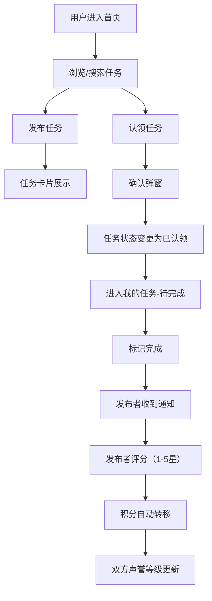

## 1. 产品概述

社区微任务平台是一个帮助邻里之间高效发布和认领小任务的应用。通过积分激励和声誉评价机制，降低邻里互助的信任成本，提升社区生活效率。

- 核心目标：解决邻里小需求（如代收快递、遛狗、借工具等）对接效率低、信任成本高的问题
- 目标用户：社区居民、上班族、老年人等需要或愿意提供邻里互助的群体
- 产品价值：建立高效、可信的社区互助生态，通过积分和声誉体系形成良性循环

## 2. 核心功能

### 2.1 用户角色
| 角色 | 注册方式 | 核心权限 |
|------|----------|----------|
| 普通用户 | 默认登录（模拟） | 发布任务、认领任务、评价、查看积分和声誉 |

### 2.2 功能模块
1. **首页**：任务发布表单、搜索筛选、任务瀑布流展示
2. **我的任务页**：待完成/已完成/已评价任务管理、侧边栏导航
3. **用户主页**：积分余额、声誉等级、历史任务记录

### 2.3 页面详情
| 页面名称 | 模块名称 | 功能描述 |
|-----------|-------------|---------------------|
| 首页 | 任务发布表单 | 标题（200字）、描述（500字）、奖励积分（1-999）、分类标签下拉选择 |
| 首页 | 搜索筛选区 | 关键词搜索框（宽480px圆角）、分类过滤 |
| 首页 | 任务瀑布流 | 3列网格（响应式2列/1列），卡片含标题、摘要、积分、发布者、时间、认领按钮 |
| 首页 | 认领弹窗 | 居中确认弹窗，确认后任务变灰显示"已认领" |
| 我的任务页 | 侧边栏导航 | 宽240px深色背景，状态切换（待完成/已完成/已评价） |
| 我的任务页 | 任务列表 | 任务标题、发布者、状态徽章（绿/黄） |
| 我的任务页 | 完成操作 | 标记完成后通知发布者，发布者可1-5星评分 |
| 通知面板 | 通知下拉 | 红色角标，点击展开，通知项含内容和相对时间 |
| 用户主页 | 积分与等级 | 头像旁显示积分（蓝色#3B82F6）、等级星星、积分变动滚动动画 |
| 用户主页 | 历史记录 | 已完成任务列表、评分记录 |

## 3. 核心流程

**主流程描述**：用户在首页浏览或搜索任务 → 点击认领按钮并确认 → 任务进入"待完成"列表 → 认领者完成后标记完成 → 发布者收到通知并评分 → 积分自动转移，双方声誉更新。

## 4. 用户界面设计

### 4.1 设计风格
- 主色调：灰蓝色体系，背景#F0F4F8，标题#1E293B，辅助文字#64748B
- 强调色：绿色#10B981（完成/认领）、橙色#F97316（积分高亮）、蓝色#3B82F6（积分数字）
- 按钮风格：统一圆角8px，悬浮过渡效果0.2s
- 卡片风格：圆角12px，默认阴影0 2px 6px rgba(0,0,0,0.06)，悬浮加深至0 4px 12px rgba(0,0,0,0.1)并上移2px，过渡0.3s
- 布局风格：卡片式布局，首页三列瀑布流，我的任务页左右分栏

### 4.2 页面设计概览
| 页面名称 | 模块名称 | UI元素 |
|-----------|-------------|----------|
| 首页 | 搜索框 | 顶部居中，宽480px，圆角24px，聚焦边框变蓝，含搜索图标 |
| 首页 | 发布表单 | 白色背景，圆角12px，内边距20px，含loading旋转动画 |
| 首页 | 任务卡片 | 宽320px，#F9FAFB背景，淡入动画（0.4s，间隔0.1s） |
| 首页 | 认领按钮 | #10B981背景，白色文字，悬浮变#059669，过渡0.2s |
| 首页 | 确认弹窗 | 居中白色圆角16px，遮罩半透明#00000050 |
| 我的任务页 | 侧边栏 | 宽240px，#1F2937背景，激活项#374151 |
| 我的任务页 | 内容区 | #F3F4F6背景，状态徽章（绿色完成/黄色待完成） |
| 用户主页 | 积分显示 | 数字滚动动画0.5s ease-out，等级星星SVG |
| 全局 | 通知栏 | 右上角图标+红色角标，下拉式通知列表 |

### 4.3 响应式设计
- 桌面端（≥1024px）：3列瀑布流，完整侧边栏
- 平板端（768px-1023px）：2列瀑布流，侧边栏正常
- 移动端（<768px）：1列布局，侧边栏折叠为汉堡菜单（抽屉动画0.3s缓动）

### 4.4 动画与性能
- 任务卡片淡入：opacity 0→1，0.4s，stagger 0.1s
- 卡片悬浮：阴影加深+上移2px，0.3s
- 积分变动：数字滚动，0.5s ease-out
- 移动端抽屉：侧滑展开，0.3s缓动
- 列表滚动：帧率≥50fps，使用IntersectionObserver实现懒加载
