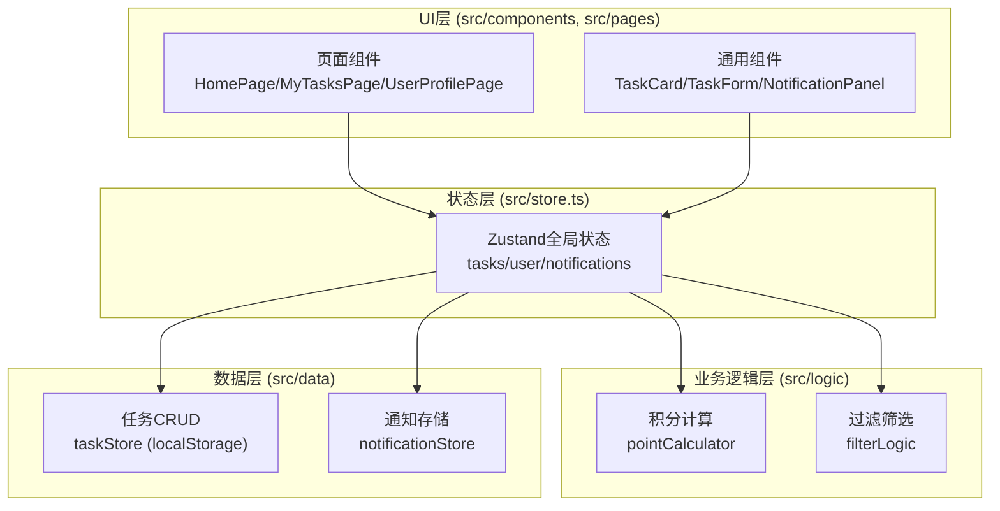

## 1. 架构设计



## 2. 技术栈说明
- 前端框架：React@18 + TypeScript
- 构建工具：Vite（vite.config.js含React插件）
- 状态管理：Zustand（全局store）
- 路由：react-router-dom v6（BrowserRouter）
- 唯一ID：uuid
- 拖拽：react-beautiful-dnd（预留）
- 数据持久化：localStorage封装
- 样式方案：原生CSS（模块化组织）

## 3. 路由定义
| 路由 | 页面 | 用途 |
|-------|------|---------|
| / | HomePage | 首页：任务发布、搜索筛选、瀑布流 |
| /my-tasks | MyTasksPage | 我的任务：状态管理、任务列表 |
| /profile | UserProfilePage | 用户主页：积分、等级、历史记录 |

## 4. 数据模型

### 4.1 数据模型定义

```mermaid
erDiagram
    USER {
        string id PK "用户ID"
        string nickname "昵称"
        string avatar "头像URL"
        number points "积分余额"
        number level "声誉等级1-5"
        number completedCount "已完成任务数"
        number avgRating "平均评分"
    }
    TASK {
        string id PK "任务ID"
        string title "标题≤200字"
        string description "描述≤500字"
        number reward "奖励积分1-999"
        string category "分类标签"
        string publisherId FK "发布者ID"
        string publisherName "发布者昵称"
        string claimantId FK "认领者ID（可空）"
        string claimantName "认领者昵称（可空）"
        string status "状态：open/claimed/completed/reviewed"
        number rating "评分1-5（可空）"
        Date createdAt "创建时间"
        Date claimedAt "认领时间（可空）"
        Date completedAt "完成时间（可空）"
    }
    NOTIFICATION {
        string id PK "通知ID"
        string userId FK "接收用户ID"
        string type "类型：completed/reviewed/claimed"
        string content "通知内容"
        string taskId FK "关联任务ID"
        boolean read 是否已读
        Date createdAt "创建时间"
    }
```

### 4.2 类型定义（TypeScript）
```typescript
// 任务状态
type TaskStatus = 'open' | 'claimed' | 'completed' | 'reviewed';

// 任务分类
type TaskCategory = '跑腿代办' | '家政服务' | '工具借用' | '技能互助' | '宠物照料' | '其他';

interface Task {
  id: string;
  title: string;
  description: string;
  reward: number;
  category: TaskCategory;
  publisherId: string;
  publisherName: string;
  claimantId?: string;
  claimantName?: string;
  status: TaskStatus;
  rating?: number;
  createdAt: Date;
  claimedAt?: Date;
  completedAt?: Date;
}

interface User {
  id: string;
  nickname: string;
  avatar: string;
  points: number;
  level: number;
  completedCount: number;
  avgRating: number;
}

interface Notification {
  id: string;
  userId: string;
  type: 'completed' | 'reviewed' | 'claimed';
  content: string;
  taskId: string;
  read: boolean;
  createdAt: Date;
}
```

## 5. 模块划分

### 5.1 数据层 (src/data/)
| 文件 | 职责 | 导出函数 |
|------|------|----------|
| taskStore.ts | 任务localStorage读写 | initTasks(), getTasks(), getTaskById(), createTask(), updateTask(), deleteTask() |
| notificationStore.ts | 通知localStorage存储 | initNotifications(), getNotifications(), getUnreadCount(), createNotification(), markAsRead(), markAllAsRead() |

### 5.2 业务逻辑层 (src/logic/)
| 文件 | 职责 | 导出函数 |
|------|------|----------|
| pointCalculator.ts | 积分与等级计算（纯函数） | calculateLevel(competedCount, avgRating), transferPoints(publisher, claimant, reward), canAfford(user, reward) |
| filterLogic.ts | 任务过滤筛选 | filterByCategory(tasks, category), filterByKeyword(tasks, keyword), filterByStatus(tasks, status), filterByUser(tasks, userId, role) |

### 5.3 全局状态 (src/store.ts)
Zustand store统一管理：
- tasks: Task[] 任务列表
- currentUser: User 当前登录用户
- notifications: Notification[] 通知列表
- actions: 任务CRUD、认领、完成、评分、通知操作

### 5.4 UI组件层
| 文件 | 职责 |
|------|------|
| components/TaskCard.tsx | 任务卡片渲染，认领按钮、状态标签、淡入动画、懒加载 |
| components/TaskForm.tsx | 任务发布表单，字段验证、loading状态 |
| components/NotificationPanel.tsx | 通知下拉面板，未读角标、通知列表 |
| pages/HomePage.tsx | 首页：搜索框、分类筛选、发布表单、瀑布流 |
| pages/MyTasksPage.tsx | 我的任务：侧边栏、状态切换、任务列表、评分 |
| pages/UserProfilePage.tsx | 用户主页：积分显示、等级、历史任务、积分动画 |

## 6. 性能优化
1. 瀑布流使用CSS Grid + 列数媒体查询响应式
2. IntersectionObserver实现任务卡片懒加载/淡入
3. Zustand选择器（selector）避免不必要的重渲染
4. 使用React.memo优化TaskCard等列表组件
5. 使用useMemo/useCallback缓存过滤结果和回调函数
6. 列表虚拟化（任务量大时）

## 7. 初始化数据（Mock）
- 预置1个模拟用户（id: 'user-1'，昵称：社区好邻居）
- 预置5-8条示例任务覆盖各分类
- 预置2-3条示例通知
