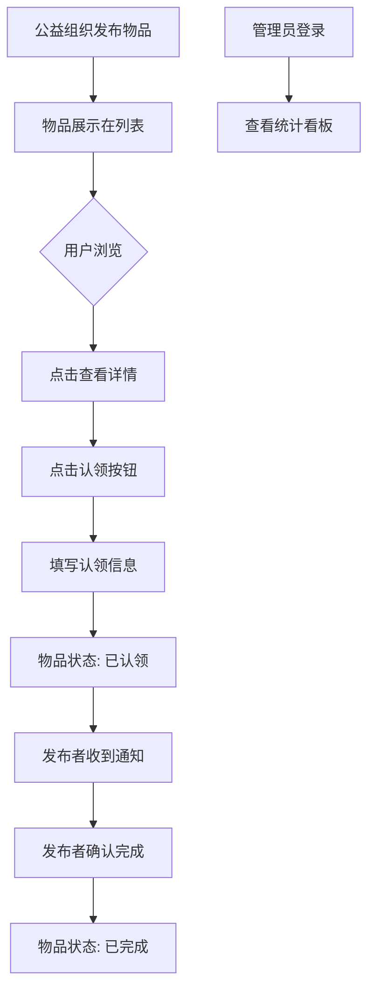

## 1. 产品概述

公益捐助物品发布与认领平台，旨在解决社区公益组织捐赠物资匹配效率低、信息分散、无法跟踪物品流向的问题。平台支持公益组织发布可捐助物品，社区用户浏览并认领物品，管理员查看捐赠统计。

- 目标用户：公益组织（发布者）、社区用户（认领者）、社区管理员
- 核心价值：提高捐赠物资匹配效率，透明化物品流向，提升社区公益参与度

## 2. 核心功能

### 2.1 用户角色

| 角色 | 注册方式 | 核心权限 |
|------|---------|---------|
| 公益组织/发布者 | 无需注册，直接发布 | 发布物品、查看认领信息、确认捐赠完成 |
| 社区用户/认领者 | 无需注册，认领时填写信息 | 浏览物品、认领物品 |
| 社区管理员 | 密码登录（admin123） | 查看捐赠统计看板 |

### 2.2 功能模块

1. **首页/物品列表页**：顶部发布表单、瀑布流物品卡片列表、搜索与筛选
2. **物品详情页**：物品详情展示、认领功能
3. **统计看板页**：捐赠统计数据可视化

### 2.3 页面详情

| 页面名称 | 模块名称 | 功能描述 |
|---------|---------|---------|
| 首页/物品列表页 | 发布表单 | 物品名称、分类、成色、联系人、图片、描述输入 |
| 首页/物品列表页 | 瀑布流卡片 | 展示物品卡片，3列响应式布局 |
| 首页/物品列表页 | 搜索筛选 | 名称搜索、分类多选、成色单选 |
| 物品详情页 | 物品信息 | 详情展示、认领按钮 |
| 物品详情页 | 认领弹窗 | 输入昵称和联系方式 |
| 统计看板页 | 数据统计 | 总数、认领率、趋势图、分类占比 |
| 导航栏 | 顶部导航 | Logo、搜索、通知、管理员入口 |

## 3. 核心流程

### 3.1 发布物品流程
公益组织在首页顶部填写发布表单（物品名称、分类、成色、联系人微信、上传图片、详细描述），提交后物品展示在瀑布流列表中。

### 3.2 认领物品流程
用户浏览物品卡片 → 点击进入详情页 → 点击"认领"按钮 → 填写昵称和联系方式 → 提交认领 → 物品状态变为"已认领" → 发布者收到通知 → 发布者确认完成 → 物品状态变为"已完成"

### 3.3 管理员查看统计
管理员访问 /dashboard → 输入密码 admin123 → 查看捐赠统计看板

## 4. 用户界面设计

### 4.1 设计风格
- 主色调：绿色 #10B981，辅色 #34D399，背景 #ECFDF5
- 卡片风格：圆角、柔和阴影、悬停上移动画
- 按钮：圆角8px，绿色主按钮
- 字体：系统无衬线字体
- 布局：顶部固定导航 + 内容区最大1200px居中

### 4.2 页面设计概述

| 页面名称 | 模块名称 | UI元素 |
|---------|---------|--------|
| 首页 | 发布表单 | 背景#F0FDF4，圆角16px，内边距24px |
| 首页 | 物品卡片 | 宽300px，白色背景，边框#D1D5DB，圆角12px |
| 首页 | 瀑布流 | 3列，间距16px，响应式 |
| 详情页 | 认领按钮 | 绿色#22C55E，圆角8px，悬停变#16A34A |
| 看板页 | 统计图表 | Canvas绘制折线图、饼图 |

### 4.3 响应式
- 桌面端（≥1024px）：瀑布流3列
- 平板端（640-1024px）：瀑布流2列
- 移动端（<640px）：瀑布流单列，导航汉堡菜单，表单100%宽度

### 4.4 动效设计
- 卡片悬停：上移4px，阴影加深，过渡0.3s弹性缓动
- 认领按钮：点击波纹扩散动画
- 筛选结果：透明度0→1，0.3s ease-out
- Toast提示：底部居中，3秒自动消失
