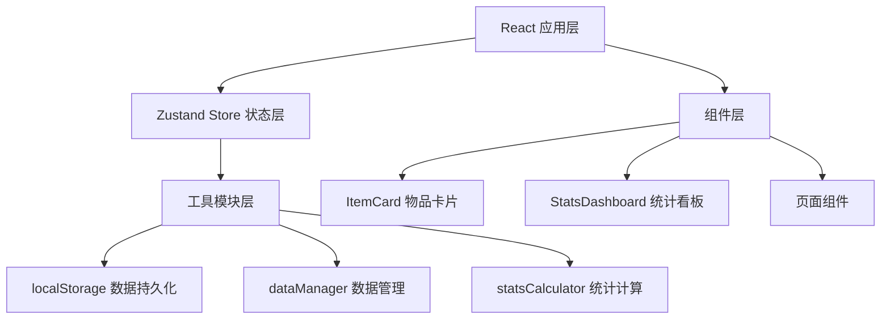
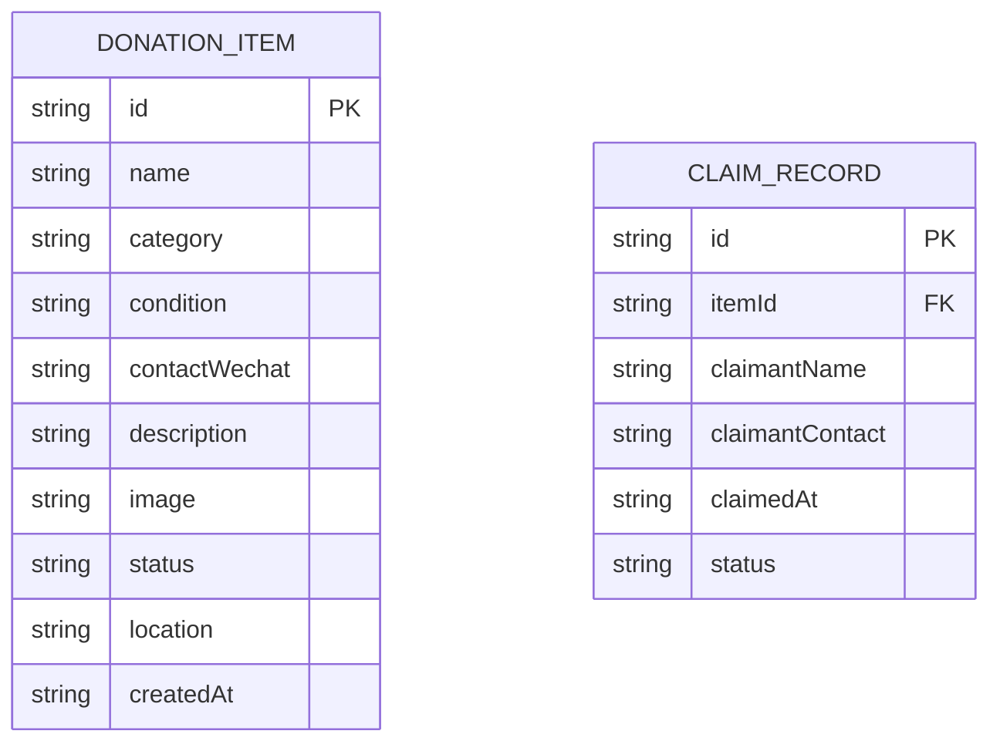

## 1. 架构设计



## 2. 技术说明

- 前端框架：React@18 + TypeScript
- 构建工具：Vite
- 状态管理：Zustand
- 路由：React Router DOM
- 唯一ID生成：uuid
- 数据持久化：localStorage
- 图表绘制：Canvas API（无第三方图表库）
- 样式：CSS + 内联样式

## 3. 路由定义

| 路由 | 用途 |
|-----|------|
| / | 首页/物品列表页，包含发布表单和瀑布流列表 |
| /item/:id | 物品详情页，展示详情和认领功能 |
| /dashboard | 管理员统计看板页 |

## 4. 数据模型

### 4.1 数据模型定义



### 4.2 数据类型定义

```typescript
type ItemCategory = '书籍' | '衣物' | '文具' | '玩具' | '其他';
type ItemCondition = '全新' | '九成新' | '七成新';
type ItemStatus = '待认领' | '已认领' | '已完成';

interface DonationItem {
  id: string;
  name: string;
  category: ItemCategory;
  condition: ItemCondition;
  contactWechat: string;
  description: string;
  image: string;
  status: ItemStatus;
  location: string;
  createdAt: string;
}

interface ClaimRecord {
  id: string;
  itemId: string;
  claimantName: string;
  claimantContact: string;
  claimedAt: string;
  status: '待确认' | '已完成';
}
```

## 5. 文件结构

```
d:\P\tasks\auto48/
├── package.json
├── vite.config.js
├── tsconfig.json
├── index.html
└── src/
    ├── main.tsx
    ├── App.tsx
    ├── store.ts
    ├── components/
    │   ├── ItemCard.tsx
    │   └── StatsDashboard.tsx
    └── utils/
        ├── dataManager.ts
        └── statsCalculator.ts
```
