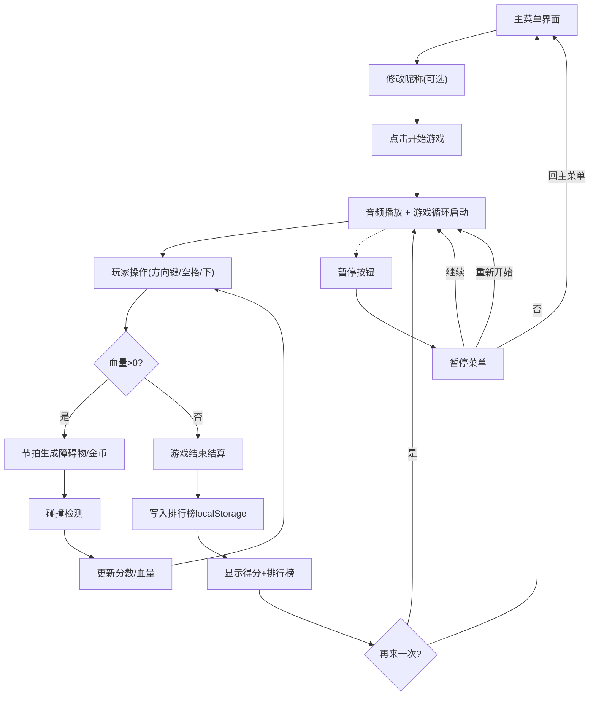

## 1. 产品概述

BeatDash是一款在浏览器中运行的节奏跑酷游戏，玩家跟随音乐节拍操控像素风角色进行跳跃、滑铲和左右移动，躲避障碍物并收集金币。游戏随音乐段落推进逐步提升难度和视觉表现力，为玩家提供沉浸式的节奏游戏体验。
- 目标用户：喜爱音乐节奏游戏和休闲跑酷游戏的玩家群体
- 核心价值：将音乐节奏与跑酷玩法深度结合，通过音画同步带来愉悦的游戏体验

## 2. 核心功能

### 2.1 功能模块
1. **主菜单界面**：游戏标题、开始按钮、昵称修改、操作说明
2. **游戏引擎模块**：Canvas渲染、物理系统、节拍解析、碰撞检测、输入处理
3. **游戏UI模块**：分数显示、血量心形、暂停菜单、节拍脉冲反馈
4. **音频管理模块**：音乐播放、节拍同步、合成音轨生成
5. **结算与排行榜**：游戏结束结算、历史最高分排行榜、本地存储

### 2.2 页面详情
| 页面名称 | 模块名称 | 功能描述 |
|---------|---------|----------|
| 主菜单 | 标题区 | 艺术字游戏标题，带上下浮动动画，紫蓝渐变配色 |
| 主菜单 | 开始按钮 | 绿色圆角按钮，悬停有交互反馈，点击启动游戏 |
| 主菜单 | 昵称输入 | 深色输入框，玩家可自定义昵称，默认"匿名玩家" |
| 主菜单 | 操作说明 | 简洁文字提示键盘操作方式 |
| 游戏界面 | Canvas画布 | 800x600像素，渲染跑道、玩家、障碍物、金币 |
| 游戏界面 | 分数显示 | 顶部居中白色发光文字，实时更新分数 |
| 游戏界面 | 血量显示 | 右上角5颗心形图标，红色满血渐变灰色失血 |
| 游戏界面 | 暂停按钮 | 可点击按钮，弹出暂停菜单遮罩 |
| 游戏界面 | 节拍脉冲 | 屏幕边缘脉冲光晕，随节拍触发，颜色随段落变化 |
| 暂停菜单 | 菜单面板 | 半透明遮罩+居中面板，含继续/重开/回主菜单三按钮 |
| 结算界面 | 得分展示 | 本次得分、金币数、存活时间统计 |
| 结算界面 | 再来一次 | 紫色圆角按钮，带按下缩放动画 |
| 结算界面 | 排行榜 | 前10名历史最高分，金银铜排名高亮，可滚动 |

## 3. 核心流程

玩家打开游戏进入主菜单，可修改昵称后点击开始按钮进入游戏。游戏开始后音乐播放，玩家通过方向键左右移动、空格跳跃、下箭头滑铲，在节拍点躲避紫色柱子障碍物并收集金色金币。碰撞障碍物扣血，血量归零游戏结束。游戏过程中可随时暂停。游戏结束后显示本次成绩和历史排行榜，玩家可选择再来一次或返回主菜单。

## 4. 用户界面设计

### 4.1 设计风格
- **主色调**：深色赛博朋克风，主背景#0B0B1A，辅助背景#1A1A2E
- **强调色**：紫色渐变#6C5CE7 → #A29BFE，按钮主色绿色#00B894、紫色#6C5CE7
- **辅助色**：玩家蓝#3498DB、起跳绿#2ECC71、滑铲红#E74C3C、障碍紫#8E44AD、金币金#FFD700
- **按钮风格**：统一圆角8-12px，背景色+悬停渐变色，0.25s过渡，点击缩放反馈
- **字体**：Google Fonts "Press Start 2P" 像素风字体
- **布局风格**：Canvas居中布局，UI元素贴边排列，不遮挡游戏区域
- **动效风格**：CSS过渡/动画，节拍脉冲光晕，标题浮动，按钮缩放

### 4.2 页面设计概览
| 页面名称 | 模块名称 | UI元素设计 |
|---------|---------|-----------|
| 主菜单 | 标题 | 64px像素艺术字，紫蓝渐变，translateY±5px浮动2s周期 |
| 主菜单 | 开始按钮 | 宽200x高50px，背景#00B894，圆角25px，悬停#55EFC4，scale(0.95)按压 |
| 主菜单 | 昵称输入 | 240x40px，背景#2D3436，边框#636E72，圆角8px，白色文字 |
| 主菜单 | 操作说明 | 小字号白色文字，简洁列出操作按键 |
| 游戏界面 | Canvas | 800x600居中，桌面左右留边，移动端90%宽度等比缩放 |
| 游戏界面 | 分数 | 顶部居中，32px白色文字，text-shadow发光特效 |
| 游戏界面 | 血量 | 右上5颗心形，红色#FF4B4B→灰色#444渐变失血 |
| 游戏界面 | 暂停按钮 | 右上位置，桌面≥44x44px触摸区域，移动端移至左下 |
| 游戏界面 | 脉冲光晕 | 屏幕边缘环形光晕，节拍触发，前奏蓝#4A90D9/主歌绿#2ECC71/副歌橙红#E74C3C |
| 暂停菜单 | 遮罩+面板 | #00000080半透明遮罩，居中圆角面板，三按钮#2D2D4A→悬停#4A4A7A |
| 结算界面 | 得分展示 | 大号白色像素字，分行展示得分/金币/时间 |
| 结算界面 | 排行榜 | 360px宽，#1A1A2EDD半透明，圆角16px，内边距20px，自定义滚动条 |

### 4.3 响应式设计
- **桌面优先**：Canvas 800x600居中，UI元素原尺寸排列
- **窗口宽度<900px**：Canvas等比缩放到窗口宽度90%，高度保持比例
- **小屏幕UI缩放**：分数/血量/暂停按钮缩小到80%
- **布局重排**：暂停按钮移至左下角，避免遮挡游戏画面
- **触摸区域**：所有可点击元素≥44x44px，确保移动端可操作
- **元素防重叠**：UI贴边排列，预留安全间距

## 5. 性能约束
- **帧率**：游戏循环稳定60FPS，使用requestAnimationFrame
- **节拍同步**：音画同步误差<50ms，节拍检测误差≤±100ms
- **存储性能**：localStorage读写操作<10ms完成
- **渲染优化**：Canvas矩形碰撞检测高效，避免过度重绘
