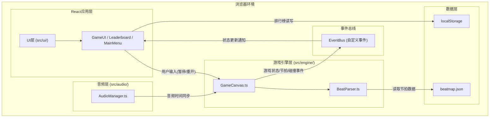

## 1. 架构设计



**数据流向说明：**
1. 游戏启动：MainMenu → GameCanvas初始化 → AudioManager播放音乐 → AudioManager.currentTime同步到GameCanvas
2. 游戏循环：requestAnimationFrame(60FPS) → GameCanvas读取音频时间 → BeatParser解析节拍 → 生成障碍物/金币 → 碰撞检测 → 更新状态 → EventBus派发gameState事件 → GameUI订阅并渲染
3. 事件通信：GameCanvas通过EventBus派发{type: 'gameState' | 'beat' | 'collision' | 'gameOver'}事件，UI组件useEffect订阅
4. 排行榜：gameOver事件触发 → Leaderboard读取localStorage → 写入新分数 → 排序渲染Top10

## 2. 技术描述
- **前端框架**：React@18 + ReactDOM@18（函数组件+Hooks）
- **开发语言**：TypeScript（严格模式 strict: true）
- **构建工具**：Vite@5（含@vitejs/plugin-react插件，target es2020）
- **样式方案**：原生CSS + CSS Modules + CSS变量主题
- **渲染方案**：HTML5 Canvas 2D API（游戏画面）+ React DOM（UI层）
- **音频方案**：Web Audio API（合成320BPM节拍音轨）
- **存储方案**：localStorage（排行榜持久化，键名"leaderboard"）

## 3. 文件结构与调用关系

```
auto49/
├── package.json              # 依赖配置: react@18, react-dom@18, typescript, vite@5, @vitejs/plugin-react
├── vite.config.js            # Vite配置: React插件, build.target=es2020
├── tsconfig.json             # TS配置: strict=true, target=es2020, jsx=react-jsx
├── index.html                # 入口HTML: #0B0B1A背景, 全屏#root容器, Google Fonts
└── src/
    ├── main.tsx              # [入口] ReactDOM.createRoot挂载App到div#root
    ├── App.tsx               # [根组件] 状态机管理 MainMenu/Playing/GameOver
    ├── assets/
    │   └── beatmap.json      # [数据] 内置节拍数据: 三段落(前奏/主歌/副歌)时间戳数组
    ├── core/
    │   └── EventBus.ts       # [基础设施] 单例事件总线: on/off/emit，跨模块通信
    ├── engine/
    │   ├── types.ts          # [类型定义] Player/Obstacle/Coin/GameState等TypeScript接口
    │   ├── GameCanvas.ts     # [引擎核心] 初始化Canvas、游戏循环、输入、碰撞、状态派发
    │   ├── BeatParser.ts     # [节拍解析] getNextBeat()/isOnBeat()，读取beatmap.json
    │   └── Physics.ts        # [物理系统] 抛物线跳跃、滑铲计时、矩形碰撞AABB
    ├── audio/
    │   └── AudioManager.ts   # [音频管理] Web Audio合成鼓点贝斯，play/pause/getCurrentTime
    └── ui/
        ├── MainMenu.tsx      # [UI] 主菜单: 标题/开始按钮/昵称输入/操作说明
        ├── GameUI.tsx        # [UI] 游戏HUD: 分数/血量/暂停按钮/脉冲光晕/暂停菜单
        ├── Leaderboard.tsx   # [UI] 排行榜: localStorage读写/Top10排序/金银铜样式
        └── GameOver.tsx      # [UI] 结算页: 得分统计/再来一次按钮/嵌入Leaderboard
```

**调用关系（关键链路）：**
1. `App.tsx` → 状态切换 → 渲染 `MainMenu.tsx` 或 `GameUI.tsx` + `GameCanvas.ts` 或 `GameOver.tsx`
2. `GameCanvas.ts` 构造时 → 实例化 `BeatParser.ts` 和 `Physics.ts`
3. `GameCanvas.ts` 每帧 → `BeatParser.isOnBeat(audioTime)` → 决定障碍物/金币生成
4. `GameCanvas.ts` 每帧 → `Physics.updatePlayer()` / `checkCollisions()` → 更新状态
5. `GameCanvas.ts` 每帧 → `EventBus.emit('gameState', state)` → `GameUI.tsx` 订阅刷新
6. `AudioManager.ts` play()后 → 每帧通过回调 → 传递currentTime给 `GameCanvas.ts`
7. `GameUI.tsx` 暂停按钮 → `EventBus.emit('pauseToggle')` → `GameCanvas.ts` 暂停循环
8. `GameOver.tsx` → 读取localStorage → 调用 `Leaderboard.tsx` → 读写排行榜

## 4. 核心类型定义

```typescript
// src/engine/types.ts
export interface Player {
  x: number;          // 水平位置(px), 范围: 跑道左-跑道右
  y: number;          // 垂直位置(px), 基准地面
  width: number;      // 24px, 滑铲时不变
  height: number;     // 40px正常, 20px滑铲
  velocityY: number;  // 垂直速度, 跳跃用
  state: 'idle' | 'jumping' | 'sliding';
  stateTimer: number; // 状态剩余时间(秒)
  color: string;      // 随状态变化
}

export interface Obstacle {
  x: number;          // 水平位置(随滚动递减)
  y: number;          // 地面位置
  width: number;      // 20px
  height: number;     // 40px
  lane: 'left' | 'right';
  color: string;      // #8E44AD
}

export interface Coin {
  x: number;
  y: number;          // 跑道中央高度
  radius: number;     // 6px (直径12px)
  collected: boolean;
  value: number;      // 10或20(副歌翻倍)
}

export type SongSection = 'intro' | 'verse' | 'chorus';

export interface GameState {
  player: Player;
  obstacles: Obstacle[];
  coins: Coin[];
  score: number;
  health: number;     // 0-5
  beatIndex: number;  // 当前节拍索引
  section: SongSection;
  coinsCollected: number;
  survivalTime: number;  // 存活秒数
  isPaused: boolean;
  isGameOver: boolean;
}

// EventBus事件类型
export type GameEventType = 
  | 'gameState'        // 每帧派发, payload: GameState
  | 'beat'             // 节拍触发, payload: {index, section}
  | 'collision'        // 碰撞, payload: {type:'obstacle'|'coin', damage?}
  | 'gameOver'         // 游戏结束, payload: {score, coins, time}
  | 'pauseToggle';     // 暂停切换

// 排行榜条目
export interface LeaderboardEntry {
  rank: number;
  name: string;        // 默认"匿名玩家"
  score: number;
  timestamp: number;
}
```

## 5. 关键算法与常量

### 5.1 游戏常量 (src/engine/constants.ts)
```typescript
export const CANVAS_WIDTH = 800;
export const CANVAS_HEIGHT = 600;
export const GROUND_Y = 480;          // 地面Y坐标
export const LANE_LEFT_X = 280;       // 左道中心
export const LANE_CENTER_X = 400;     // 中央金币道
export const LANE_RIGHT_X = 520;      // 右道中心
export const LANE_WIDTH = 100;
export const PLAYER_SPEED = 4;        // 每帧像素
export const JUMP_HEIGHT = 60;        // 总跳跃高度
export const JUMP_UP_TIME = 0.3;      // 上升时间(秒)
export const JUMP_DOWN_TIME = 0.3;    // 下落时间(秒)
export const SLIDE_DURATION = 0.5;    // 滑铲持续(秒)
export const SCROLL_SPEED_BASE = 5;   // 基础滚动速度
export const BEAT_TOLERANCE_MS = 100; // 节拍检测容差
export const INITIAL_HEALTH = 5;
export const COIN_VALUE_NORMAL = 10;
export const COIN_VALUE_CHORUS = 20;
```

### 5.2 物理算法
- **跳跃抛物线**：velocityY计算：上升期 `v = (2*height/upTime) - g*t`，g=`2*height/upTime²`，确保0.3s到达顶点60px
- **滑铲**：状态机，state='sliding'时height=20，持续0.5s后自动恢复
- **碰撞检测AABB**：
  - 玩家矩形 `{x, y, w, h}` 与障碍矩形相交检测
  - 玩家矩形圆心与金币圆心距离 < (玩家半宽+半径) 检测

### 5.3 节拍生成策略
| 段落 | 节拍频率 | 障碍物 | 金币 | 背景效果 |
|------|---------|--------|------|----------|
| Intro前奏 | 每拍1对 | 左右各1柱(#8E44AD) | 每2拍1个(10分) | 蓝色脉冲#4A90D9 |
| Verse主歌 | 每拍1对 | 左右各1柱 | 每2拍1个(10分) | 绿色脉冲#2ECC71 |
| Chorus副歌 | 每拍2对(翻倍) | 左右各2柱 | 每拍1个(20分) | 橙红脉冲#E74C3C+背景闪烁 |

## 6. 性能保障
- **requestAnimationFrame固定循环**：使用时间戳差值(deltaTime)校正，避免高刷新率屏幕加速
- **对象池**：障碍物/金币对象复用，减少GC压力
- **Canvas脏区渲染**：仅重绘变化区域（简化实现：每帧全清重绘，但800x600分辨率足够轻量）
- **事件节流**：EventBus派发gameState合并到RAF帧中，UI订阅直接使用状态引用
- **localStorage异步化**：读写操作包裹在微任务中避免阻塞主线程
