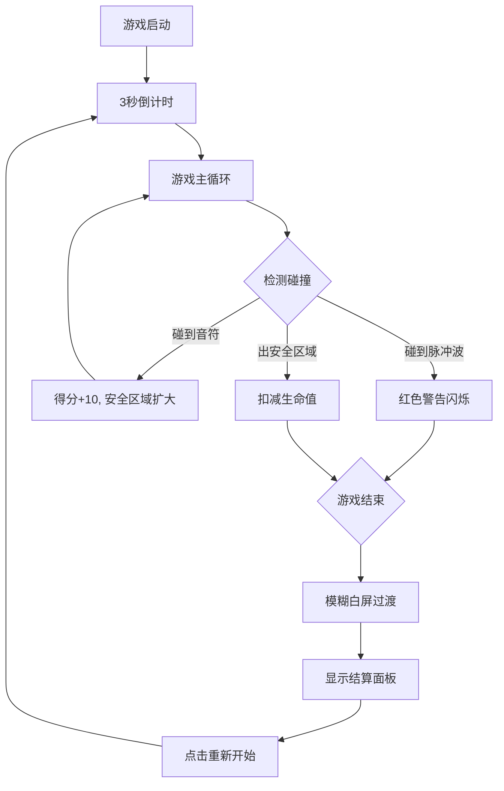

## 1. 产品概述

EchoDodge是一款节奏躲避类休闲游戏，玩家控制一个发光小球在不断收缩的圆形安全区域内躲避脉冲波攻击，同时拾取音符获得分数和奖励。游戏融合了反应速度、空间判断和资源管理等元素，为玩家提供紧张刺激的游戏体验。

- 核心玩法：躲避 + 收集，考验玩家的反应和策略
- 目标用户：休闲游戏玩家、音乐节奏游戏爱好者

## 2. 核心功能

### 2.1 功能模块

1. **游戏主场景**：Canvas渲染、小球控制、安全区域、脉冲波生成
2. **碰撞检测系统**：空间哈希优化的碰撞检测
3. **计分系统**：音符收集得分、生存时间计算
4. **生命值系统**：安全区域外扣血、生命耗尽游戏结束
5. **粒子特效系统**：音符拾取闪光、脉冲波轨迹残留
6. **游戏流程控制**：3秒倒计时、游戏结束过渡动画、结算面板

### 2.2 页面详情

| 页面名称 | 模块名称 | 功能描述 |
|---------|---------|---------|
| 游戏场景 | 倒计时模块 | 3秒倒计时数字渐显动画，游戏开始前显示 |
| 游戏场景 | 主游戏模块 | 渲染小球、脉冲波、音符、安全区域 |
| 游戏场景 | HUD模块 | 分数显示、生命值方块、安全区域进度条 |
| 结算面板 | 游戏结束模块 | 模糊白屏过渡、显示最终分数、重新开始按钮 |

## 3. 核心流程

## 4. 用户界面设计

### 4.1 设计风格

- **主色调**：深紫蓝色系背景（#0A0A1A → #1A1A3A渐变）
- **强调色**：
  - 金色小球 #FFD700（发光模糊4px）
  - 青色安全区域 #00E5FF（半透明描边）
  - 脉冲波三色：#FF6B6B（红）、#48C9B0（青）、#F39C12（橙）
  - 红色生命值 #FF4444
- **字体**：monospace等宽字体
- **整体风格**：科幻发光效果，暗色调+高对比明亮元素

### 4.2 页面设计概览

| 页面名称 | 模块名称 | UI元素 |
|---------|---------|--------|
| 游戏场景 | 背景 | Canvas全屏、#0A0A1A到#1A1A3A径向渐变 |
| 游戏场景 | 安全区域 | 圆形区域，青色描边，内部径向渐变填充，持续收缩 |
| 游戏场景 | 玩家小球 | 金色圆形，发光效果，键盘方向键控制 |
| 游戏场景 | 脉冲波 | 圆形彩色球体，从四周向中心发射，带轨迹残留 |
| 游戏场景 | 音符 | 金色圆点，缓慢旋转闪烁，1秒周期 |
| 游戏场景 | HUD-分数 | 右上角，20px monospace，白色带发光 |
| 游戏场景 | HUD-生命 | 左上角，三个12x12红色方块 |
| 游戏场景 | HUD-进度条 | 顶部中央，200x6px，青色填充显示安全区域半径 |
| 结算面板 | 过渡效果 | 画面逐渐模糊至完全白屏 |
| 结算面板 | 内容 | 显示最终分数、重新开始按钮 |

### 4.3 响应式设计

- 桌面端优先设计，Canvas自适应窗口大小
- 游戏区域以中心为原点，圆形安全区域根据窗口最小边计算

## 5. 性能要求

- 游戏循环稳定60FPS
- 脉冲波数量上限100个
- 碰撞检测使用空间哈希优化
- Canvas渲染使用requestAnimationFrame
