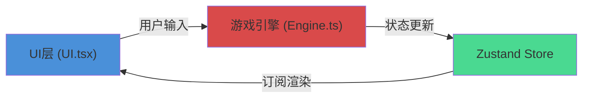

## 1. 架构设计



## 2. 技术说明

- **前端框架**：React@18 + TypeScript
- **构建工具**：Vite
- **状态管理**：Zustand
- **唯一ID生成**：uuid
- **渲染方式**：Canvas 2D API
- **游戏循环**：requestAnimationFrame

## 3. 文件结构

```
.
├── package.json
├── vite.config.js
├── tsconfig.json
├── index.html
└── src/
    ├── Engine.ts        # 游戏引擎：脉冲波生成、碰撞检测、计分逻辑
    ├── UI.tsx           # React组件：Canvas渲染、HUD、用户输入
    └── main.tsx         # 应用入口
```

## 4. 核心数据模型

### 4.1 游戏状态 (Zustand Store)

```typescript
interface GameState {
  // 游戏状态
  phase: 'countdown' | 'playing' | 'gameover';
  countdown: number;
  
  // 玩家
  ball: { x: number; y: number; radius: number };
  
  // 安全区域
  safeZone: { radius: number; initialRadius: number };
  
  // 游戏对象
  pulses: Pulse[];
  notes: Note[];
  particles: Particle[];
  trails: Trail[];
  
  // 数值
  score: number;
  lives: number;
  
  // 特效
  flashAlpha: number; // 红色警告闪烁
  blurAmount: number; // 结束模糊过渡
  
  // 输入指令
  input: { up: boolean; down: boolean; left: boolean; right: boolean };
}
```

### 4.2 脉冲波

```typescript
interface Pulse {
  id: string;
  x: number;
  y: number;
  vx: number;
  vy: number;
  radius: number;
  color: string;
}
```

### 4.3 音符

```typescript
interface Note {
  id: string;
  x: number;
  y: number;
  rotation: number;
  flashPhase: number;
}
```

### 4.4 粒子

```typescript
interface Particle {
  id: string;
  x: number;
  y: number;
  vx: number;
  vy: number;
  life: number;
  maxLife: number;
  color: string;
}
```

## 5. 核心算法

### 5.1 空间哈希碰撞检测

- 将画布划分为网格（cellSize = max(脉冲波最大半径, 小球半径) * 2）
- 每帧重建空间哈希表
- 仅检测相邻网格内的对象，减少O(n²)复杂度

### 5.2 脉冲波生成

- 每帧从随机角度生成3个脉冲波
- 从屏幕边缘外一点向中心方向发射
- 速度恒定2.5px/帧，半径6-16px随机

### 5.3 安全区域收缩

- 每帧收缩0.5px
- 拾取音符时短暂扩大+20px

## 6. 引擎模块数据流

1. **输入阶段**：React组件捕获键盘事件，写入store的input字段
2. **更新阶段**（Engine.update每帧调用）：
   - 根据input更新小球位置
   - 收缩安全区域
   - 生成新脉冲波
   - 更新脉冲波位置，记录轨迹
   - 空间哈希碰撞检测
   - 处理碰撞结果（游戏结束/得分/扣命）
   - 更新粒子生命
   - 刷新音符
3. **渲染阶段**（UI组件订阅store变化）：
   - Canvas重绘所有元素
   - HUD更新分数/生命/进度条
