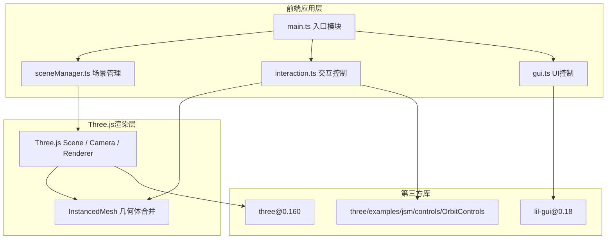

## 1. 架构设计


## 2. 技术说明
- 前端框架：原生 TypeScript（无React/Vue，直接操作Three.js API）
- 3D渲染：three@0.160
- UI控制面板：lil-gui@0.18
- 构建工具：Vite（原生TS模板）
- 语言目标：ES2020 + TypeScript严格模式
- 后端：无（纯前端应用，所有状态内存管理）
- 数据库：无

## 3. 项目文件结构
| 文件路径 | 用途说明 |
|-------|---------|
| package.json | 依赖配置：three@0.160, lil-gui@0.18，dev脚本 |
| vite.config.js | Vite构建配置 |
| tsconfig.json | TypeScript配置（严格模式，target es2020） |
| index.html | 入口HTML，全屏容器，黑色背景，无滚动条 |
| src/main.ts | 入口，初始化Scene/PerspectiveCamera/WebGLRenderer，阴影抗锯齿，动画循环 |
| src/sceneManager.ts | 体素网格管理：创建/更新InstancedMesh，添加/移除方块方法，方块数据数组 |
| src/interaction.ts | Raycaster鼠标点击/拖拽，坐标网格取整，OrbitControls相机控制 |
| src/gui.ts | lil-gui面板：10色选择、画刷1-5、放置/移除/查看模式切换、清空场景 |

## 4. 核心数据结构
### 4.1 体素数据模型
```typescript
// 单个方块数据
interface Voxel {
  x: number;      // 网格X坐标 (0-19)
  y: number;      // 网格Y坐标 (0-19)
  z: number;      // 网格Z坐标 (0-19)
  color: string;   // 颜色十六进制字符串
  isGround: boolean; // 是否为地面层（不可删除）
  scale: number;    // 动画用缩放值 (0-1)
}

// 场景状态
interface SceneState {
  voxels: Map<string, Voxel>;  // key: "x,y,z"
  instancedMesh: InstancedMesh;
  groundCount: number;
  dirty: boolean;
}

// 编辑状态
interface EditState {
  mode: 'place' | 'remove' | 'view';
  currentColor: string;
  brushSize: number;
}
```

## 5. 关键实现方案
### 5.1 InstancedMesh性能优化
- 使用单一BoxGeometry + 单一MeshStandardMaterial数组
- 每种颜色维护一个InstancedMesh，按颜色分组渲染
- 每次数据变更时调用instanceMatrix.needsUpdate = true
- 限制总数上限8000实例

### 5.2 射线拾取
- Raycaster.intersectObjects([instancedMeshes, groundPlane]
- 命中方块：取面法线计算相邻空位
- 画刷范围：以命中点为中心，brushSize为半径的立方体区域
- 放置动画：通过更新instanceMatrix逐帧插值scale (0→1，0.3秒)

### 5.3 清空动画
- 遍历非地面方块，逐方块随机方向添加velocity
- requestAnimationFrame帧更新position + rotation
- 动画结束后从voxels Map移除，更新InstancedMesh
