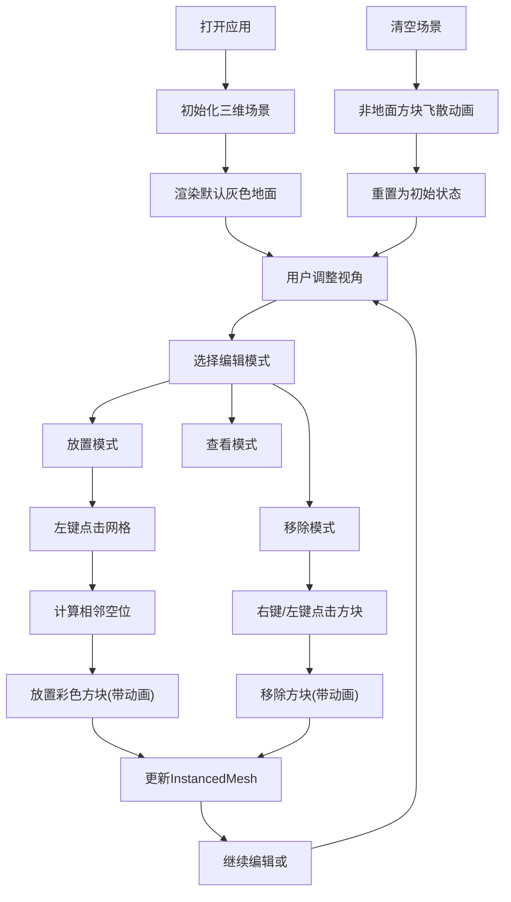

## 1. 产品概述
VoxelForge 是一个基于Web的3D体素世界构建与编辑应用，让用户通过直观的鼠标交互在三维网格空间中自由创作立体场景。
- 主要目的：提供简单易用的3D体素编辑工具，支持用户快速构建和可视化立体像素艺术
- 目标用户：体素艺术家、游戏设计师、教育工作者及创意爱好者
- 产品价值：降低3D创作门槛，在浏览器中即可完成体素场景的构建与预览

## 2. 核心功能

### 2.1 功能模块
1. **主编辑场景**：三维体素网格空间、光照系统、地面辅助网格
2. **交互控制**：方块放置/移除、视角旋转与缩放、画刷系统
3. **UI控制面板**：颜色选择器、画刷大小调节、编辑模式切换、场景清空

### 2.2 功能详情
| 页面名称 | 模块名称 | 功能描述 |
|-----------|-------------|---------------------|
| 主编辑场景 | 三维网格空间 | 20×20×20网格，y=0层默认灰色地面，紧密排列的体素方块 |
| 主编辑场景 | 光照系统 | 环境光(强度0.4) + 方向光(强度0.8，位置(10,20,10)) |
| 主编辑场景 | 地面辅助网格 | 半透明#444444网格线，间距1 |
| 交互控制 | 方块放置 | 左键点击网格表面，在相邻空位放置当前颜色方块，带缩放动画 |
| 交互控制 | 方块移除 | 右键点击现有方块将其移除，带动画 |
| 交互控制 | 视角控制 | 鼠标拖拽旋转视角(OrbitControls)，滚轮缩放(范围1-50) |
| 交互控制 | 画刷系统 | 画刷大小1-5，批量放置/移除区域内方块 |
| UI控制面板 | 颜色选择 | 10种预设颜色：红、橙、黄、绿、青、蓝、紫、粉、棕、白 |
| UI控制面板 | 编辑模式 | 放置模式/移除模式/查看模式切换 |
| UI控制面板 | 清空场景 | 一键移除所有非地面方块，方块下落飞散动画(0.5秒) |
| UI控制面板 | 面板样式 | 左上角，#222222背景，220px宽，圆角8px，可折叠 |

## 3. 核心流程
用户打开应用 → 看到默认灰色地面的20×20×20网格空间 → 通过鼠标拖拽调整视角 → 选择颜色和画刷大小 → 切换到放置模式 → 左键点击网格表面放置彩色方块 → 切换到移除模式或使用右键 → 点击方块进行移除 → 可随时点击清空按钮重置场景（保留地面）

## 4. 用户界面设计
### 4.1 设计风格
- 主背景色：纯黑#000000（全屏沉浸式）
- UI面板背景：#222222（深灰色，与3D场景形成层次）
- 文字颜色：#EEEEEE（浅灰确保可读性）
- 主色调：10种鲜艳预设色（方块颜色），配合深色背景
- 按钮风格：扁平设计，圆角，悬停时背景变亮（微交互）
- 字体：系统等宽字体，14px
- 布局风格：全屏3D画布 + 左上角浮动控制面板（可折叠）

### 4.2 页面设计概览
| 页面名称 | 模块名称 | UI元素 |
|-----------|-------------|-------------|
| 主编辑页面 | 3D场景画布 | 全屏黑色背景，体素方块，光照阴影，地面辅助网格 |
| 主编辑页面 | 控制面板(左上) | 标题、颜色选择器(10色方块网格)、画刷大小滑块、模式切换(单选按钮组)、清空按钮、折叠按钮 |
| 主编辑页面 | 动画效果 | 方块缩放放置动画、方块飞散移除动画、按钮悬停高亮、面板折叠过渡 |

### 4.3 响应式
- 桌面端优先设计，全屏3D画布自适应窗口大小
- 控制面板固定220px宽度，左上角绝对定位
- 支持窗口resize事件，自动调整渲染器尺寸

### 4.4 3D场景指引
- 环境：深黑色背景营造沉浸感，体素方块为主角
- 光照：环境光+方向光组合，方向光开启阴影，营造立体感
- 相机：PerspectiveCamera，初始位置可俯瞰全局，OrbitControls自由操控
- 构图：20×20×20立方体空间居中，地面层为视觉基底
- 交互动画：方块放置/移除缩放动画(0.3s)，清空场景飞散动画(0.5s)
- 性能：使用InstancedMesh合并几何体，限制方块总数≤8000
