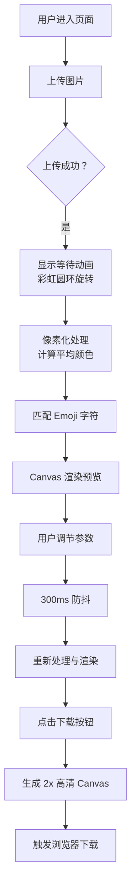

## 1. 产品概述

EmojiMosaic 是一款基于 Web 的图片创意工具，让用户上传任意图片并自动转换为由 Emoji 字符拼成的马赛克艺术画。用户可通过直观的控制面板实时调节马赛克颗粒度、Emoji 风格和颜色匹配精度，最终导出高清作品。

- **主要用途：将普通照片转化为富有创意的 Emoji 拼贴画，适用于社交媒体分享、个性化头像制作
- **目标用户：设计爱好者、社交媒体用户、普通用户
- **市场价值：低门槛、高趣味性的创意工具，满足用户个性化内容创作需求

## 2. 核心功能

### 2.1 用户角色

| 角色 | 注册方式 | 核心权限 |
|------|----------|----------|
| 普通用户 | 无需注册 | 上传图片、调节参数、预览效果、下载作品 |

### 2.2 功能模块

1. **主页面**：图片上传区、控制面板、马赛克预览区、下载按钮

### 2.3 页面详情

| 页面名称 | 模块名称 | 功能描述 |
|---------|---------|---------|
| 主页面 | 图片上传区 | 虚线边框容器，支持点击选择和拖拽上传，显示原图缩略图，上传时显示旋转彩虹圆环等待动画 |
| 主页面 | 控制面板 | 颗粒大小滑块（4-32px）、Emoji 风格选择（经典/动物/食物）、色差阈值滑块（0.1-0.5） |
| 主页面 | 马赛克预览区 | Canvas 实时渲染、支持缩放拖动、参数变更 300ms 防抖更新、淡入动画、Emoji 随机旋转缩放 |
| 主页面 | 下载按钮 | 浮动圆形按钮，生成 2 倍高清导出，文件名包含参数摘要 |

## 3. 核心流程

用户进入页面 → 点击或拖拽上传图片 → 图片加载成功（显示等待动画）→ 自动处理完成后预览显示 → 用户调节参数 → 实时预览更新 → 点击下载按钮 → 生成高清图片并下载

## 4. 用户界面设计

### 4.1 设计风格

- **主色调**：#667EEA → #764BA2 渐变（品牌紫蓝渐变）
- **辅助色**：#ACC8E5（浅蓝边框）、#EDF2F7（背景灰蓝）、#F7FAFC（上传区背景）
- **按钮风格**：圆角按钮、渐变填充、柔和阴影
- **字体**：现代无衬线字体，清晰可读
- **布局风格**：Flex 三栏布局（上传区+控制面板 | 预览区），高度 100vh 全屏
- **视觉元素**：虚线上传边框、圆角卡片、彩虹动画、渐变滑块

### 4.2 页面设计概览

| 页面名称 | 模块名称 | UI 元素 |
|---------|---------|---------|
| 主页面 | 上传区 | 400×300px 虚线容器（2px dashed #ACC8E5，圆角 16px，背景 #F7FAFC），缩略图 80px 圆角 8px，等待动画（彩虹圆环 50px 2s/圈 |
| 主页面 | 控制面板 | 240px 宽白色面板（阴影 -2px 0 12px rgba(0,0,0,0.08），圆角 12px 左边界，内边距 20px），滑块轨道 #E2E8F0 高 4px，滑块按钮 16px 渐变，风格按钮 80×36px 圆角 |
| 主页面 | 预览区 | 占剩余宽度全高，背景 #EDF2F7，Canvas 淡入动画（opacity 0.6→1，0.5s），Emoji 随机旋转（-5°~5°）缩放（0.95~1.05） |
| 主页面 | 下载按钮 | 左下角固定 40px 圆形（背景渐变，阴影 0 4px 16px，悬停加深，点击缩放 0.1s |

### 4.3 响应式

- **桌面优先设计（≥1024px）：三栏完整布局
- **中等屏幕**：自适应宽度
- **拖动预览**：鼠标/触摸支持，响应延迟 ≤ 100ms

### 4.4 性能指标

- 颗粒 4px 处理 800×600 图片 ≤ 2 秒
- Canvas 渲染帧率 ≥ 30fps
- 参数更新防抖 300ms
