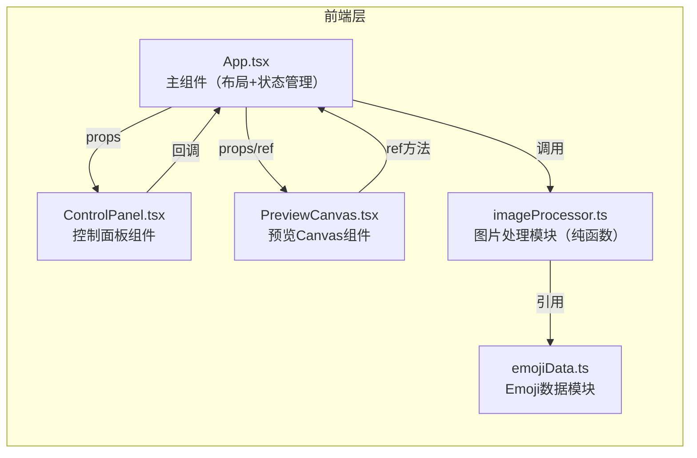

## 1. 架构设计



## 2. 技术描述

- **前端框架**：React@18 + TypeScript
- **构建工具**：Vite + @vitejs/plugin-react
- **渲染技术**：HTML5 Canvas 2D API
- **样式方案**：内联样式 + CSS（style 属性）
- **无后端、无数据库**：纯前端应用，所有处理在浏览器端完成

## 3. 项目文件结构

```
auto51/
├── package.json
├── vite.config.js
├── tsconfig.json
├── index.html
└── src/
    ├── main.tsx          # React 挂载入口
    ├── App.tsx           # 主组件（布局+共享状态）
    ├── imageProcessor.ts # 图片处理纯函数模块
    ├── emojiData.ts      # Emoji 字符与颜色数据
    ├── PreviewCanvas.tsx # Canvas 预览与导出组件
    └── ControlPanel.tsx # 控制面板组件
```

## 4. 模块职责定义

### 4.1 共享配置对象

```typescript
interface MosaicConfig {
  cellSize: number;       // 颗粒大小 4-32px
  emojiStyle: 'classic' | 'animal' | 'food';
  colorThreshold: number;   // 色差阈值 0.1-0.5
}
```

### 4.2 emojiData.ts

- 导出 `emojiSets`: 按风格分类的 Emoji 数组
  - `classic`: 黄色笑脸系列
  - `animal`: 动物脸系列
  - `food`: 食物系列
- 导出 `emojiColorMap`: 每个 Emoji 对应的 RGB 平均颜色值

### 4.3 imageProcessor.ts

- `pixelate(image: HTMLImageElement, cellSize: number): PixelBlock[]`
  - 将图片按 cellSize 分块
  - 计算每个块的平均 RGB 颜色
  - 返回像素块数组（含位置和颜色信息）
- `matchEmoji(blocks: PixelBlock[], style: string, threshold: number): MosaicCell[]`
  - 根据颜色距离（欧氏距离）匹配最接近的 Emoji
  - 应用色差阈值过滤

### 4.4 ControlPanel.tsx

- 接收当前配置 props
- 三个交互控件：
  - 颗粒大小滑块（range input）
  - Emoji 风格按钮组（radio-like buttons）
  - 色差阈值滑块（range input）
- 通过 onChange 回调通知父组件

### 4.5 PreviewCanvas.tsx

- 接收 config 和 pixelData props
- Canvas 渲染逻辑：
  - 遍历每个马赛克单元
  - 应用随机旋转（-5°~5°）和缩放（0.95~1.05）
  - 填充 Emoji 文字
- 支持缩放（滚轮）和拖动（鼠标/触摸）
- 暴露 `exportHD()` 方法通过 ref 调用
- 防抖重绘（300ms）
- 淡入动画（CSS transition）

### 4.6 App.tsx

- Flex 布局，高度 100vh
- 管理全局状态：上传图片、配置对象、处理结果
- 串联各模块：上传 → 处理 → 预览 → 导出
- 使用 useRef 获取 PreviewCanvas 的导出方法

## 5. 关键性能优化

1. **图片像素化使用 OffscreenCanvas 或临时 Canvas 采样
2. **颜色匹配使用预计算颜色查找，避免重复计算
3. **参数变更防抖 300ms 合并多次更新
4. **Canvas 渲染使用 requestAnimationFrame
5. **高清导出时使用离屏 Canvas，避免阻塞主线程
