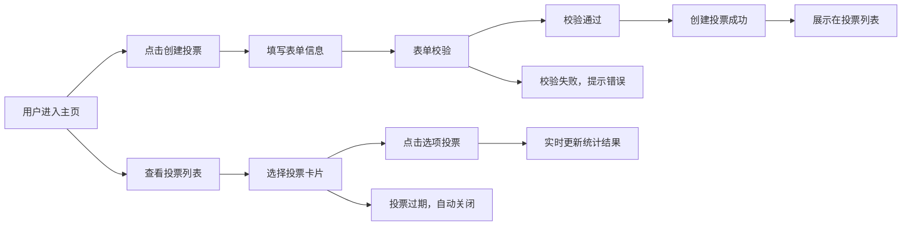

## 1. 产品概述
QuickPoll是一款轻量级匿名投票工具，解决团队日常决策（午餐选择、团建地点等）中微信群接龙混乱的问题，提供匿名投票、实时结果展示与自动统计图表功能。
- 目标用户：需要快速做出团队决策的职场人群、学生团体
- 产品价值：降低沟通成本，提升决策效率，保证投票的匿名性与公正性

## 2. 核心功能

### 2.1 用户角色
| 角色 | 注册方式 | 核心权限 |
|------|----------|----------|
| 普通用户 | 无需注册，直接使用 | 创建投票、参与投票、查看结果 |

### 2.2 功能模块
1. **投票管理模块**：创建投票、提交投票、关闭投票
2. **数据统计模块**：实时统计投票结果、生成柱状图与时间趋势图
3. **历史投票模块**：投票列表展示、搜索、过期状态标记

### 2.3 页面详情
| 页面名称 | 模块名称 | 功能描述 |
|----------|----------|----------|
| 主页 | 顶部导航栏 | 应用名展示、创建投票按钮 |
| 主页 | 搜索区域 | 按标题搜索历史投票 |
| 主页 | 投票列表 | 按创建时间倒序展示所有投票，已关闭投票灰显后置 |
| 主页 | 投票卡片 | 展示投票详情、选项列表、实时图表、倒计时 |
| 创建弹窗 | 投票创建表单 | 标题输入、选项动态增删、截止时间设置、表单校验 |

## 3. 核心流程
用户进入应用后，可以创建新投票或浏览已有投票。创建投票需填写标题、至少2个选项和截止时间，创建成功后自动展示在列表顶部。其他用户点击选项即可投票，支持切换选择，投票后实时更新统计图表。超过截止时间的投票自动关闭，禁止继续投票。

## 4. 用户界面设计

### 4.1 设计风格
- 主色调：#4F46E5（深紫蓝），辅助色：#A5B4FC（浅紫）
- 背景色：#F9FAFB（浅灰白），卡片背景：白色
- 圆角：卡片12px，按钮8px
- 阴影：0 2px 8px rgba(0,0,0,0.06)
- 创建按钮：渐变色#4F46E5到#6366F1，白色文字，hover阴影加深+缩放1.02，过渡0.2s
- 选中选项：边框#4F46E5，浅紫色背景#EEF2FF
- 字体：现代无衬线字体，清晰易读

### 4.2 页面设计概览
| 页面名称 | 模块名称 | UI元素 |
|----------|----------|----------|
| 主页 | 顶部导航栏 | 左侧应用名"QuickPoll"，右侧渐变创建按钮，整体居中最大宽800px |
| 主页 | 搜索区域 | 搜索输入框，聚焦边框变色，移动端占满一行 |
| 主页 | 投票卡片列表 | flex垂直排列，卡片间距统一，响应式适配 |
| 主页 | 投票卡片内部 | 标题、总票数、截止倒计时、选项列表、柱状图 |
| 创建弹窗 | Modal遮罩 | 半透明rgba(0,0,0,0.4)，居中表单区域，内边距24px |
| 创建弹窗 | 表单区域 | 标题输入、选项列表（可增删）、截止时间选择、提交按钮 |

### 4.3 响应式设计
- 桌面优先设计，最大宽度800px居中布局
- 宽度小于640px时：
  - 卡片宽度100%
  - 柱状图高度缩减为200px
  - 搜索框占满整行
  - 内边距适当缩小

### 4.4 动画与交互
- 柱状图：0.5秒缓动动画过渡
- 创建按钮：hover时阴影加深+缩放1.02，0.2s过渡
- Modal弹出：淡入效果
- 选项按钮：选中状态平滑过渡
