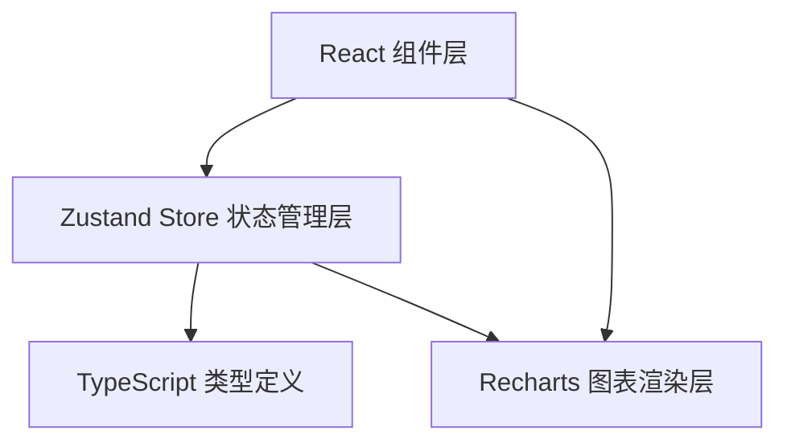

## 1. 架构设计



## 2. 技术说明
- 前端：React@18 + TypeScript + Vite
- 状态管理：Zustand
- 图表库：Recharts
- 工具库：uuid（生成唯一ID）
- 构建工具：Vite（含代码分包，recharts单独打包）

## 3. 文件结构与调用关系

```
src/
├── types.ts              # 类型定义（被所有模块引用）
├── store.ts              # Zustand状态管理（被组件调用）
├── App.tsx               # 主应用组件
├── main.tsx              # 入口文件
├── index.css             # 全局样式
└── components/
    ├── Navbar.tsx        # 导航栏组件
    ├── PollCreator.tsx   # 投票创建组件（调用store.createPoll）
    ├── PollCard.tsx      # 投票卡片组件（调用store.vote）
    └── StatisticsPanel.tsx # 统计图表组件（从store获取数据）
```

**数据流向：**
1. PollCreator：表单提交 → store.createPoll → 更新store → 列表重渲染
2. PollCard：点击选项 → store.vote → store自动统计 → 图表组件重渲染
3. StatisticsPanel：从store获取统计数据 → 生成图表数据 → 渲染recharts组件

## 4. 核心类型定义

```typescript
interface PollOption {
  id: string;
  text: string;
  votes: number;
}

interface VoteRecord {
  optionId: string;
  timestamp: number;
}

interface Poll {
  id: string;
  title: string;
  options: PollOption[];
  createdAt: number;
  deadline: number;
  isClosed: boolean;
  votes: VoteRecord[];
}

interface PollStatistics {
  totalVotes: number;
  optionStats: { optionId: string; text: string; votes: number; percentage: number }[];
  timelineData: { time: string; votes: number }[];
}
```

## 5. Store状态设计

```typescript
interface PollStore {
  polls: Poll[];
  votedPolls: Record<string, string>; // pollId -> optionId
  searchKeyword: string;
  createPoll: (title: string, options: string[], deadline: number) => void;
  vote: (pollId: string, optionId: string) => void;
  closePoll: (pollId: string) => void;
  setSearchKeyword: (keyword: string) => void;
  hasVoted: (pollId: string) => boolean;
  getSelectedOption: (pollId: string) => string | null;
  getStatistics: (pollId: string) => PollStatistics;
  getFilteredPolls: () => Poll[];
}
```

## 6. 性能优化策略
- 代码分包：vite配置中将recharts单独打包，减少主包体积
- 状态细粒度订阅：组件仅订阅所需的store状态切片
- 图表动画：使用CSS transition实现0.5s缓动，控制在200ms内完成重渲染
- 响应式图片与资源加载：按需加载图表组件
