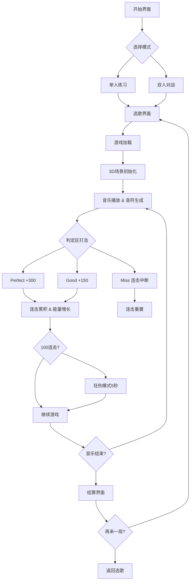

## 1. 产品概述

EchoArena 是一款节奏光剑式音乐对战游戏，两名玩家在同一设备上通过左右分屏（或上下分屏）根据音乐节拍挥砍飞来的音符方块，比拼命中率和连击数。目标用户为喜爱音游、节奏游戏的休闲及竞技玩家，提供本地双人对战的沉浸式体验。

## 2. 核心功能

### 2.1 用户角色

| 角色 | 说明 |
|------|------|
| 玩家1 | 蓝色轨道，屏幕左半区 |
| 玩家2 | 红色轨道，屏幕右半区（双人模式） |

### 2.2 功能模块

1. **开始界面**：游戏标题、动态粒子背景、单人练习/双人对战按钮
2. **选歌界面**：3首内置MIDI风格短曲选择卡片
3. **游戏主界面**：左右分屏3D场景、音符飞行与打击、分数板、连击数、能量槽、频谱可视化
4. **结算界面**：详细统计数据、胜者动画、重赛/返回按钮

### 2.3 页面详情

| 页面名称 | 模块名称 | 功能描述 |
|----------|----------|----------|
| 开始界面 | 动态粒子背景 | 50个粒子沿X轴正弦波动，颜色#00BFFF |
| 开始界面 | 模式选择按钮 | 单人练习和双人对战两个入口 |
| 选歌界面 | 歌曲列表 | 3首内置MIDI风格短曲，每首约60秒 |
| 游戏主界面 | 双人分屏3D场景 | 左右垂直分割，各自独立3D场景和相机 |
| 游戏主界面 | 音符生成与飞行 | 音符沿Z轴飞来，含颜色和方向箭头 |
| 游戏主界面 | 打击判定区 | Z=0平面半透明圆环，鼠标拖拽模拟挥砍 |
| 游戏主界面 | 判定反馈 | Perfect/Good/Miss文字飘移+粒子爆散 |
| 游戏主界面 | 分数板 | 各玩家画面上方，等宽字体36px白色发光 |
| 游戏主界面 | 连击显示 | 分数下方24px，颜色随连击数变化 |
| 游戏主界面 | 能量槽 | 底部宽300px高20px，蓝到红渐变 |
| 游戏主界面 | 狂热模式 | 100连击触发，5秒双倍分数+Perfect判定 |
| 游戏主界面 | 频谱柱状图 | 两侧各20根柱子，高度随音量变化 |
| 游戏主界面 | 节拍粒子 | 柱子底部放射状粒子爆发 |
| 结算界面 | 统计面板 | 总分/最高连击/判定数量/准确率 |
| 结算界面 | 胜者动画 | 胜者侧放大1.2倍+金色光晕 |
| 结算界面 | 操作按钮 | 再来一局/返回选歌 |

## 3. 核心流程

玩家打开游戏 → 看到开始界面（含动态粒子背景）→ 选择单人练习或双人对战 → 进入选歌界面选择曲目 → 游戏开始，音符从远处飞来 → 玩家在判定区按方向挥砍 → 系统判定Perfect/Good/Miss → 连击累积触发屏幕闪光和能量增长 → 100连击进入狂热模式 → 音乐结束进入结算界面 → 显示统计数据和胜者 → 选择重赛或返回选歌

## 4. 用户界面设计

### 4.1 设计风格

- **主题**：深色科幻风格，纯黑背景#000000
- **主色**：玩家1蓝色#1E90FF，玩家2红色#FF6347
- **强调色**：金色#FFD700（Perfect/连击闪光）、绿色#00FF88（Perfect文字）、红色#FF3366（Miss文字）
- **按钮**：圆角矩形，宽160px高50px，背景#3A3A3A，悬浮#555555，过渡0.2s
- **字体**：等宽无衬线 'Courier New', monospace
- **布局**：左右垂直分屏，响应式切换上下分屏
- **轨道**：半透明网格线#333333透明度0.3
- **UI透明度**：游戏中默认0.6，悬浮/操作时1.0，过渡0.3s

### 4.2 页面设计概览

| 页面名称 | 模块名称 | UI元素 |
|----------|----------|--------|
| 开始界面 | 粒子背景 | 50个2-5px粒子，#00BFFF，X轴正弦0.5px/s |
| 开始界面 | 标题 | 居中大字，科幻风格发光 |
| 开始界面 | 模式按钮 | 两个圆角按钮居中排列 |
| 选歌界面 | 歌曲卡片 | 3张卡片横排，封面+曲名+时长 |
| 游戏主界面 | 分屏3D场景 | 左右各50%宽度，独立相机 |
| 游戏主界面 | 分数板 | 画面上方，36px白色发光数字 |
| 游戏主界面 | 连击数 | 分数下方24px，颜色渐变+脉冲动画 |
| 游戏主界面 | 能量槽 | 底部300x20px，#00BFFF→#FF4500渐变填充 |
| 游戏主界面 | 判定文字 | 半透明飘移1.5秒消失 |
| 游戏主界面 | 频谱柱 | 两侧各20根，4px宽，5-80px高，#8A2BE2→#00CED1 |
| 游戏主界面 | 连击闪光 | 四角向中心扩散0.3秒金色渐变 |
| 结算界面 | 统计表格 | 双列对比，等宽字体 |
| 结算界面 | 胜者光晕 | 放大1.2倍+金色光晕2秒 |
| 结算界面 | 操作按钮 | 圆角矩形底部居中 |

### 4.3 响应式适配

- **≥960px**：左右分屏（各占50%宽度）
- **480-960px**：上下分屏（各占50%高度）
- **<480px**：强制单人模式，提示"分屏需更大屏幕"

### 4.4 3D场景设计

- **环境**：深色科幻太空感，纯黑背景+网格地面
- **灯光**：环境光（低强度）+ 方向光 + 点光源跟随音符
- **相机**：透视相机，位于判定区后方俯视，玩家1蓝色调/玩家2红色调
- **音符模型**：立方体+方向圆锥/箭头，红/蓝双色标识
- **判定区**：Z=0平面半透明圆环
- **粒子系统**：打击爆散、频谱放射、连击闪光，总量≤200
- **轨道**：半透明网格线延伸至远方
- **性能**：30FPS@1920x1080，音符预缓存2秒，粒子FIFO淘汰200上限
