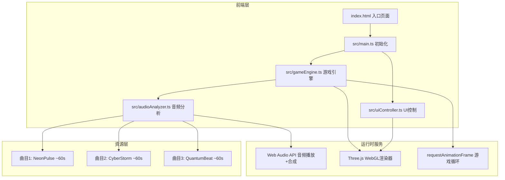

## 1. 架构设计



## 2. 技术描述

- **前端**：TypeScript + Three.js@0.160 + Vite
- **初始化工具**：Vite (vanilla-ts template)
- **后端**：无（纯前端游戏）
- **数据库**：无（内置节拍数据）
- **音频**：Web Audio API（音频播放 + 节拍合成 + 音效生成）
- **3D渲染**：Three.js WebGLRenderer（双视口分屏渲染）
- **构建**：Vite 开发服务器 + 生产构建

## 3. 路由定义

本游戏为单页应用，通过状态机切换界面，无URL路由：

| 状态 | 用途 |
|------|------|
| MENU | 开始菜单界面 |
| SONG_SELECT | 选歌界面 |
| PLAYING | 游戏进行中 |
| PAUSED | 暂停状态 |
| RESULT | 结算界面 |

## 4. 核心数据结构

```typescript
interface Note {
  id: number;
  time: number;
  color: 'red' | 'blue';
  direction: 'up' | 'down' | 'left' | 'right';
  lane: number;
  mesh: THREE.Mesh | null;
  hit: boolean;
  missed: boolean;
}

interface BeatData {
  bpm: number;
  notes: Note[];
  duration: number;
}

interface PlayerState {
  score: number;
  combo: number;
  maxCombo: number;
  perfectCount: number;
  goodCount: number;
  missCount: number;
  energy: number;
  isFever: boolean;
  feverTimer: number;
}

interface JudgeResult {
  grade: 'perfect' | 'good' | 'miss';
  score: number;
  timeDelta: number;
}

interface SongInfo {
  id: string;
  name: string;
  duration: number;
  bpm: number;
  beatData: BeatData;
}

interface Particle {
  mesh: THREE.Mesh;
  velocity: THREE.Vector3;
  life: number;
  maxLife: number;
}
```

## 5. 模块职责

### 5.1 main.ts — 入口与场景管理
- 创建Three.js场景、相机、双视口渲染器
- 初始化游戏引擎、音频分析器、UI控制器
- 管理游戏状态机（菜单→选歌→游戏→结算）
- 处理窗口resize和响应式分屏切换

### 5.2 gameEngine.ts — 核心游戏循环
- 每帧更新音符位置（沿Z轴飞行）
- 碰撞检测（音符到达判定区Z=0时检测玩家输入）
- 打击判定（Perfect±50ms/Good±100ms/Miss）
- 计分系统（300/150/0分 + 连击倍率）
- 连击与能量系统管理
- 狂热模式逻辑
- 粒子特效管理（FIFO≤200）
- 预缓存2秒内节拍数据

### 5.3 audioAnalyzer.ts — 音频分析模块
- 加载内置MIDI风格音乐数据
- 提取/生成节拍点（基于BPM预计算）
- 缓存节拍数据供gameEngine调用
- 使用Web Audio API播放背景音乐
- 生成判定音效（100Hz方波0.1秒）
- 实时频谱分析（供可视化使用）

### 5.4 uiController.ts — UI层
- 开始/暂停/结束界面DOM管理
- 分数板和连击数实时更新
- 能量槽渲染
- 判定文字飘移动画
- 连击闪光效果（四角向中心0.3秒）
- 狂热模式视觉效果（彩色条纹闪烁）
- 频谱柱状图渲染
- 结算界面统计和胜者动画
- 响应式布局切换逻辑
