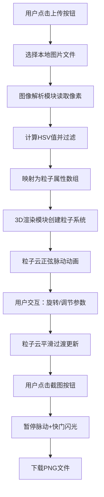

## 1. 产品概述
AuraBloom 是一款创意3D粒子可视化Web应用，将用户上传的照片转换为悬浮的动态呼吸彩色粒子云。用户可以自由旋转视角、调节粒子参数，最终截取渲染画面保存。

- 核心价值：将静态照片转化为沉浸式3D艺术体验，通过粒子系统赋予图像新的生命力
- 目标用户：艺术爱好者、设计师、普通用户，用于创意展示和社交分享

## 2. 核心功能

### 2.1 功能模块
1. **图像上传模块**：左上角半透明磨砂玻璃容器，支持点击按钮选择图片文件
2. **3D粒子渲染模块**：全屏深色背景场景，粒子云位于中心，支持鼠标拖拽旋转
3. **控制面板模块**：右下角悬浮面板，包含参数滑块和颜色模式选择器
4. **截图保存模块**：顶部中央圆形截图按钮，支持当前视角渲染画面下载

### 2.2 页面详情
| 页面名称 | 模块名称 | 功能描述 |
|-----------|-------------|---------------------|
| 单页应用 | 图像上传容器 | 磨砂玻璃效果容器，渐变色按钮，隐藏文件输入框 |
| 单页应用 | 3D场景渲染 | Three.js全屏场景，OrbitControls相机控制，粒子系统动画 |
| 单页应用 | 参数控制面板 | 扩散半径、脉动速度、粒子大小滑块，颜色模式下拉选择器 |
| 单页应用 | 截图功能 | 相机图标按钮，快门闪光效果，自动下载PNG文件 |

## 3. 核心流程

用户点击上传按钮 → 选择本地图片文件 → 图像解析模块读取像素并计算HSV值 → 按亮度阈值过滤后映射为粒子属性 → 3D渲染模块创建粒子系统 → 粒子云以随机相位正弦脉动 → 用户拖拽旋转视角或调节参数 → 粒子云平滑过渡到新状态 → 用户点击截图按钮 → 暂停脉动 → 快门闪光效果 → 弹出下载对话框保存图片。

## 4. 用户界面设计

### 4.1 设计风格
- **主色调**：深紫色渐变背景 (#0D0B1E → #1A143A)
- **强调色**：紫色渐变 (#6C64C0 → #BE5BFD)，用于按钮和交互元素
- **中性色**：半透明白色磨砂玻璃效果，深色面板背景 (#1E1B33)
- **按钮样式**：渐变色圆角按钮，悬停时亮度提升并轻微放大
- **字体**：现代无衬线字体，清晰易读
- **布局风格**：元素悬浮于3D场景之上，左上角上传区、右下角控制面板、顶部截图按钮
- **图标**：相机形状截图按钮，简洁线性风格

### 4.2 页面设计概述
| 页面名称 | 模块名称 | UI元素 |
|-----------|-------------|-------------|
| 单页应用 | 图像上传容器 | 磨砂玻璃背景rgba(255,255,255,0.15)，1px边框，16px圆角，20px内边距，0 8px 32px阴影 |
| 单页应用 | 3D场景 | 深紫色渐变背景，粒子云位于中心，鼠标拖拽旋转带阻尼效果 |
| 单页应用 | 控制面板 | #1E1B33背景0.8透明度，12px圆角，16px内边距，220px宽度，0.15缩放进入动画 |
| 单页应用 | 滑块控件 | 4px高度轨道#2D2850，16px直径滑块#7B6FE0，悬停变为#9B8FF0 |
| 单页应用 | 截图按钮 | 48px直径圆形，#BE5BFD背景，相机图标，悬停旋转5度放大1.1倍 |

### 4.3 响应性
- **桌面端**：完整布局，左上角上传区，右下角控制面板
- **移动端**（<768px）：
  - 控制面板折叠为底部居中浮动按钮，点击弹出
  - 相机距离缩小30%以适应小屏幕
  - 截图功能移除闪烁动画，直接保存
- **触摸优化**：支持触摸拖拽旋转，滑块支持触摸操作

### 4.4 3D场景指导
- **环境**：深紫色渐变背景，无HDRI，营造神秘氛围
- **光照**：粒子自发光，无需额外光源
- **相机**：PerspectiveCamera，OrbitControls控制，阻尼系数0.1，缩放范围0.5-5
- **动画**：每个粒子随机相位正弦脉动，周期1-3秒，幅度为扩散半径的0.15倍
- **性能**：粒子数量上限5000，超过3000时自动降低粒子大小（4px→2px），帧率保持60FPS，拖拽时不低于50FPS
- **后期处理**：截图时暂停动画确保清晰，无额外后期效果

## 5. 性能优化
- **粒子系统**：使用THREE.Points和BufferGeometry，高效渲染大量粒子
- **参数过渡**：调整参数时0.5秒内平滑过渡，避免突变
- **自适应大小**：粒子数量超过3000时自动缩小尺寸，保证性能
- **响应式相机**：移动端自动调整相机距离，优化可视范围
