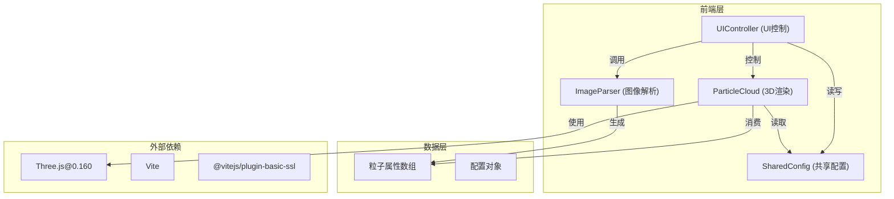

## 1. 架构设计



## 2. 技术描述

- **前端框架**：纯 TypeScript + Three.js，无React/Vue框架，直接操作DOM和WebGL
- **构建工具**：Vite 5.x，支持热更新和快速开发
- **SSL插件**：@vitejs/plugin-basic-ssl 用于HTTPS预览
- **3D引擎**：Three.js@0.160，使用Points和BufferGeometry实现高效粒子渲染
- **语言**：TypeScript 5.x，严格模式，target ES2020
- **无后端**：纯前端应用，所有处理在浏览器端完成

## 3. 项目结构

| 文件路径 | 职责描述 |
|----------|----------|
| `/package.json` | 项目依赖配置，three@0.160，npm run dev启动脚本 |
| `/vite.config.js` | Vite构建配置，basic-ssl插件启用 |
| `/tsconfig.json` | TypeScript配置，严格模式，ES2020目标 |
| `/index.html` | 入口HTML，深色背景，全屏无滚动条，viewport meta |
| `/src/main.ts` | 应用入口，初始化场景、相机、渲染器、轨道控制 |
| `/src/sharedConfig.ts` | 共享配置对象，类型定义，粒子参数和状态标志 |
| `/src/imageParser.ts` | 图像解析模块，读取像素→转HSV→过滤→映射粒子属性 |
| `/src/particleCloud.ts` | 3D渲染模块，粒子系统管理、动画循环、脉动逻辑 |
| `/src/uiController.ts` | UI控制模块，DOM创建、事件绑定、参数同步 |

## 4. 核心类型定义

```typescript
// 粒子属性
interface ParticleData {
  x: number;           // 基础X位置
  y: number;           // 基础Y位置
  z: number;           // 基础Z位置
  r: number;           // 红色通道 (0-1)
  g: number;           // 绿色通道 (0-1)
  b: number;           // 蓝色通道 (0-1)
  h: number;           // 色相 (0-360)
  s: number;           // 饱和度 (0-1)
  v: number;           // 亮度 (0-1)
  size: number;        // 粒子大小
  phase: number;       // 脉动相位 (0-2π)
  period: number;      // 脉动周期 (1-3秒)
}

// 颜色模式
type ColorMode = 'hueGroup' | 'brightnessMix';

// 共享配置
interface SharedConfig {
  maxParticles: number;      // 粒子数量上限 5000
  spreadRadius: number;      // 扩散半径 0.5-3, 默认1.5
  pulseSpeed: number;        // 脉动速度 0-2, 默认1
  particleSize: number;      // 粒子大小 1-6, 默认4
  colorMode: ColorMode;      // 颜色模式
  screenshotRequested: boolean;  // 截图请求标志
  isScreenshotting: boolean;     // 正在截图标志
}
```

## 5. 模块接口设计

### 5.1 ImageParser 模块
```typescript
class ImageParser {
  static parse(file: File, config: SharedConfig): Promise<ParticleData[]>;
  private static rgbToHsv(r: number, g: number, b: number): {h: number, s: number, v: number};
  private static filterByBrightness(hsv: {h,s,v}, threshold: number): boolean;
  private static mapToParticle(pixel: {x,y,r,g,b,h,s,v}, index: number, total: number, config: SharedConfig): ParticleData;
}
```

### 5.2 ParticleCloud 模块
```typescript
class ParticleCloud {
  constructor(scene: THREE.Scene, config: SharedConfig);
  loadParticles(particles: ParticleData[]): void;
  update(deltaTime: number): void;
  updateSize(): void;
  pauseAnimation(): void;
  resumeAnimation(): void;
  dispose(): void;
}
```

### 5.3 UIController 模块
```typescript
class UIController {
  constructor(config: SharedConfig, 
              onImageUpload: (file: File) => void,
              onScreenshot: () => void,
              onParamChange: () => void);
  showUploadPanel(): void;
  hideUploadPanel(): void;
  showControlPanel(): void;
  hideControlPanel(): void;
  triggerFlashEffect(): void;
  updateUI(): void;
}
```

## 6. 性能优化策略

1. **BufferGeometry**：使用Float32Array存储所有粒子数据，单次draw call
2. **GPU计算**：粒子脉动在vertex shader中实现，减少CPU开销
3. **自适应粒子大小**：粒子数>3000时，size从4px降至2px
4. **平滑过渡**：参数变化使用lerp插值，0.5秒完成过渡
5. **动画节流**：拖拽时降低计算精度，保持50+FPS
6. **资源释放**：粒子系统重建时正确dispose旧的geometry和material

## 7. 关键算法

### 7.1 RGB转HSV
```
max = max(r, g, b), min = min(r, g, b)
v = max
delta = max - min
s = delta / max (if max > 0)
h = 60 * ((g-b)/delta) if max=r
h = 60 * (2 + (b-r)/delta) if max=g
h = 60 * (4 + (r-g)/delta) if max=b
if h < 0: h += 360
```

### 7.2 色相分组
将色相按30度区间分组（12组），每组使用区间中心色相：
- 0-30° → 15°（红色）
- 30-60° → 45°（橙色）
- ...以此类推

### 7.3 脉动算法
```
currentRadius = baseRadius + sin(time * speed / period + phase) * amplitude
amplitude = spreadRadius * 0.15
```

### 7.4 粒子位置映射
```
// 球面坐标映射
theta = random() * 2π
phi = acos(2 * random() - 1)
x = spreadRadius * sin(phi) * cos(theta) * (v * 0.5 + 0.5)
y = spreadRadius * sin(phi) * sin(theta) * (v * 0.5 + 0.5)
z = spreadRadius * cos(phi) * (v * 0.5 + 0.5)
```
