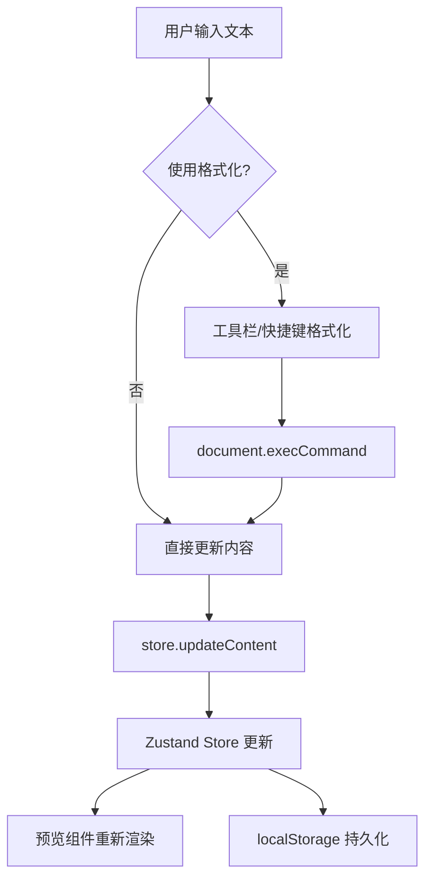
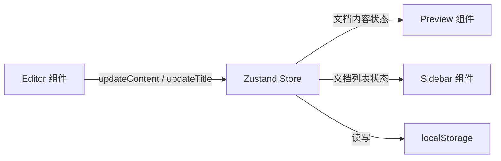

## 1. 产品概述

QuickDoc 是一款轻量级富文本编辑器应用，专注于文档的创建、编辑、格式化和实时HTML预览。相比Notion等臃肿的协作工具，QuickDoc提供纯粹、高效的文档编写体验，零延迟实时预览，所有数据本地存储。
- 目标用户：需要快速编写和预览格式化文档的个人开发者、技术写作者和小团队
- 核心价值：极简、即时、本地优先的文档创作工具

## 2. 核心功能

### 2.1 用户角色
| 角色 | 注册方式 | 核心权限 |
|------|----------|----------|
| 普通用户 | 无需注册 | 创建、编辑、删除、导出文档 |

### 2.2 功能模块
1. **编辑器页面**：富文本编辑区、格式化工具栏、快捷键支持
2. **预览面板**：实时HTML渲染预览，与编辑区同步
3. **文档管理边栏**：文档列表、新建/删除/切换文档
4. **导出功能**：将文档导出为完整HTML文件

### 2.3 页面详情
| 页面名称 | 模块名称 | 功能描述 |
|----------|----------|----------|
| 编辑器页面 | 格式化工具栏 | 提供标题(H1-H3)、加粗、斜体、下划线、有序/无序列表、代码块、引用块按钮，快捷键操作时按钮高亮 |
| 编辑器页面 | 富文本编辑区 | contentEditable div，支持文本输入和格式化，用户输入→触发store.updateContent |
| 编辑器页面 | 实时预览区 | 接收store文档内容，使用dangerouslySetInnerHTML渲染HTML，样式隔离 |
| 编辑器页面 | 文档管理边栏 | 文档列表（标题+最后修改时间），新建文档（弹出提示框输入标题），删除文档，切换文档 |
| 编辑器页面 | 导出按钮 | 导出当前文档为HTML文件，文件名使用文档标题，包含完整HTML模板和默认CSS样式 |

## 3. 核心流程

### 3.1 文档编辑流程
用户在编辑区输入文本 → 通过快捷键或工具栏按钮应用格式 → 编辑器组件dispatch动作更新Zustand store → store状态更新触发预览组件重新渲染 → 预览区实时显示格式化HTML

### 3.2 文档管理流程
用户点击新建按钮 → 弹出提示框输入标题 → 创建新文档并存入localStorage → 边栏更新文档列表 → 用户可切换/删除文档

### 3.3 数据流向

## 4. 用户界面设计

### 4.1 设计风格
- 主色调：蓝色(#3B82F6)用于新建按钮和选中态，绿色(#10B981)用于导出按钮
- 辅助色：灰色系(#F3F4F6, #E5E7EB, #D1D5DB)用于边栏和边框
- 按钮风格：圆角8px，扁平化设计，hover过渡0.2s
- 字体：系统字体栈，标题24px(#1F2937)，正文16px(#374151)
- 布局：左侧文档边栏(220px) + 中间编辑区(55%) + 右侧预览区(45%)
- 图标：lucide-react图标库

### 4.2 页面设计概览
| 页面名称 | 模块名称 | UI元素 |
|----------|----------|--------|
| 编辑器页面 | 顶部栏 | 应用标题"QuickDoc"(24px, #1F2937, 居中)，新建按钮(蓝底白字, 圆角8px)，导出按钮(绿底白字, 圆角8px) |
| 编辑器页面 | 文档边栏 | 宽220px, 背景#F3F4F6, 文档项高48px, 圆角6px, 悬停#E5E7EB, 选中#DBEAFE/#1E40AF |
| 编辑器页面 | 编辑区 | 白色背景, 边框1px #D1D5DB, 圆角8px, 内边距16px, 字号16px, 行高1.6 |
| 编辑器页面 | 工具栏 | 格式化按钮组, 快捷键激活时背景#DBEAFE高亮 |
| 编辑器页面 | 预览区 | 背景#F9FAFB, 边框1px #E5E7EB, 圆角8px, 内边距16px, 代码块背景#1E293B |

### 4.3 响应式设计
- 桌面端(>768px)：左右分栏布局，左侧文档边栏常驻
- 移动端(≤768px)：上下布局，编辑区和预览区各占100%高度，文档边栏折叠为顶部下拉菜单

### 4.4 快捷键
| 快捷键 | 功能 | 工具栏高亮色 |
|--------|------|-------------|
| Ctrl+B | 加粗 | #DBEAFE |
| Ctrl+I | 斜体 | #DBEAFE |
| Ctrl+U | 下划线 | #DBEAFE |
| Ctrl+Shift+C | 代码块 | #DBEAFE |
