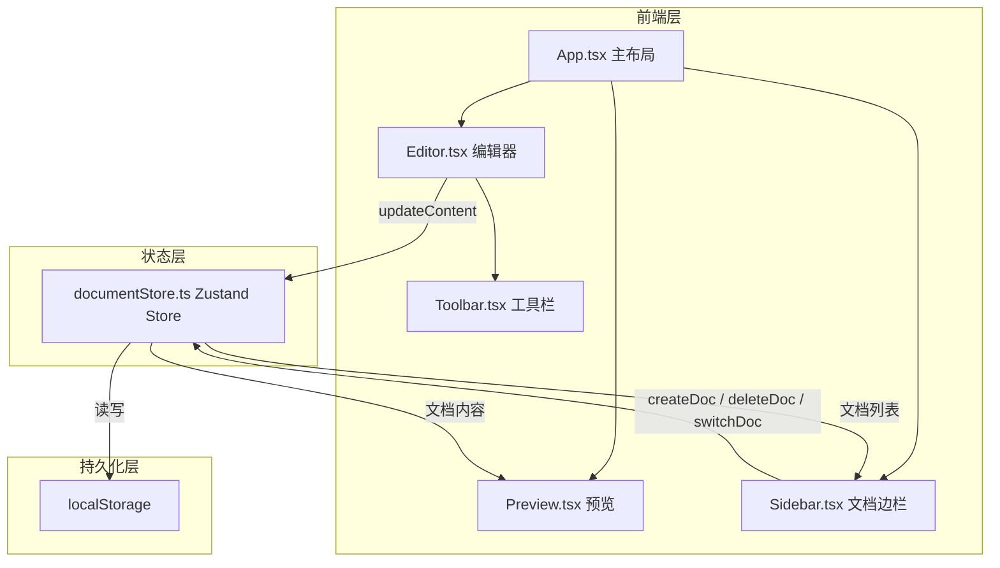
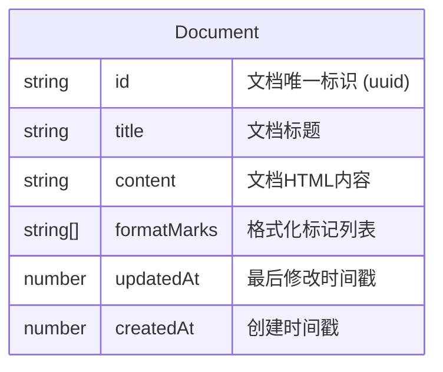

## 1. 架构设计



## 2. 技术说明
- 前端：React@18 + TypeScript + Vite + Tailwind CSS@3
- 初始化工具：vite-init (react-ts 模板)
- 状态管理：Zustand
- 后端：无（纯前端应用）
- 数据库：无（使用 localStorage 持久化）
- 图标库：lucide-react

## 3. 路由定义
| 路由 | 用途 |
|------|------|
| / | 编辑器主页面，包含编辑区、预览区、文档边栏 |

（单页应用，无需路由）

## 4. API 定义
无后端API，所有数据操作通过 Zustand Store + localStorage 完成。

## 5. 服务器架构图
无后端服务器。

## 6. 数据模型

### 6.1 数据模型定义



### 6.2 数据结构定义

```typescript
interface Document {
  id: string;
  title: string;
  content: string;
  formatMarks: string[];
  updatedAt: number;
  createdAt: number;
}

interface DocumentState {
  documents: Document[];
  activeDocId: string | null;
  content: string;
  title: string;
  formatMarks: string[];
  createDoc: (title: string) => void;
  deleteDoc: (id: string) => void;
  switchDoc: (id: string) => void;
  updateContent: (content: string) => void;
  updateTitle: (title: string) => void;
  updateFormatMarks: (marks: string[]) => void;
}
```

### 6.3 文件结构与调用关系

```
quickdoc/
├── index.html                    # 入口页面
├── package.json                  # 依赖配置
├── vite.config.ts                # Vite配置
├── tsconfig.json                 # TypeScript配置
├── src/
│   ├── main.tsx                  # 入口，挂载App
│   ├── App.tsx                   # 主布局，左右分栏
│   ├── store/
│   │   └── documentStore.ts      # Zustand状态管理
│   ├── components/
│   │   ├── Editor.tsx            # 富文本编辑区
│   │   ├── Preview.tsx           # HTML预览区
│   │   ├── Sidebar.tsx           # 文档管理边栏
│   │   └── Toolbar.tsx           # 格式化工具栏
│   └── utils/
│       └── exportHtml.ts         # HTML导出工具
```

**数据流向**：
- 编辑器组件 → `store.updateContent()` → Zustand Store → 预览组件重新渲染
- 边栏组件 → `store.createDoc/deleteDoc/switchDoc()` → Store → 边栏列表更新
- Store → `localStorage` 持久化读写（每次状态变更自动同步）
- 导出按钮 → `exportHtml()` → 生成HTML文件下载
