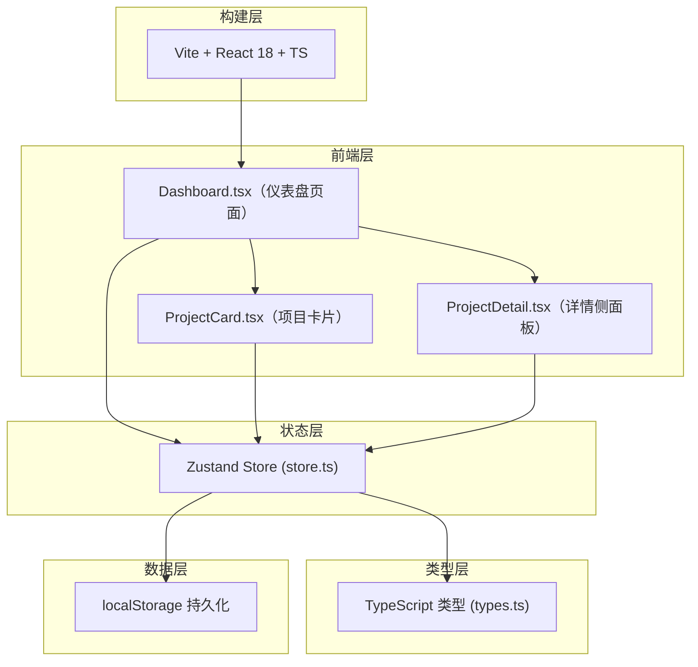
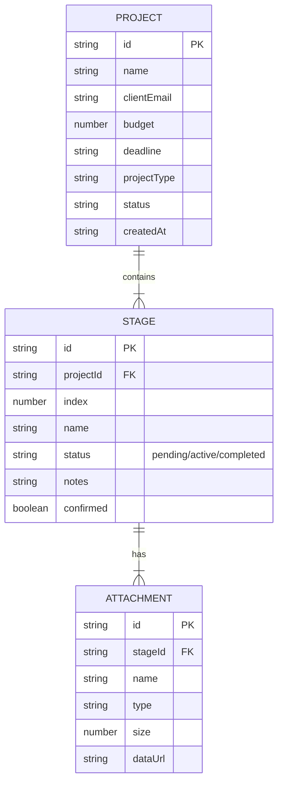

## 1. 架构设计



## 2. 技术说明

- 前端框架：React@18 + TypeScript（strict模式，target es2020）
- 构建工具：Vite（含React插件）
- 状态管理：Zustand（单一store管理项目、搜索、筛选、统计）
- ID生成：uuid
- 数据持久化：localStorage（模拟后端，刷新不丢失）
- 路由：无（单页应用Dashboard为唯一页面）
- 样式方案：原生CSS（CSS变量 + className，不引入Tailwind以保持轻量）

## 3. 目录结构

```
auto56/
├── package.json          # 依赖 react/react-dom/zustand/uuid，脚本 dev
├── vite.config.js        # Vite + React 插件配置
├── tsconfig.json         # 严格模式 target es2020
├── index.html            # 入口、viewport、字体
└── src/
    ├── main.tsx          # React 入口，挂载 Root
    ├── types.ts          # Project/Stage/Filter 等接口
    ├── store.ts          # Zustand store，统一状态
    └── components/
        ├── Dashboard.tsx      # 主页面：导航+搜索+网格+统计
        ├── ProjectCard.tsx    # 项目卡片：进度条+倒计时+点击
        └── ProjectDetail.tsx  # 侧面板：阶段+备注+附件+确认
```

## 4. 数据模型

### 4.1 数据模型定义



### 4.2 核心类型定义（TypeScript）

```typescript
type ProjectType = '角色设计' | '场景绘制' | '漫画分镜' | '绘本插图' | '品牌视觉';
type ProjectStatus = '进行中' | '待确认' | '已完成';
type StageStatus = 'pending' | 'active' | 'completed';

interface Attachment {
  id: string;
  name: string;
  type: string;
  size: number;
  dataUrl: string;
}

interface Stage {
  id: string;
  index: number;
  name: string;
  status: StageStatus;
  notes: string;
  confirmed: boolean;
  attachments: Attachment[];
}

interface Project {
  id: string;
  name: string;
  clientEmail: string;
  budget: number;
  deadline: string;
  projectType: ProjectType;
  status: ProjectStatus;
  createdAt: string;
  stages: Stage[];
}

type FilterStatus = '全部' | '进行中' | '待确认' | '已完成';
type SortType = '按截止日期' | '按创建时间' | '按预算';
```

## 5. Zustand Store 设计

### 5.1 State 结构

```typescript
interface AppState {
  // 数据层
  projects: Project[];
  // 搜索筛选层
  searchQuery: string;
  filterStatus: FilterStatus;
  sortType: SortType;
  // UI 层
  selectedProjectId: string | null;
  // 派生（getters）
  filteredProjects: Project[];
  stats: { total: number; pending: number; avgBudget: number };
}
```

### 5.2 Actions

| Action | 说明 |
|--------|------|
| `createProject(data)` | 新建项目 + 初始化5阶段 |
| `deleteProject(id)` | 删除项目 |
| `updateStageNotes(projectId, stageId, notes)` | 更新阶段备注 |
| `addAttachment(projectId, stageId, file)` | 上传附件（转dataUrl） |
| `removeAttachment(projectId, stageId, attachId)` | 删除附件 |
| `confirmStage(projectId, stageId)` | 阶段确认 + 推进下一阶段为 active |
| `setSearchQuery(q)` | 设置搜索词（组件层防抖） |
| `setFilterStatus(s)` | 设置筛选状态 |
| `setSortType(s)` | 设置排序方式 |
| `selectProject(id)` | 选中项目展开侧面板 |
| `clearSelection()` | 关闭侧面板 |

### 5.3 持久化策略

- Store 初始化时从 localStorage 读取 `artflow_projects`
- 每次 `projects` 数组变更后 50ms debounce 写入 localStorage
- 读写使用 JSON.parse/stringify，包裹 try-catch 防损坏
- 性能：单次读写控制在 5ms 内（100项目数据量）

## 6. 性能优化点

1. **搜索防抖**：输入框 onChange 使用 300ms debounce hook
2. **列表渲染**：使用 React.memo 包裹 ProjectCard 避免无效重渲染
3. **附件处理**：FileReader 异步读入 dataUrl，不阻塞主线程
4. **Store 选择器**：组件使用 zustand selector 精确订阅所需字段
5. **动画性能**：transform + opacity 驱动过渡，避免重排
