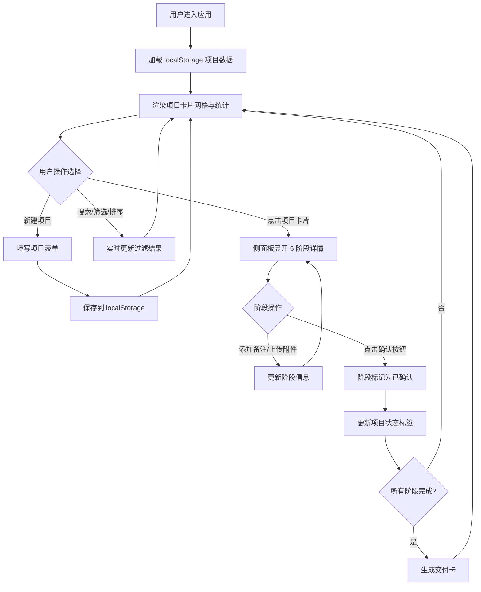

## 1. 产品概述

ArtFlow 是一款面向独立插画师和小型设计工作室的在线项目管理工具，解决委托项目管理混乱、进度反馈延迟、文件版本失控等核心问题。

- 目标用户：自由插画师、小型设计工作室、独立创意工作者
- 核心价值：统一管理委托项目、可视化创作进度、高效客户沟通与交付、文件版本可控

## 2. 核心功能

### 2.1 用户角色

| 角色 | 说明 | 核心权限 |
|------|------|----------|
| 创作者用户 | 插画师/设计师 | 项目CRUD、阶段管理、附件上传、客户确认、数据统计 |

### 2.2 功能模块

1. **项目仪表盘**：项目创建表单、项目卡片网格、统计卡片
2. **创作阶段管理**：5阶段进度条、阶段详情侧面板、备注与附件管理
3. **客户沟通与交付**：阶段确认按钮、项目状态标签、终稿交付卡
4. **全局搜索与筛选**：搜索框、状态筛选、排序下拉、延迟搜索
5. **数据持久化与统计**：localStorage 存储、统计数据计算

### 2.3 页面详情

| 页面名称 | 模块名称 | 功能描述 |
|----------|----------|----------|
| 仪表盘 | 顶部导航栏 | Logo、搜索输入框、状态筛选下拉、排序下拉、新建项目按钮 |
| 仪表盘 | 项目网格 | 响应式卡片网格（4/2/1列）、卡片悬停动画、倒计时显示、类型边框色 |
| 仪表盘 | 项目创建表单 | 项目名称、客户邮箱、预算范围、截止日期、项目类型下拉 |
| 仪表盘 | 统计卡片 | 项目总数、待确认项目数、平均预算 |
| 项目详情侧面板 | 阶段进度条 | 5阶段水平进度条、已完成/进行中/待办状态区分 |
| 项目详情侧面板 | 阶段详情 | 备注文本域（200字）、附件上传（5个/10MB/png/jpg/pdf）、附件卡片 |
| 项目详情侧面板 | 客户确认 | 每个阶段确认按钮、确认后禁用显示对勾 |
| 项目详情侧面板 | 交付卡 | 项目名称、所有阶段确认状态、最终压缩包下载链接 |
| 全局 | 状态标签 | 进行中/待确认/已完成，对应不同颜色 |

## 3. 核心流程

主要用户流程：用户登录 → 查看仪表盘项目列表 → 搜索/筛选/排序项目 → 点击卡片查看详情 → 更新阶段备注/上传附件 → 点击确认按钮请求客户确认 → 所有阶段完成后生成交付卡 → 项目归档统计。

## 4. 用户界面设计

### 4.1 设计风格

- 主色：品牌紫色 `#6366F1`，辅色：中性灰 `#475569`
- 浅色主题，页面背景 `#F1F5F9`，卡片背景 `#FAFAFA`
- 所有圆角统一（卡片16px、按钮8px、进度条4px）
- 系统无衬线字体 system-ui，统一 0.2s 平滑过渡
- 项目类型配色：角色设计 `#7C3AED`、场景绘制 `#2563EB`、漫画分镜 `#D97706`、绘本插图 `#059669`、品牌视觉 `#DC2626`
- 状态颜色：进行中 `#3B82F6`、待确认 `#F59E0B`、已完成 `#10B981`

### 4.2 页面设计概述

| 页面/模块 | 设计元素 |
|-----------|----------|
| 左侧导航（220px） | 白色背景，64px Logo区域 "ArtFlow"，项目列表/设置链接，当前页高亮 `#EEF2FF` |
| 顶部导航（56px） | 白底底部阴影，搜索框300px，筛选下拉+排序下拉，新建项目按钮 |
| 项目卡片（280px） | 左沿类型色边框，项目名、邮箱缩写、截止倒计时，悬停上移3px阴影加深 |
| 进度条（600px） | 8px高圆角4px，5阶段等分，已完成纯色、当前70%渐变、待办浅灰 |
| 详情侧面板 | 右侧滑入 0.25s cubic-bezier(0.4,0,0.2,1)，备注域、附件区、确认按钮 |
| 统计卡片（180px） | 背景 `#F8FAFC` 圆角12px，3列居中显示总数/待确认/平均预算 |
| 状态标签 | 4px圆角 padding 4px 8px 字号12px 三色区分 |

### 4.3 响应式适配

- Desktop-first 设计
- 屏宽 ≥1200px：网格4列，左侧导航展开
- ≥768px：网格2列，左侧导航展开
- <768px：网格1列，导航收起为汉堡菜单
- 所有交互支持触控

## 4.4 性能指标

- 100项目首帧渲染 ≤200ms
- 滚动无卡顿（虚拟滚动/按需渲染策略）
- localStorage 单次读写 ≤5ms
- 搜索输入防抖 300ms
