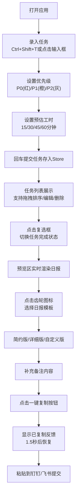

## 1. 产品概述

DayBrief是一款面向职场人士的浏览器端日报生成助手，帮助用户在下班前快速总结当日工作任务完成情况、记录工作要点，并一键复制格式化后的日报内容到钉钉、飞书等企业协作平台。

- **主要目的**：简化日报撰写流程，通过任务管理+智能模板的方式，将零散的工作记录快速转化为结构化的日报文档
- **解决问题**：传统日报撰写耗时、格式不统一、容易遗漏当日工作内容的痛点
- **目标用户**：需要每日提交工作汇报的职场人士，尤其是互联网行业的研发、产品、运营人员
- **产品价值**：提升效率（日报撰写时间从15分钟压缩至3分钟以内），规范格式，确保信息完整

## 2. 核心功能

### 2.1 功能模块

1. **任务管理区**：任务快速录入、任务列表展示、状态管理、优先级标记、拖拽排序、工时预估
2. **日报预览区**：实时预览日报内容、多种模板切换、工时自动统计、一键复制功能
3. **设置面板**：日报模板定制、模板参数调整

### 2.2 页面详情

| 页面名称 | 模块名称 | 功能描述 |
|-----------|-------------|---------------------|
| 主页面（单页应用） | 任务录入组件 | 快捷键Ctrl+Shift+T唤起输入框，支持优先级标签(P0/P1/P2)、预估工时选择(15/30/45/60分钟)，最多50字限制，回车提交 |
| 主页面 | 任务列表组件 | 按完成状态分组，已完成自动折叠到底部；每项含复选框(切换完成状态)、编辑按钮(内联编辑)、删除按钮；支持HTML5拖拽排序 |
| 主页面 | 分隔条组件 | 左右栏可拖拽调整宽度，4px宽，悬停高亮，移动端自动隐藏 |
| 主页面 | 日报预览组件 | 实时渲染日报：标题(今日工作汇报+日期)、已完成/待完成任务列表、工时统计、备注区域、一键复制按钮 |
| 主页面 | 设置面板Modal | 点击齿轮图标弹出，三种模板选择(简约版/详细版/自定义版)，预览区平滑过渡切换 |

## 3. 核心流程

### 3.1 主用户流程描述

用户打开应用后，通过快捷键或点击输入框录入当日任务，为每个任务设置优先级和预估工时。任务录入后可通过复选框标记完成状态，支持拖拽调整任务优先级顺序。完成所有任务标记后，右侧预览区实时生成日报内容，用户可根据需要切换日报模板风格，补充备注信息，最后点击一键复制按钮将格式化后的日报内容复制到剪贴板，粘贴到钉钉或飞书提交。

### 3.2 Mermaid流程图

## 4. 用户界面设计

### 4.1 设计风格

- **主色调**：蓝色系 - 主色#2563EB，辅色#60A5FA，背景色#F0F5FF
- **状态色**：成功#10B981（已完成）、警告#F59E0B（待完成）、危险#EF4444（P0优先级/删除按钮）
- **中性色**：标题#111827，正文#374151，辅助文字#9CA3AF，分割线#E5E7EB，卡片背景#F3F4F6
- **按钮样式**：圆角8px，过渡动画0.2s，主按钮蓝色背景白字，次按钮白底灰边
- **字体**：系统默认字体栈（优先微软雅黑/PingFang SC），标题20px加粗，正文14px
- **布局风格**：卡片式布局，任务卡片圆角8px，预览卡片圆角12px，Modal圆角16px
- **图标**：使用lucide-react图标库，线条风格

### 4.2 页面设计概述

| 页面名称 | 模块名称 | UI元素描述 |
|-----------|-------------|-------------|
| 主页面 | 整体布局 | 桌面端左右两栏(60%/40%)，中间4px可拖拽分隔条；移动端(<768px)上下布局，分隔条隐藏；页面背景白色#F8F9FA |
| 主页面 | 任务区(左栏) | 白色背景；顶部输入区域：输入框+添加按钮+快捷键提示；任务列表：每项卡片圆角8px、内边距12px、下边距8px，悬停阴影0 2px 4px rgba(0,0,0,0.06) |
| 主页面 | 任务卡片 | 左侧：优先级色点 + 复选框；中部：任务文本(完成时删除线+#9CA3AF) + 工时标签；右侧：编辑按钮 + 删除按钮(红叉，悬停#EF4444) |
| 主页面 | 预览区(右栏) | 背景#F3F4F6，顶部与整体页面圆角衔接；内部白色卡片：圆角12px、阴影0 4px 12px rgba(0,0,0,0.08)、内边距24px |
| 主页面 | 日报内容 | 标题20px加粗#111827；日期灰色小字；工时统计标签；已完成任务(绿圆点#10B981)；待完成任务(橙圆点#F59E0B)；备注文本域；底部复制按钮 |
| 主页面 | 设置Modal | 白色背景，圆角16px，阴影0 8px 30px rgba(0,0,0,0.12)；三种模板卡片横向排列；选中态蓝色边框 |

### 4.3 响应式设计

- **设计原则**：桌面优先(Desktop-first)，移动端自适应
- **断点**：768px
- **桌面端(≥768px)**：左右两栏布局(60%任务区/40%预览区)，中间可拖拽分隔条
- **移动端(<768px)**：上下布局(任务区在上/预览区在下)，分隔条隐藏，卡片宽度自适应
- **触控优化**：移动端按钮最小点击区域44x44px，任务卡片增加触控反馈

### 4.4 动画与过渡

- **状态切换**：任务完成/待办背景色渐变过渡0.3s ease
- **模板切换**：预览区opacity过渡0.4s实现平滑切换
- **拖拽效果**：拖拽中卡片半透明(opacity 0.5)，目标位置显示虚线占位
- **复制反馈**：按钮文字切换为绿色"已复制"，1.5秒后恢复
- **悬停效果**：按钮、任务卡片、分隔条均有0.2s过渡的悬停状态变化
