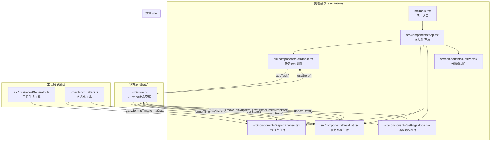

## 1. 架构设计



## 2. 技术描述

- **前端框架**：React@18 + ReactDOM@18（函数式组件 + Hooks）
- **构建工具**：Vite（快速冷启动，HMR热更新）
- **编程语言**：TypeScript（严格模式，target es2020）
- **状态管理**：Zustand（轻量级、API简洁、支持选择器优化渲染）
- **样式方案**：原生CSS + CSS Modules（组件级样式隔离，避免全局污染）
- **工具库**：
  - date-fns：日期格式化（轻量级、模块化）
  - uuid：任务ID生成
  - lucide-react：图标库
- **初始化方式**：Vite + react-ts模板

## 3. 文件结构与职责

```
auto59/
├── index.html                     # 入口HTML页面，白色背景#F8F9FA
├── package.json                   # 依赖配置与启动脚本
├── vite.config.js                 # Vite配置（含React插件）
├── tsconfig.json                  # TypeScript配置（严格模式，es2020）
└── src/
    ├── main.tsx                   # 应用入口，渲染App组件
    ├── store.ts                   # Zustand全局状态管理
    ├── types/
    │   └── index.ts               # 全局TypeScript类型定义
    ├── utils/
    │   ├── formatters.ts          # 时间、日期、工时格式化工具
    │   └── reportGenerator.ts     # 日报内容生成工具
    ├── styles/
    │   ├── globals.css            # 全局样式与CSS变量
    │   ├── App.module.css         # App组件样式
    │   ├── TaskInput.module.css   # TaskInput组件样式
    │   ├── TaskList.module.css    # TaskList组件样式
    │   ├── ReportPreview.module.css # ReportPreview组件样式
    │   ├── SettingsModal.module.css # SettingsModal组件样式
    │   └── Resizer.module.css     # Resizer分隔条样式
    └── components/
        ├── App.tsx                # 主布局组件（左任务/右预览）
        ├── TaskInput.tsx          # 任务录入（输入框+快捷键）
        ├── TaskList.tsx           # 任务列表（分组+拖拽排序）
        ├── TaskItem.tsx           # 单个任务卡片（子组件拆分）
        ├── ReportPreview.tsx      # 日报预览+复制功能
        ├── SettingsModal.tsx      # 设置面板Modal
        └── Resizer.tsx            # 可拖拽分隔条
```

### 文件调用关系：
1. **main.tsx** → 导入并渲染 **App.tsx**
2. **App.tsx** → 从 **store.ts** 读取全局状态，引入所有子组件，管理布局
3. **TaskInput.tsx** → 调用 **store.ts** 的 `addTask()` action，`useRef` 管理聚焦
4. **TaskList.tsx** → 从 **store.ts** 读取 tasks，调用 `toggleTask/removeTask/updateTask/reorderTasks`
5. **TaskItem.tsx** → 被 TaskList 渲染，接收props，调用 **store.ts** action，使用 **formatters.ts**
6. **ReportPreview.tsx** → 从 **store.ts** 读取 tasks/template/draft，使用 **reportGenerator.ts** 生成内容
7. **SettingsModal.tsx** → 从 **store.ts** 读取 template，调用 `setTemplate()` action
8. **Resizer.tsx** → 纯交互组件，通过props回调通知 App.tsx 调整布局比例
9. **store.ts** → 所有组件的唯一数据源，包含完整状态树与action

## 4. 数据模型

### 4.1 类型定义（TypeScript）

```typescript
// 任务优先级
type Priority = 'P0' | 'P1' | 'P2';

// 任务状态
type TaskStatus = 'todo' | 'in-progress' | 'completed';

// 预估工时（分钟）
type EstimatedMinutes = 15 | 30 | 45 | 60;

// 日报模板类型
type TemplateType = 'simple' | 'detailed' | 'custom';

// 自定义模板配置
interface CustomTemplateConfig {
  sections: Array<{
    key: 'title' | 'completedTasks' | 'pendingTasks' | 'workHours' | 'notes';
    title: string;
    enabled: boolean;
    order: number;
  }>;
}

// 任务实体
interface Task {
  id: string;                    // uuid生成
  content: string;               // 任务内容（最大50字）
  priority: Priority;            // 优先级
  status: TaskStatus;            // 状态
  estimatedMinutes: EstimatedMinutes; // 预估工时
  createdAt: number;             // 创建时间戳
  completedAt?: number;          // 完成时间戳
  order: number;                 // 排序序号
}

// 状态Store
interface DayBriefStore {
  // 状态数据
  tasks: Task[];
  draftNotes: string;            // 备注草稿
  templateType: TemplateType;
  customTemplate: CustomTemplateConfig;
  
  // Actions
  addTask: (task: Omit<Task, 'id' | 'createdAt' | 'order'>) => void;
  removeTask: (id: string) => void;
  updateTask: (id: string, updates: Partial<Task>) => void;
  toggleTaskStatus: (id: string) => void;
  reorderTasks: (fromIndex: number, toIndex: number, scope: 'all' | 'completed' | 'pending') => void;
  updateDraftNotes: (notes: string) => void;
  setTemplateType: (type: TemplateType) => void;
  updateCustomTemplate: (config: Partial<CustomTemplateConfig>) => void;
  
  // Selectors（派生数据）
  getPendingTasks: () => Task[];
  getCompletedTasks: () => Task[];
  getTotalCompletedMinutes: () => number;
}
```

### 4.2 数据流向说明

1. **输入流**：用户在 TaskInput 输入内容 → 选择优先级/工时 → Enter提交 → `store.addTask()` → 状态更新 → 所有订阅组件重渲染
2. **修改流**：用户在 TaskItem 点击复选框/编辑/删除 → 调用对应 store action → 状态更新
3. **排序流**：用户拖拽 TaskItem → HTML5 DnD API 捕获起止索引 → `store.reorderTasks()` → 更新 order 字段
4. **预览流**：ReportPreview 通过 useStore 订阅 tasks/template/draft → 变更时调用 reportGenerator → 生成新内容 → 视图更新
5. **设置流**：用户打开 SettingsModal → 选择模板 → `store.setTemplateType()` → ReportPreview 检测变更 → 平滑过渡切换渲染

## 5. 性能优化策略

| 优化目标 | 具体措施 | 预期效果 |
|---------|---------|---------|
| 任务列表渲染<50ms(100条内) | 使用 Zustand selector 精确订阅所需字段；TaskItem 使用 React.memo；避免内联函数props | 单条任务渲染<0.5ms，100条<50ms |
| 拖拽帧率≥50fps | 拖拽过程不更新全局store，仅更新CSS位置；dragover使用requestAnimationFrame节流；避免频繁重排 | 拖拽过程稳定50-60fps |
| 预览更新<200ms | 使用useMemo缓存日报生成结果；备注文本输入防抖(150ms)后再更新store | 输入完成到界面反射150-200ms |
| 包体积优化 | date-fns按需引入具体函数；tree-shaking移除未使用图标；生产环境压缩 | 首屏加载<300KB(gzip) |
| 渲染优化 | 列表使用稳定key(任务id)；大列表使用CSS contain: layout；预览区过渡使用GPU加速opacity/transform | 切换动画平滑无卡顿 |

## 6. 关键实现要点

### 6.1 快捷键支持
使用 `useEffect` 注册 `keydown` 事件监听 `Ctrl+Shift+T`，通过 `event.preventDefault()` 阻止浏览器默认行为，利用 `useRef` 获取输入框DOM并调用 `.focus()`。

### 6.2 HTML5 拖拽排序
- 每个任务卡片设置 `draggable="true"`
- `onDragStart` 设置 `dataTransfer.effectAllowed='move'` 和拖拽数据（源索引）
- `onDragOver` 调用 `preventDefault()` 允许放置，添加虚线占位样式
- `onDrop` 获取目标索引，计算新顺序后调用 store 的 `reorderTasks`
- 拖拽中通过 `opacity: 0.5` 实现半透明效果

### 6.3 可拖拽分隔条
- 鼠标按下时记录起始X坐标和当前宽度比例
- 监听全局 `mousemove` 计算新比例（40%-80%区间限制）
- 监听全局 `mouseup` 释放事件监听
- CSS设置 `cursor: col-resize` 和悬停高亮过渡

### 6.4 一键复制功能
优先使用现代 `navigator.clipboard.writeText()` API，降级方案使用临时 textarea + `document.execCommand('copy')`。复制成功后通过 React state 切换按钮文字，setTimeout 1.5秒后恢复。

### 6.5 移动端适配
使用 CSS `@media (max-width: 768px)` 媒体查询切换 flex 方向（row→column），隐藏分隔条，调整卡片宽度为100%。使用 ResizeObserver 或 window.matchMedia 监听视口变化。
