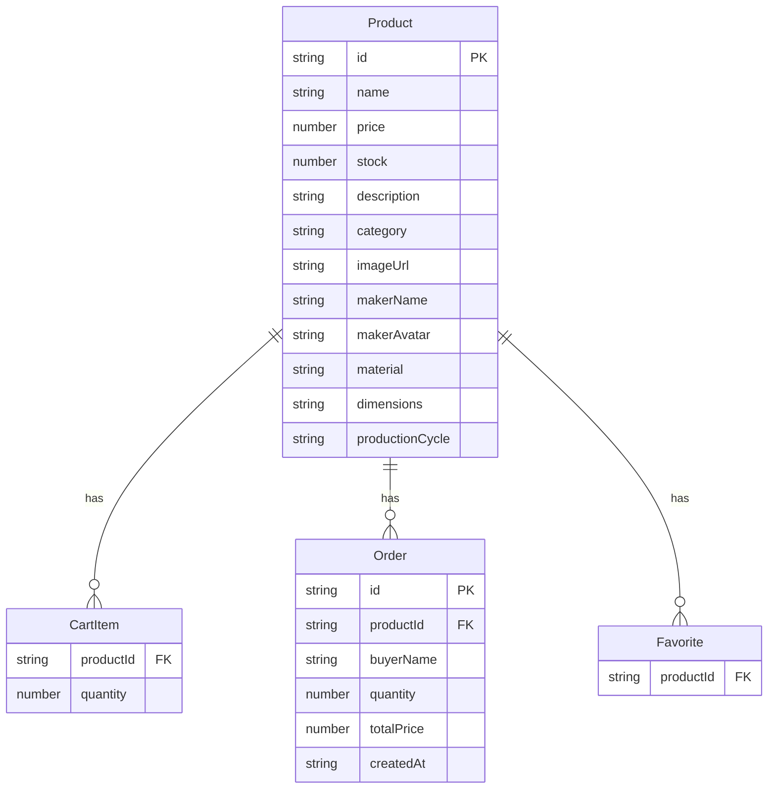

## 1. 架构设计

```mermaid
flowchart TB
    subgraph "前端层"
        "React 18 + TypeScript"
        "Vite 构建工具"
        "Zustand 状态管理"
        "React Router 6 路由"
    end
    subgraph "数据层"
        "localStorage 持久化"
    end
    "React 18 + TypeScript" --> "Zustand 状态管理"
    "Zustand 状态管理" --> "localStorage 持久化"
    "React 18 + TypeScript" --> "React Router 6 路由"
```

纯前端应用，无后端服务。所有数据通过 Zustand 管理并持久化到 localStorage。

## 2. 技术说明

- **前端**：React@18 + TypeScript + Vite
- **初始化工具**：vite-init（react-ts 模板）
- **样式**：Tailwind CSS + 自定义CSS变量
- **状态管理**：Zustand（含 localStorage 持久化中间件）
- **路由**：react-router-dom@6
- **图标**：lucide-react
- **唯一ID**：uuid
- **后端**：无
- **数据库**：localStorage（模拟持久化）

## 3. 路由定义

| 路由 | 用途 |
|------|------|
| `/` | 首页商品画廊 |
| `/product/:id` | 商品详情页 |
| `/favorites` | 收藏夹页面 |
| `/admin` | 简易后台管理 |

## 4. API定义

无后端API，所有数据操作通过 Zustand store 完成。

## 5. 服务端架构图

不适用

## 6. 数据模型

### 6.1 数据模型定义



### 6.2 数据定义语言

```typescript
interface Product {
  id: string;
  name: string;
  price: number;
  stock: number;
  description: string;
  category: string;
  imageUrl: string;
  makerName: string;
  makerAvatar: string;
  material: string;
  dimensions: string;
  productionCycle: string;
}

interface CartItem {
  productId: string;
  quantity: number;
}

interface Order {
  id: string;
  productId: string;
  buyerName: string;
  quantity: number;
  totalPrice: number;
  createdAt: string;
}

interface Favorite {
  productId: string;
}
```
