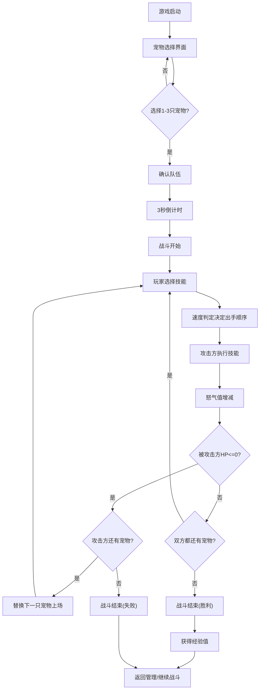

## 1. 产品概述

宠物对战纪元是一款轻量级回合制宠物养成与对战网页游戏，填补了现有网页游戏在复杂度上的空白——既不像MMO/RPG那样沉重，也不像纯点击游戏那样肤浅。目标用户为喜欢养成与策略对战的休闲玩家，支持离线游玩，数据持久化于浏览器本地。

## 2. 核心功能

### 2.2 功能模块

1. **宠物选择页**：6种属性宠物卡片网格展示、选择初始队伍（最多3只）
2. **宠物管理页**：查看宠物状态、切换宠物、喂食恢复HP
3. **战斗页**：回合制对战、技能选择、战斗动画、战斗日志

### 2.3 页面详情

| 页面名称 | 模块名称 | 功能描述 |
|----------|----------|----------|
| 宠物选择页 | 宠物卡片网格 | 3列网格展示6种属性宠物（火/水/草/电/风/土），卡片显示宠物SVG图形、属性标签、选择状态；最多选3只组队 |
| 宠物选择页 | 队伍确认 | 底部显示已选队伍，确认后进入战斗 |
| 宠物管理页 | 宠物状态面板 | 显示宠物等级、HP、攻击、防御、速度、怒气值、技能列表 |
| 宠物管理页 | 喂食功能 | 每次恢复25%HP，每天限5次，次数存于localStorage |
| 宠物管理页 | 宠物切换 | 切换当前出战宠物，首次免费 |
| 战斗页 | 对战区域 | 左右分屏展示双方宠物，中间10%为技能特效区，宠物120px SVG图形+HP条+等级 |
| 战斗页 | 技能选择区 | 4个技能按钮（80x80px），冷却时灰化，释放时0.8秒不可用 |
| 战斗页 | 战斗日志 | 右侧200px宽度日志区域，记录每次攻击伤害、效果和怒气变化，最多30条 |
| 战斗页 | 倒计时 | 对战开始前3秒倒计时，数字3→1渐显渐隐 |
| 战斗页 | 粒子动画 | Canvas绘制技能粒子特效（火焰/水花/闪电/旋风/土石/叶片），100粒子以内 |
| 战斗页 | 伤害反馈 | 目标闪烁（红色3次）、被击退动画、伤害数字浮升 |
| 战斗页 | 怒气光晕 | 怒气满100时金色光晕脉冲效果 |
| 全局 | 重置进度 | 模态确认对话框，确认后清空localStorage并刷新页面 |

## 3. 核心流程

玩家打开游戏 → 宠物选择界面选择最多3只宠物组成队伍 → 确认进入战斗 → 3秒倒计时 → 回合制对战（选择技能→速度判定→攻击→怒气增减→HP判定→宠物替换/战斗结束）→ 战斗结束获得经验 → 可返回管理宠物或继续战斗

## 4. 用户界面设计

### 4.1 设计风格

- **主题**：深色奇幻风格
- **主背景色**：#1a1a2e，辅以#16213e和#0f3460渐变层次
- **按钮风格**：方形圆角（12px），4种颜色（橙#fb8500、紫#7209b7、蓝#4361ee、绿#06d6a0），悬停放大1.05倍+阴影增大
- **字体**：使用Google Fonts中具有奇幻感的字体，如Cinzel作为标题字体，Nunito作为正文字体
- **布局**：卡片式布局，战斗页左右分屏对战
- **图标**：宠物为SVG图形（圆形+属性特征），属性颜色：火#e63946、水#457b9d、草#2d6a4f、电#ffb703、风#a8dadc、土#bc6c25

### 4.2 页面设计概览

| 页面名称 | 模块名称 | UI元素 |
|----------|----------|--------|
| 宠物选择页 | 宠物卡片 | 3列网格，卡片240x320px，背景渐变#1f4068→#1b1c20，圆角24px，边框2px solid #e0e1dd20，悬停上浮8px+内发光2px #ffffff40，选中金色边框3px solid #ffd700+"已选择"标签 |
| 战斗页 | 对战区域 | 左右各45%，中间10%特效区，宠物120x120px SVG，HP条（红#e63946背景#333高12px圆角6px渐变过渡），等级LV标识 |
| 战斗页 | 技能按钮 | 4个80x80px方形圆角12px按钮，颜色各异，冷却灰化+显示剩余时间 |
| 战斗页 | 战斗日志 | 宽200px，背景#0d1b2a，字体#e0e1dd 12px，滚动最多30条 |
| 战斗页 | 倒计时 | 48px加粗白色数字，居中渐显渐隐 |
| 战斗页 | 粒子动画 | Canvas绘制，2-4px粒子，寿命0.8s，100粒子以内 |
| 战斗页 | 伤害反馈 | 红色闪烁3次0.1s/次，击退10px回弹0.3s ease-out，伤害数字上浮60px渐隐1.2s |
| 战斗页 | 怒气光晕 | 金色脉冲，周期0.5s，透明度0.3-0.8 |
| 全局 | 重置对话框 | 居中模态，背景#00000080，圆角12px，宽400px，内边距24px |

### 4.3 响应式设计

- **≥1024px**：上述完整布局
- **768px-1024px**：战斗区域变为上下结构（对战区在上，技能区在下），宠物卡片2列
- **<768px**：单列布局，宠物卡片宽度90%，战斗日志折叠为底部抽屉（点击按钮展开，高150px，背景#0d1b2a，按钮固定右下角）
