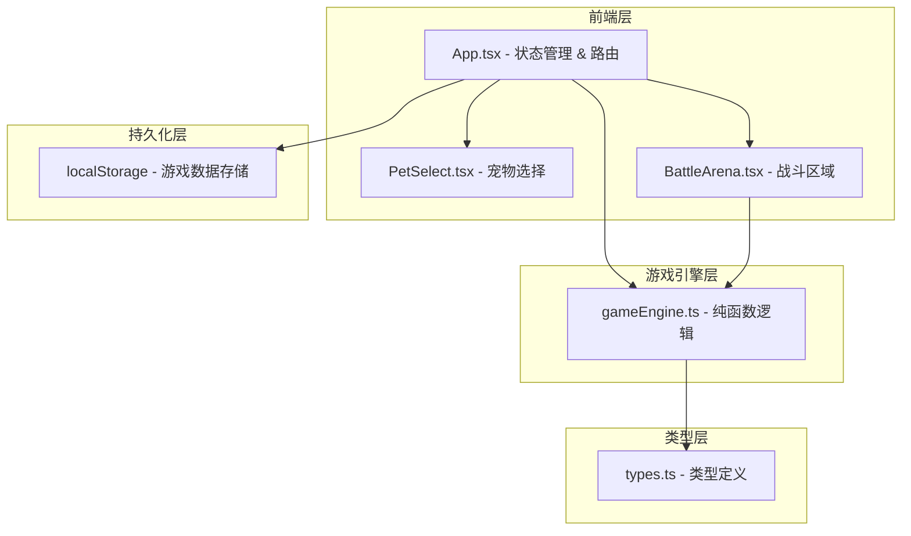

## 1. 架构设计



## 2. 技术说明

- **前端**：React@18 + TypeScript + Vite
- **构建工具**：Vite（React插件，esbuild目标es2020）
- **样式**：CSS Modules / 行内样式（无额外CSS框架，保持轻量）
- **动画**：requestAnimationFrame + Canvas API（粒子效果）
- **持久化**：localStorage（无后端，单次写入<200ms）
- **依赖**：react@18, react-dom@18, uuid@9

## 3. 路由定义

本项目为单页应用，不使用React Router，通过useState控制界面状态切换：

| 状态值 | 用途 |
|--------|------|
| "select" | 宠物选择界面 |
| "manage" | 宠物管理界面 |
| "battle" | 战斗界面 |

## 4. 数据模型

### 4.1 核心类型定义

```typescript
type ElementType = "fire" | "water" | "grass" | "electric" | "wind" | "earth";

interface Skill {
  name: string;
  coefficient: number;
  element: ElementType;
  unlockLevel: number;
  description: string;
}

interface Pet {
  id: string;
  name: string;
  element: ElementType;
  level: number;
  exp: number;
  maxHp: number;
  currentHp: number;
  attack: number;
  defense: number;
  speed: number;
  rage: number;
  skills: Skill[];
}

interface BattleState {
  playerTeam: Pet[];
  enemyTeam: Pet[];
  currentPlayerPet: number;
  currentEnemyPet: number;
  turn: number;
  log: string[];
  phase: "countdown" | "selectSkill" | "animating" | "ended";
  winner: "player" | "enemy" | null;
}

interface PlayerState {
  pets: Pet[];
  teamIndices: number[];
  feedCount: number;
  feedDate: string;
}
```

### 4.2 游戏数据结构

localStorage存储键：

| 键名 | 数据 | 说明 |
|------|------|------|
| petBattle_playerState | PlayerState JSON | 玩家所有宠物、队伍、喂食记录 |
| petBattle_battleState | BattleState JSON | 当前战斗状态（可选） |

### 4.3 核心公式

| 公式 | 计算 |
|------|------|
| 经验获取 | EXP_gained = 敌方等级 × 10 + 50 |
| 技能伤害 | max(1, 攻击力 × 技能系数 × random(0.9, 1.1) - 防御力 × 0.2) |
| 怒气增加 | 攻击时+10，被攻击时+5 |
| 喂食恢复 | 当前HP += 最大HP × 25%，每天限5次 |
| 升级技能 | 等级每升5级解锁一个新技能（共4个主动技能） |

## 5. 文件组织

```
├── package.json
├── vite.config.js
├── tsconfig.json
├── index.html
└── src/
    ├── main.tsx
    ├── App.tsx
    ├── gameEngine.ts
    ├── types.ts
    └── components/
        ├── BattleArena.tsx
        └── PetSelect.tsx
```
