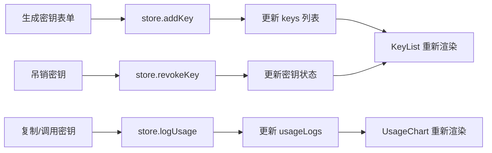

## 1. 产品概述

KeyVault 是一款面向独立开发者和小团队的 API 密钥管理与用量看板工具，帮助用户安全地生成、存储和管理 API 密钥，避免密钥明文泄露，同时提供用量统计和可视化分析。

- **核心价值**：解决密钥明文存储、滥用追踪难的问题，提供安全便捷的密钥生命周期管理
- **目标用户**：独立开发者、小型技术团队
- **市场定位**：轻量级、零配置的本地密钥管理解决方案

## 2. 核心功能

### 2.1 用户角色

本产品为单用户本地工具，无需注册登录。

### 2.2 功能模块

1. **密钥管理模块**：密钥生成、密钥列表展示、密钥复制、密钥吊销
2. **用量统计模块**：调用记录、按日聚合统计、柱状图可视化、密钥筛选
3. **数据持久化**：localStorage 本地存储、页面刷新数据恢复

### 2.3 页面详情

| 页面名称 | 模块名称 | 功能描述 |
|---------|---------|----------|
| 密钥管理页 | 密钥生成表单 | 输入名称、选择角色，生成 32 位随机密钥，明文展示 15 秒后自动隐藏 |
| 密钥管理页 | 密钥卡片列表 | 网格布局展示所有密钥，显示前缀、名称、角色标签、状态，支持复制和吊销 |
| 用量统计页 | 用量柱状图 | 最近 7 天每日调用次数柱状图，支持按密钥筛选 |
| 用量统计页 | 统计数字 | 总调用次数、活跃密钥数，带数字递增动画 |

## 3. 核心流程

### 3.1 密钥生成流程

用户在左侧表单输入密钥名称和角色，点击生成按钮 → 系统生成 32 位随机密钥并加密存储 → 密钥卡片出现在右侧列表，明文高亮显示 15 秒 → 15 秒后明文自动隐藏为"已隐藏"

### 3.2 密钥使用流程

用户点击密钥卡片上的复制按钮 → 密钥明文复制到剪贴板 → 按钮显示"已复制"并变绿 1.5 秒 → 用户将密钥用于 API 调用 → 系统记录调用日志

### 3.3 密钥吊销流程

用户点击吊销按钮 → 弹出确认模态框 → 用户确认吊销 → 密钥状态变为"已吊销" → 卡片变灰，复制功能禁用

### 3.4 用量统计流程

用户切换到统计页面 → 系统从 localStorage 加载调用记录 → 按天聚合调用次数 → 渲染柱状图和统计数字 → 支持下拉选择单个密钥筛选

## 4. 用户界面设计

### 4.1 设计风格

- **主题**：深色科技风格，安全感与专业感并重
- **主色调**：紫色渐变 #6C63FF → #8B5CF6（按钮）
- **辅助色**：蓝色 #3B82F6（图表）、红色 #EF4444（admin/危险操作）、绿色 #10B981（reader/成功）
- **背景色**：#1E1E2E（页面）、#2A2A3E（卡片）
- **边框色**：#3A3A5E
- **按钮**：圆角 8px，渐变背景，悬停亮度提升 10%，过渡 0.2s ease
- **卡片**：圆角 16px，阴影 0 4px 16px rgba(0,0,0,0.2)
- **字体**：现代无衬线字体，清晰可读
- **图标风格**：线性简洁图标

### 4.2 页面设计概览

| 页面名称 | 模块名称 | UI 元素 |
|---------|---------|---------|
| 密钥管理页 | 顶部导航 | Logo + 页面切换标签（密钥管理/用量统计） |
| 密钥管理页 | 左侧表单区 | 名称输入框、角色选择下拉、生成按钮 |
| 密钥管理页 | 右侧列表区 | 响应式网格布局、密钥卡片、复制按钮、吊销按钮 |
| 用量统计页 | 筛选区 | 密钥选择下拉框 |
| 用量统计页 | 图表区 | 白色背景圆角柱状图、日期横轴、次数纵轴 |
| 用量统计页 | 数据卡片区 | 总调用次数、活跃密钥数，数字动画 |

### 4.3 响应式设计

- **桌面端（>768px）**：左右两栏布局，左侧 1/3，右侧 2/3，间隙 24px
- **移动端（≤768px）**：上下堆叠布局，表单区在上，列表区在下
- **密钥卡片**：桌面端 2-3 列网格，移动端单列
- **图表**：响应式宽度，自适应容器大小

### 4.4 动画与交互

- 密钥明文高亮：黄色背景 #FEF08A，黑色文字，15 秒后淡出隐藏
- 复制反馈：按钮文字切换为"已复制"，背景变绿，持续 1.5 秒
- 数字动画：从 0 递增到目标值，过渡 0.5s ease
- 卡片悬停：轻微上浮，阴影加深
- 模态框：淡入淡出 + 缩放过渡
- 所有过渡：平滑 ease 曲线，无突兀变化
