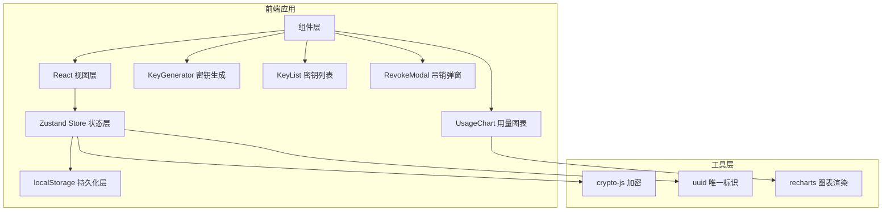
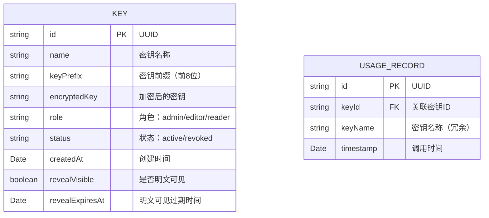

## 1. 架构设计



## 2. 技术描述

- **前端框架**：React@18 + TypeScript
- **构建工具**：Vite
- **状态管理**：Zustand
- **图表库**：Recharts
- **加密库**：crypto-js
- **唯一标识**：uuid
- **样式方案**：原生 CSS + CSS 变量（深色主题）
- **数据持久化**：localStorage

## 3. 路由定义

| 路由 | 页面 | 用途 |
|------|------|------|
| / | 密钥管理页 | 密钥生成、列表展示、复制与吊销 |
| /stats | 用量统计页 | 调用统计图表、数据看板 |

## 4. 数据模型

### 4.1 数据模型定义



### 4.2 TypeScript 类型定义

```typescript
type KeyRole = 'admin' | 'editor' | 'reader';
type KeyStatus = 'active' | 'revoked';

interface Key {
  id: string;
  name: string;
  keyPrefix: string;
  encryptedKey: string;
  role: KeyRole;
  status: KeyStatus;
  createdAt: string;
  revealVisible: boolean;
  revealExpiresAt: number;
}

interface UsageRecord {
  id: string;
  keyId: string;
  keyName: string;
  timestamp: string;
}

interface KeyStore {
  keys: Key[];
  usageLogs: UsageRecord[];
  addKey: (name: string, role: KeyRole) => string;
  revokeKey: (id: string) => void;
  logUsage: (keyId: string) => void;
  getStats: (keyId?: string) => { total: number; activeKeys: number; dailyData: DailyStat[] };
}

interface DailyStat {
  date: string;
  count: number;
}
```

## 5. 文件结构

```
src/
├── main.tsx              # React 入口
├── App.tsx               # 根组件，路由
├── store/
│   └── keyStore.ts       # Zustand store，密钥与用量状态管理
├── components/
│   ├── KeyGenerator.tsx  # 密钥生成表单
│   ├── KeyList.tsx       # 密钥列表
│   ├── KeyCard.tsx       # 单个密钥卡片
│   ├── UsageChart.tsx    # 用量统计图表
│   ├── RevokeModal.tsx   # 吊销确认弹窗
│   ├── StatsCard.tsx     # 统计数字卡片
│   └── Navbar.tsx        # 导航栏
├── utils/
│   ├── crypto.ts         # 加密解密工具
│   └── storage.ts        # localStorage 工具
└── types/
    └── index.ts          # 类型定义
```

### 5.1 调用关系与数据流

- **KeyGenerator** → `store.addKey()` → 更新 `store.keys` → **KeyList** 重新渲染
- **KeyCard** 复制按钮 → 解密密钥 → 写入剪贴板 → `store.logUsage()` → 更新 `store.usageLogs`
- **KeyCard** 吊销按钮 → 打开 **RevokeModal** → 确认 → `store.revokeKey()` → 更新 `store.keys`
- **UsageChart** → `store.getStats()` → 从 `store.usageLogs` 聚合数据 → 渲染图表
- **Store** ↔ **localStorage**：初始化时读取，变更时持久化

## 6. 性能约束

- 密钥生成与吊销操作响应时间 ≤ 100ms
- 图表渲染在 50 条数据以内帧率稳定 60fps
- localStorage 读写异步处理，不阻塞 UI
- 组件按需渲染，避免不必要的重渲染
