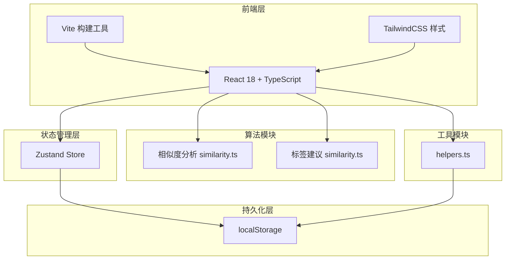

## 1. 架构设计



## 2. 技术说明

- **前端**：React@18 + TypeScript + Vite
- **初始化工具**：vite-init (react-ts模板)
- **样式**：TailwindCSS@3
- **状态管理**：Zustand
- **后端**：无（纯前端应用）
- **数据持久化**：localStorage

## 3. 路由定义

| 路由 | 用途 |
|------|------|
| / | Issue列表页，含筛选、卡片列表、批量操作 |
| /issue/:id | Issue详情页，含相似检测面板、标签建议 |

## 4. 文件结构

```
├── package.json
├── index.html
├── vite.config.js
├── tsconfig.json
├── src/
│   ├── main.tsx                    # ReactDOM渲染入口
│   ├── App.tsx                     # 路由配置
│   ├── store/
│   │   └── issueStore.ts           # Zustand store，Issue类型、CRUD、筛选selector
│   ├── components/
│   │   ├── IssueList.tsx           # Issue列表与卡片、筛选栏、骨架屏、批量操作
│   │   └── IssueDetail.tsx         # Issue详情、相似面板、标签建议
│   ├── api/
│   │   └── similarity.ts           # Jaccard相似度算法、N-gram标签匹配算法
│   └── utils/
│       └── helpers.ts              # relativeTime、uuidV4、localStorage持久化函数
```

## 5. 数据模型

### 5.1 Issue数据结构

```typescript
type IssueStatus = 'pending' | 'in-progress' | 'completed';
type IssueTag = 'Bug' | '增强' | '文档' | '优化' | '其他';

interface Issue {
  id: string;
  title: string;
  description: string;
  tags: IssueTag[];
  status: IssueStatus;
  createdAt: string;
  comments: Comment[];
  isDuplicate?: boolean;
}

interface Comment {
  id: string;
  author: string;
  content: string;
  createdAt: string;
}
```

### 5.2 Store结构

```typescript
interface IssueStore {
  issues: Issue[];
  selectedIssueIds: Set<string>;
  searchQuery: string;
  statusFilter: IssueStatus | 'all';
  tagFilter: IssueTag | 'all';
  isLoading: boolean;

  addIssue: (issue: Omit<Issue, 'id' | 'createdAt' | 'comments'>) => void;
  updateIssue: (id: string, updates: Partial<Issue>) => void;
  deleteIssue: (id: string) => void;
  setSimilarIssues: (id: string, similar: SimilarIssue[]) => void;
  setSuggestedTags: (id: string, tags: SuggestedTag[]) => void;
  toggleSelect: (id: string) => void;
  clearSelection: () => void;
  setSearchQuery: (query: string) => void;
  setStatusFilter: (filter: IssueStatus | 'all') => void;
  setTagFilter: (filter: IssueTag | 'all') => void;
  filteredIssues: () => Issue[];
}
```

## 6. 算法设计

### 6.1 Jaccard相似度算法

- 对Issue标题+描述进行中文分词（按字符级2-gram拆分）
- 计算两个文本集合的交集/并集比
- 复杂度O(N*L)，N为Issue数量，L为平均描述长度
- 默认阈值0.6，可调整

### 6.2 N-gram标签匹配

- 对Issue标题+描述提取2-gram和3-gram特征
- 与预定义标签词库进行匹配打分
- 返回各标签确信度百分比
- 词库内联定义在similarity.ts中
