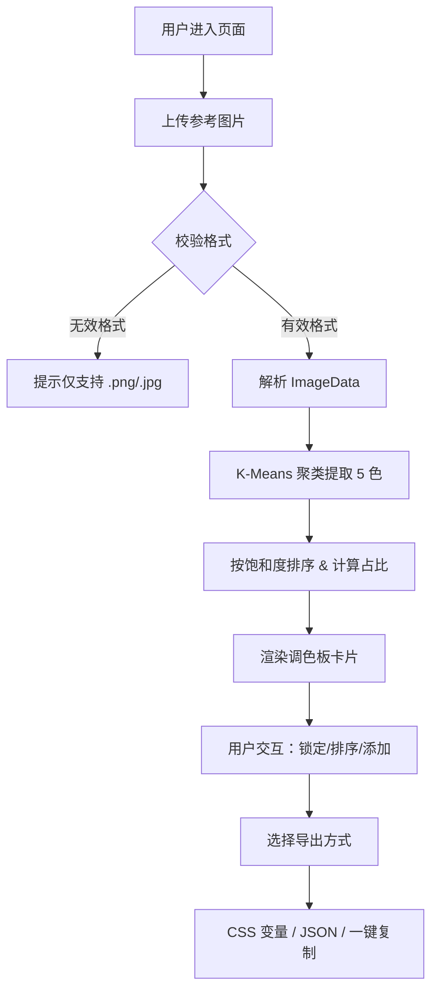

## 1. 产品概述

ColorHunt 是一个基于图片的智能调色板生成工具，帮助设计师和开发者从参考图片中快速提取核心颜色，生成可直接使用的色彩主题调色板。

- 核心功能：上传图片 → K-Means 算法提取 5 种核心色 → 可视化调色板展示 → 颜色编辑与排序 → 多格式导出
- 目标用户：UI 设计师、前端开发者、品牌设计师、艺术创作者
- 市场价值：解决手动取色繁琐、色彩搭配不和谐的问题，提升设计效率和配色质量

## 2. 核心功能

### 2.1 功能模块

1. **上传区域**：图片拖拽/点击上传、格式校验（.png/.jpg）、拖拽视觉反馈
2. **颜色提取模块**：K-Means 聚类算法提取 5 种核心色、按饱和度排序、计算颜色占比
3. **调色板编辑模块**：颜色卡片展示、展开查看多格式色值、锁定/解锁颜色、拖拽排序、删除/添加颜色
4. **导出模块**：CSS 变量导出、JSON 导出、一键复制所有色值

### 2.2 页面详情

| 页面名称 | 模块名称 | 功能描述 |
|---------|---------|---------|
| 首页 | 上传区域 | 400x280px 虚线边框容器，支持拖拽/点击上传 .png/.jpg，拖拽时背景渐变反馈 |
| 首页 | 调色板网格 | 流动网格布局，每行 4-5 张 160px 卡片，显示色块、HEX 色值和占比 |
| 首页 | 颜色卡片 | 点击展开显示 RGB/HSL/HEX 可复制色值，小锁图标切换锁定状态，支持拖拽排序 |
| 首页 | 操作按钮组 | 添加颜色（色轮选择器）、导出下拉（CSS/JSON）、一键复制按钮 |

## 3. 核心流程

## 4. 用户界面设计

### 4.1 设计风格

- **主题模式**：深色科技风
- **背景色**：#1A1B2E（深蓝紫暗色）
- **卡片背景**：#2D2E44（半透明紫暗色）
- **主文字**：#E4E4E7（浅灰白）
- **次要文字**：#6B7280（中灰）
- **强调色**：#A5B4FC（浅紫色）、#8B5CF6（紫色调阴影）
- **按钮反馈**：fleeting 绿色打勾动画
- **卡片阴影**：0 4px 12px rgba(139, 92, 246, 0.12)
- **上传区域**：边框 2px dashed #A5B4FC，背景 #FAFAFA，拖拽时变实线+背景 #EFF6FF
- **圆角规范**：上传区 16px，卡片 12px，色块顶部 12px 12px 0 0
- **字体**：系统无衬线字体 stack
- **动画**：卡片展开 0.3s ease-out，复制成功 fleeting 绿色对勾

### 4.2 页面设计概览

| 页面名称 | 模块名称 | UI 元素 |
|---------|---------|---------|
| 首页 | 上传区域 | SVG 上传图标、提示文字、虚线边框、hover 过渡、拖拽高亮 |
| 首页 | 调色板网格 | 流动 grid、卡片阴影、色块渐变、色值小字、占比百分比 |
| 首页 | 颜色卡片 | 展开过渡动画、HEX/RGB/HSL 三栏、小锁 SVG、复制图标、拖拽手柄 |
| 首页 | 操作按钮组 | 添加按钮+色轮弹窗、导出下拉菜单、复制按钮+对勾动画 |

### 4.3 响应式适配

- **断点 768px 以下（移动端）**：
  - 上传区域：宽度 90%，高度自适应
  - 调色板网格：每行 2 张卡片
  - 色值字体：缩小至 0.8rem
  - 操作按钮组：竖排布局
- **桌面端（768px+）**：
  - 上传区域 400x280px 居中
  - 调色板每行 4-5 张自适应
  - 操作按钮水平排列

### 4.4 性能指标

- 颜色提取：800x600 图片 ≤ 2 秒
- K-Means 迭代次数：5 次
- 动画帧率：60fps
- 交互反馈：无明显卡顿掉帧
