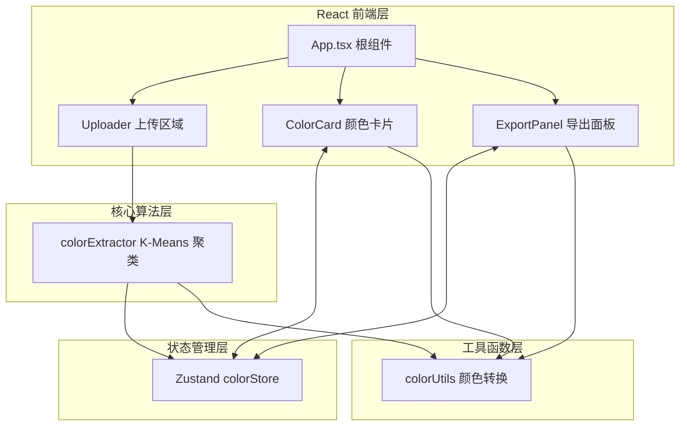

## 1. 架构设计



## 2. 技术说明

- **构建工具**：Vite（含 React 插件）
- **前端框架**：React@18 + React-DOM@18
- **语言**：TypeScript（严格模式，target ES2020）
- **状态管理**：Zustand
- **辅助工具**：uuid（生成唯一颜色 ID）
- **样式方案**：原生 CSS + CSS 变量（Tailwind 不作为强制要求，使用内联/原生 CSS 保证精细控制）

## 3. 文件结构定义

```
auto67/
├── index.html
├── package.json
├── vite.config.js
├── tsconfig.json
└── src/
    ├── main.ts              # React 入口
    ├── App.tsx              # 根组件（布局+数据流）
    ├── store/
    │   └── colorStore.ts    # Zustand 状态管理
    ├── modules/
    │   ├── extractor/
    │   │   └── colorExtractor.ts  # K-Means 颜色提取
    │   └── editor/
    │       ├── ColorCard.tsx      # 颜色卡片组件
    │       └── ExportPanel.tsx    # 导出面板组件
    └── utils/
        └── colorUtils.ts    # 颜色转换/剪贴板工具
```

## 4. 数据模型

### 4.1 颜色对象 (ColorItem)

```typescript
interface ColorItem {
  id: string;           // uuid
  hex: string;          // #RRGGBB
  rgb: { r: number; g: number; b: number };
  hsl: { h: number; s: number; l: number };
  percentage: number;   // 0-100 占比
  locked: boolean;      // 是否锁定
}
```

### 4.2 Zustand Store 接口

```typescript
interface ColorStore {
  // state
  extractedColors: ColorItem[];    // 提取的颜色数组
  manualColors: ColorItem[];       // 手动添加的颜色
  selectedIndex: number | null;    // 当前选中索引

  // actions
  setExtractedColors: (colors: Omit<ColorItem, 'id' | 'locked'>[]) => void;
  addManualColor: (color: Omit<ColorItem, 'id' | 'locked' | 'percentage'>) => void;
  toggleLock: (id: string) => void;
  removeColor: (id: string) => void;
  reorderColors: (fromId: string, toId: string) => void;
  setSelectedIndex: (index: number | null) => void;
  getAllColors: () => ColorItem[];
}
```

## 5. K-Means 算法实现要点

1. **像素采样**：将 ImageData 缩放到最多 10000 像素（按比例采样）
2. **初始化质心**：从像素中随机选取 5 个作为初始质心
3. **迭代过程**：
   - 每个像素计算到 5 个质心的欧氏距离，分配到最近簇
   - 重新计算每个簇的均值作为新质心
   - 重复 5 次迭代（保证性能）
4. **后处理**：
   - 计算每个簇的像素数量 → 百分比占比
   - 按饱和度（HSL 的 S 值）降序排序
   - 转换为 HEX/RGB/HSL 三种格式输出

## 6. 性能优化策略

- **像素降采样**：800x600 图片先按比例缩采样至 ≤10000 像素再聚类
- **requestAnimationFrame**：UI 动画全部走 CSS transition，避免 JS 阻塞
- **Web Worker 可选**：K-Means 计算在主线程执行但通过采样控制在 2s 内
- **Zustand 选择器**：组件仅订阅所需 slice，避免不必要重渲染
- **memo 包裹**：ColorCard 使用 React.memo，仅 id/锁定态变化才重渲染
