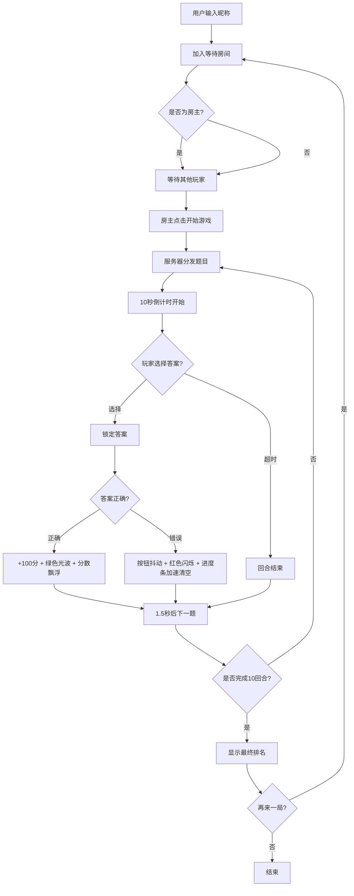

## 1. 产品概述

BuzzWise 是一款实时多人答题对战游戏应用，面向团队线上活动场景（猜谜、知识竞赛等），提供计时抢答、积分排名的轻量级互动体验。基于 WebSocket 模拟连接实现多人实时交互，采用发布订阅模式解耦通信。

- 解决问题：团队线上活动缺少实时多人、计时抢答、积分排名的互动工具
- 目标用户：需要进行线上知识竞赛、团建活动的团队成员（2-4人）

## 2. 核心功能

### 2.1 用户角色

| 角色 | 加入方式 | 核心权限 |
|------|----------|----------|
| 房主 | 首位加入房间 | 开始游戏、重置游戏 |
| 玩家 | 输入昵称加入房间 | 答题、查看排名 |

### 2.2 功能模块

1. **等待房间页**：昵称输入、玩家加入、头像生成、房主开始游戏
2. **答题对战页**：题目展示、选项按钮、倒计时进度条、答案锁定与反馈
3. **积分排名侧栏**：实时积分排名、皇冠标识、排名动画
4. **结果总结页**：最终排名、金银铜卡片、统计数据、再来一局

### 2.3 页面详情

| 页面名称 | 模块名称 | 功能描述 |
|----------|----------|----------|
| 等待房间 | 玩家加入面板 | 输入昵称加入房间（最多4人），显示圆形首字母头像（随机背景色），房主点击"开始游戏"启动第一回合 |
| 等待房间 | 房间标题 | 霓虹渐变标题 BuzzWise，灰色副标题"在线知识竞技场" |
| 答题对战 | 题目卡片 | 显示题干与4个选项按钮，选项水平排列（间距24px），点击锁定答案 |
| 答题对战 | 倒计时进度条 | 10秒倒计时，进度条从绿渐变至红，宽度100%→0% |
| 答题对战 | 答题反馈 | 正确：绿色光波扩散+分数飘浮；错误：按钮抖动+红色闪烁+进度条加速清空 |
| 答题对战 | 回合过渡 | QuestionCard左滑出右滑入，排名翻牌动画，积分数字跳动 |
| 积分排名 | 玩家列表 | 固定右侧240px，显示头像/昵称/积分，第一名皇冠图标，当前玩家高亮 |
| 结果总结 | 最终排名 | 前三名金银铜色卡片，显示正确题数/总得分/平均用时，卡片依次滑入 |
| 结果总结 | 再来一局 | 圆角24px按钮，背景#6C63FF，重置所有状态 |

## 3. 核心流程

用户打开应用 → 输入昵称加入等待房间 → 其他玩家加入 → 房主点击开始游戏 → 模拟服务器分发题目 → 10秒倒计时开始 → 玩家选择答案 → 答案锁定与反馈 → 1.5秒后自动下一题 → 重复10回合 → 显示最终排名 → 可选再来一局

## 4. 界面设计

### 4.1 设计风格

- 主色调：深色太空风格渐变背景 #0F0C29 → #302B63 → #24243E
- 强调色：#6C63FF（按钮）、#00FF88（正确/成功）、#FF4444（错误/警告）
- 霓虹渐变标题：#00DBDE → #FC00FF
- 按钮样式：圆角12px，背景#6C63FF，悬停亮度+缩放1.05，transition 0.2s
- 字体：主标题霓虹渐变，副标题灰色#A0A0A0（0.9em）
- 布局：玻璃态面板（backdrop-filter: blur 8px，半透明#FFFFFF20，圆角16px）
- 图标：皇冠图标👑（排名第一）、lucide-react图标库

### 4.2 页面设计概览

| 页面名称 | 模块名称 | UI元素 |
|----------|----------|--------|
| 等待房间 | 标题区域 | 霓虹渐变字体BuzzWise、灰色副标题 |
| 等待房间 | 玩家面板 | 玻璃态容器、圆形首字母头像（随机色）、昵称、开始按钮 |
| 答题对战 | 进度条 | 高6px，深灰#333背景，渐变填充#00FF88→#FFD700→#FF4444 |
| 答题对战 | 题目卡片 | 题干文本、4选项按钮（2px solid #FFFFFF30边框）、正确/错误边框高亮 |
| 答题对战 | 玩家列表 | 右侧240px固定、半透明深色#1A1A2E80背景、60px条目高度 |
| 结果总结 | 排名卡片 | 金#FFD700/银#C0C0C0/铜#CD7F32色背景、依次滑入（stagger 0.15s） |
| 结果总结 | 再来一局按钮 | 圆角24px、#6C63FF背景、白色文字 |

### 4.3 响应式设计

- 桌面端（>1024px）：房间面板居中，右侧玩家列表始终可见
- 窄屏（<768px）：右侧列表折叠为右上角手风琴图标，题目卡片全宽，选项2x2网格布局
- 中等屏幕（768-1024px）：列表缩窄但仍可见

### 4.4 动画规范

- 倒计时进度条：CSS动画10s线性，绿→黄→红渐变
- 正确答案反馈：绿色光波扩散0.6s + 分数飘浮1s（+10px后消失）
- 错误答案反馈：按钮抖动0.3s + 红色闪烁 + 进度条0.5s加速清空
- 回合切换：QuestionCard左滑出0.3s + 右滑入0.3s
- 排名更新：翻牌效果、积分数字跳动向上、transform排序transition 0.4s ease
- 结果卡片入场：从下方滑入，stagger 0.15s延迟
