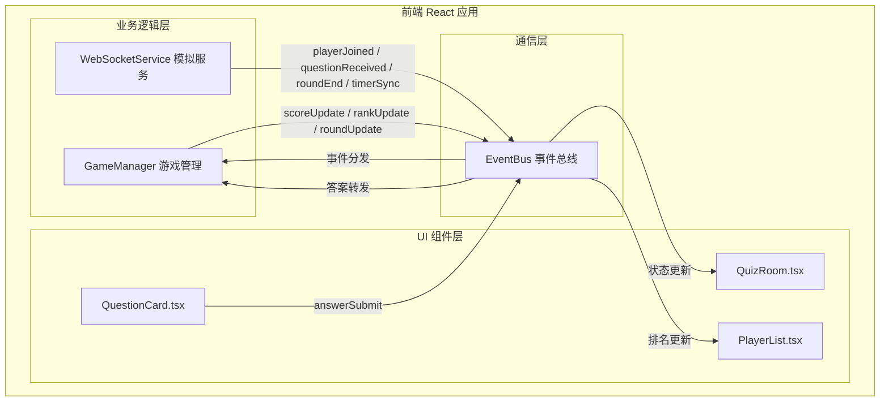

## 1. 架构设计



### 数据流向

1. **WebSocketService** 接收游戏配置消息，发出 `playerJoined`、`questionReceived`、`timerSync`、`roundEnd` 事件至 EventBus
2. **GameManager** 监听 EventBus 上的事件，计算积分/排名/倒计时，通过 EventBus 发出 `scoreUpdate`、`rankUpdate`、`roundUpdate` 消息
3. **UI 组件** 订阅 EventBus 上的状态更新事件，驱动渲染
4. **QuestionCard** 用户点击选项后，通过 EventBus 发出 `answerSubmit` 事件

## 2. 技术说明

- 前端：React@18 + TypeScript + Vite + TailwindCSS
- 初始化工具：vite-init（react-ts 模板）
- 后端：无（WebSocket模拟前端实现）
- 状态管理：Zustand（游戏全局状态） + EventBus（模块间通信）
- 样式：TailwindCSS + 自定义CSS动画
- 包管理器：npm

### 用户指定依赖

- react@18, react-dom@18, typescript, uuid

## 3. 路由定义

| 路由 | 用途 |
|------|------|
| / | 主游戏页面（等待房间 → 答题对战 → 结果总结，通过状态切换） |

说明：本应用为单页应用，通过游戏状态（waiting / playing / result）切换不同界面，无需多路由。

## 4. API 定义

无后端 API。所有数据通过模拟 WebSocket 服务在本地生成。

### EventBus 事件类型定义

```typescript
type EventBusEvent =
  | { type: 'playerJoined'; payload: { playerId: string; nickname: string } }
  | { type: 'questionReceived'; payload: { questionIndex: number; question: string; options: string[]; correctIndex: number } }
  | { type: 'timerSync'; payload: { remaining: number; total: number } }
  | { type: 'answerSubmit'; payload: { playerId: string; answerIndex: number; timeElapsed: number } }
  | { type: 'roundEnd'; payload: { questionIndex: number; correctIndex: number; answers: PlayerAnswer[] } }
  | { type: 'scoreUpdate'; payload: { playerId: string; score: number; delta: number } }
  | { type: 'rankUpdate'; payload: { rankings: PlayerRanking[] } }
  | { type: 'roundUpdate'; payload: { round: number; totalRounds: number } }
  | { type: 'gameEnd'; payload: { finalRankings: PlayerRanking[] } }
  | { type: 'gameStart'; payload: { players: PlayerInfo[] } }
  | { type: 'gameReset'; payload: {} }
```

### 数据模型

```typescript
interface PlayerInfo {
  id: string;
  nickname: string;
  avatarColor: string;
  score: number;
  correctCount: number;
  totalTime: number;
}

interface PlayerAnswer {
  playerId: string;
  answerIndex: number;
  timeElapsed: number;
  isCorrect: boolean;
}

interface PlayerRanking {
  playerId: string;
  nickname: string;
  score: number;
  rank: number;
  correctCount: number;
  avgTime: number;
}

interface Question {
  question: string;
  options: string[];
  correctIndex: number;
}
```

## 5. 文件结构

```
├── package.json
├── vite.config.js
├── tsconfig.json
├── index.html
├── src/
│   ├── main.tsx              # 入口，初始化React应用
│   ├── App.tsx               # 根组件，状态路由
│   ├── index.css             # 全局样式+动画
│   ├── eventBus.ts           # 全局事件总线（发布订阅模式）
│   ├── store.ts              # Zustand全局状态
│   ├── types.ts              # TypeScript类型定义
│   ├── data/
│   │   └── questions.ts      # 题库数据（10道题）
│   ├── buzzer/
│   │   └── websocketService.ts  # 模拟WebSocket服务
│   ├── game/
│   │   └── gameManager.ts    # 游戏逻辑管理
│   └── components/
│       ├── QuizRoom.tsx      # 主游戏房间组件
│       ├── PlayerList.tsx    # 玩家列表与积分排名
│       ├── QuestionCard.tsx  # 题目卡片组件
│       ├── WaitingRoom.tsx   # 等待房间组件
│       └── ResultScreen.tsx  # 结果总结组件
```

### 文件间调用关系

- `main.tsx` → `App.tsx` → `QuizRoom.tsx`
- `QuizRoom.tsx` → `WaitingRoom.tsx` / `QuestionCard.tsx` / `ResultScreen.tsx` / `PlayerList.tsx`
- `websocketService.ts` → `eventBus.ts`（发出事件）
- `gameManager.ts` → `eventBus.ts`（监听+发出事件）
- `QuestionCard.tsx` → `eventBus.ts`（发出 answerSubmit）
- `PlayerList.tsx` → `eventBus.ts`（监听 rankUpdate）
- `QuizRoom.tsx` → `eventBus.ts`（监听状态更新）
- 所有组件 → `store.ts`（读写全局状态）
- 所有组件 → `types.ts`（类型引用）
