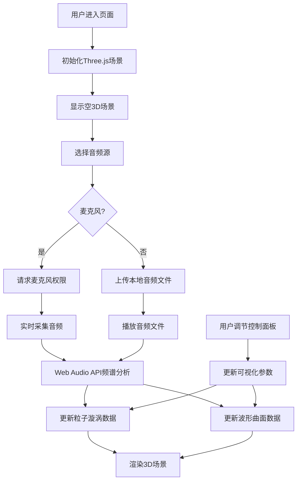

## 1. 产品概述

SoundVortex是一款沉浸式3D音乐可视化应用，通过实时音频频谱分析在三维空间中生成动态粒子漩涡和波形曲面，让用户直观感受音乐节奏与频率之美。

- 核心价值：将抽象的音频数据转化为沉浸式3D视觉体验，支持麦克风实时输入和本地音频文件播放
- 目标用户：音乐爱好者、视觉艺术家、需要视觉化展示音频内容的创作者
- 产品定位：轻量级、高性能、视觉惊艳的Web端音乐可视化工具

## 2. 核心功能

### 2.1 功能模块

1. **音频输入模块**：麦克风实时采集、本地音频文件上传（MP3/WAV）、波形实时预览
2. **3D可视化模块**：粒子漩涡效果、波形曲面效果、混合模式渲染
3. **交互控制模块**：灵敏度调节、旋转速度控制、粒子扩散度调节、可视化模式切换
4. **响应式适配模块**：桌面端悬浮控制面板、移动端底部滑出面板

### 2.2 页面详情

| 页面名称 | 模块名称 | 功能描述 |
|-----------|-------------|---------------------|
| 主场景 | 3D渲染区域 | 全屏Three.js场景，渲染粒子漩涡和波形曲面 |
| 主场景 | 音频源选择 | 顶部按钮切换麦克风/文件输入，Canvas波形预览 |
| 主场景 | 控制面板 | 右下角半透明面板，包含滑块和模式切换按钮 |
| 主场景 | 音频源标识 | 左上角悬浮显示当前音频源名称 |

## 3. 核心流程

用户进入页面后，默认显示空3D场景。用户选择音频源（麦克风或上传文件），系统获取音频数据并通过Web Audio API进行频谱分析。可视化引擎根据实时频谱数据更新粒子位置、颜色、大小以及波形曲面高度。用户可通过控制面板调节参数，切换可视化模式。

## 4. 用户界面设计

### 4.1 设计风格

- **主色调**：纯黑背景 #000000，营造沉浸式体验
- **强调色**：荧光绿 #00FF88（交互元素）、红 #FF3366（低频）、绿 #33FF66（中频）、蓝 #3366FF（高频）
- **辅助色**：渐变蓝 #00AAFF、白 #FFFFFF
- **字体**：无衬线字体 sans-serif，现代简洁
- **按钮风格**：圆角8px，悬停状态颜色变化，选中态高亮
- **滑块风格**：细轨道4px，圆形滑块16px，荧光绿主题

### 4.2 页面设计概述

| 页面名称 | 模块名称 | UI元素 |
|-----------|-------------|-------------|
| 主场景 | 3D渲染区 | 全屏黑色背景，粒子漩涡（5000粒子螺旋分布），波形曲面（20x20网格），相机自动旋转 |
| 主场景 | 音频源选择 | 顶部按钮组（麦克风/文件），Canvas波形预览（曲线#00FF88，透明背景） |
| 主场景 | 控制面板 | 半透明rgba(20,20,30,0.8)，圆角12px，内边距16px，fadeIn/fadeOut动画 |
| 主场景 | 音频源标识 | 左上角悬浮，14px #aaa 透明度0.6 |

### 4.3 响应式

- **桌面端（≥768px）**：控制面板悬浮右下角，水平排列控件，fadeIn/fadeOut动画，鼠标移出1秒后自动隐藏
- **移动端（<768px）**：控制面板改为底部半屏滑出，所有控件垂直排列，滑块宽度80%，粒子数量自动降为2000
- **触摸优化**：增大点击区域，支持触摸滑动调节滑块

### 4.4 3D场景指导

- **环境与氛围**：纯黑背景，无HDRI，营造深空/宇宙沉浸感
- **光照设置**：环境光 + 点光源，突出粒子发光效果，网格材质自发光
- **相机设置**：PerspectiveCamera，初始位置(0, 2, 8)，看向场景中心，支持自动旋转
- **构图与焦点**：粒子漩涡为视觉中心，位于上半部分；波形曲面位于下半部分，形成上下呼应
- **交互与动画**：粒子沿螺旋路径运动，速度随音乐节奏变化；波形曲面顶点随频率实时波动
- **后期处理**：轻微辉光效果增强粒子视觉冲击力，抗锯齿处理
- **性能预算**：桌面端5000粒子，移动端2000粒子，目标60fps

## 5. 性能要求

- **帧率**：3D场景稳定60fps
- **粒子数量**：桌面端5000，移动端自动降为2000
- **频谱更新**：不低于30Hz
- **内存占用**：控制在200MB以内
